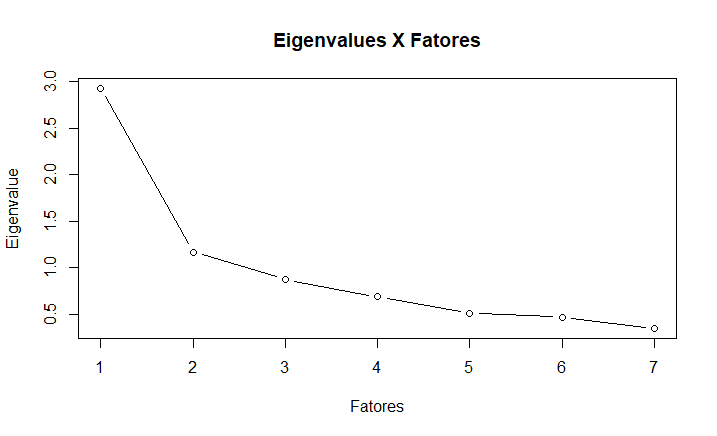

\newpage

# Introducao
Para a construção do Índice das Cidades Empreendedoras (ICE) de 2023, a manipulação e tratamento dos dados, bem como o cálculo dos indicadores, foram feitos em Python, R e SQL. Optou por utilizar diferentes linguagens de programação a fim de otimizar o trabalho com a base de dados. Os scripts realizados estão disponíveis tanto no Apêndice deste relatório quanto em um repositório criado pelos bolsistas, disponível em [link](https://github.com/ocesarfreitas/ICE-23).

# Determinantes
## Determinante Ambiente Regulatório {#det_amb_regulatorio}

- [Clique aqui](#script_2.1) para ver o script do Determinante Ambiente Regulatório.

### Subdeterminante Tempo de Processos {#subdet_tempo_processo}

- [Clique aqui](#script_2.1.1) para ver o script do Subdeterminante Tempo de Processos.

#### Indicador Tempo de Viabilidade de Localização {#indicador_tempo_viabilidade}

|                       	  | **Informações**                                                        	|
|---------------------------|-------------------------------------------------------------------------|
| **Fonte**             	  |           https://estatistica.redesim.gov.br/tempos-abertura           	|
| **Período**           	  |                           01/2021 ~ 12/2021                           	|
| **Cidades faltantes** 	  | São José do Rio Preto (SP), Maringá (PR),  Jundiaí (SP), Anápolis (GO) 	|
| **Variável de Interesse** | 	 	 	 	 	 	 	 	 	 	    QTDE. HH VIABILIDADE END 	 	 	 	 	 	 	 	 	 	    |
| **Efeito**                |  	 	 	 	 	 	 	 	 	 	     	 	 	 	Negativo 	 	 	  	 	 	 	 	 	 	 	 	 	    |
| **Problemas com a coleta**|  	 	 	 	 	 	 	 	 	 	     	 	 	 	  Não   	 	 	  	 	 	 	 	 	 	 	 	 	    |

Para o cálculo do indicador foi realizado a partir da média simples das variável de interesse, `QTDE. HH VIABILIDADE END`.

\begin{equation}
Tempo\ de\ Viabilidade\ de\ Localização = \frac{\displaystyle\sum_{12}Qtnd.\ Horas\ Viabilidade}{12}
\end{equation}

Em relação à importação dos dados no site da REDESIM, para nenhum dos 12 meses analisados houve problemas quanto aos arquivos importados e a qualidade dos dados coletados.

#### Indicador Tempo de Registro, Cadastro e Viabilidade de Nome {#indicador_tempo_registro}

|                       	  | **Informações**                                                        	|
|---------------------------|-------------------------------------------------------------------------|
| **Fonte**             	  |           https://estatistica.redesim.gov.br/tempos-abertura           	|
| **Período**           	  |                           01/2021 ~ 12/2021                           	|
| **Cidades faltantes** 	  | São José do Rio Preto (SP), Maringá (PR),  Jundiaí (SP), Anápolis (GO) 	|
| **Variável de Interesse** | 	 	 	 	 	 	 	 	 	 	    QTDE. HH LIBERAÇÃO DBE  	 	 	 	 	 	 	 	 	 	    |
| **Efeito**                |  	 	 	 	 	 	 	 	 	 	     	 	 	 	Negativo 	 	 	  	 	 	 	 	 	 	 	 	 	    |
| **Problemas com a coleta**|  	 	 	 	 	 	 	 	 	 	     	 	 	 	  Não   	 	 	  	 	 	 	 	 	 	 	 	 	    |

Assim como o anterior, o cálculo do indicador foi realizado a partir da média simples das variável de interesse, `QTDE. HH LIBERAÇÃO DBE`.

\begin{equation}
Tempo\ de\ Registro,\ Cadastro\ e\ Viabilidade\ de\ Nome = \frac{\displaystyle\sum_{12}Qtnd.\ Horas\ Liberação}{12}
\end{equation}

Como a base de dados é a mesma do indicador anterior, os mesmo comentários são válidos quanto a qualidade e coleta dos dados.

#### Indicador Taxa de Congestionamento em Tribunais {#indicador_congestionamento}

|                       	   | **Informações**                                                        	|
|--------------------------- |-------------------------------------------------------------------------|
| **Fonte**             	   | https://paineis.cnj.jus.br/QvAJAXZfc/opendoc.htm?document=qvw_l%2FPainelCNJ.qvw&host=QVS%40neodimio03&anonymous=true&sheet=shPDPrincipal|
| **Período**           	   |                            01/2021 ~ 12/2021                           	|
| **Cidades faltantes** 	   |                                     -                                    |
| **Efeito**                 |  	 	 	 	 	 	 	 	 	 	     	 	 	 	Negativo 	 	 	  	 	 	 	 	 	 	 	 	 	    |
| **Problemas com a coleta** |  	 	 	 	 	 	 	 	 	 	     	 	 	 	  Não   	 	 	  	 	 	 	 	 	 	 	 	 	    |

Para a coleta dos dados, ao acessar o painel de Produtividade Mensal da CNJ, foi selecionado o tópico de \textit{Gráficos Customizados}. Os parâmetros de pesquisa selecionados foram:

- Justiça: Justiça Estadual
- Campos Agrupados: Sede Município
- Tipo de variável: Novos, Pendentes e Baixados. 

Com a taxa líquida de congestionamento sendo definida como:

\begin{equation}
  Tx.\ líquida\ de\ congestionamento = \frac{1 - baixados}{novos + pendentes}
\end{equation}

### Subdeterminante Tributação {#subdet_tributacao}

- [Clique aqui](#script_2.1.2) para ver o script do Subdeterminante Tributação.

#### Indicador Alíquota Interna do ICMS

|                       	   | **Informações**                                  |
|--------------------------- |--------------------------------------------------|
| **Fonte**             	   | https://siconfi.tesouro.gov.br/siconfi/index.jsf |
| **Período**           	   | 01/2021 ~ 12/2021 (Sinconfi), 2018 (PIB)         |
| **Cidades faltantes** 	   |  -                                               |
| **Efeito**                 | Negativo 	 	 	  	 	 	 	 	 	 	 	 	 	            |
| **Variável de interesse**  | ICMS (Siconfi), PIB Municipal (IBGE) 	 	 	  	 	|
| **Problemas com a coleta** | Não   	 	 	  	 	 	 	 	 	 	 	 	 	                |

Foi utilizada a tabela Receitas Orçamentárias (Anexo I-C). Restringindo o montante das receitas filtrando-as para as 'Receitas Brutas Realizadas'. Com o indicador sendo a razão entre esse montante e o PIB Municipal\footnote{Utilizamos o \textit{data lake} público 'Base dos dados', disponível em https://basedosdados.org, para importar esse dado.} de 2018, o mais recente que foi disponibilizado. Além disso, pela natureza especial da cidade de Brasília (DF), ao invés de usar os dados municípais, tivemos que utilizar os por estado.

\begin{equation}
  Alíquota\ ICMS = \frac{Receitas\ Brutas\ Realizadas_{ICMS}}{PIB\ Municipal}
\end{equation}

#### Indicador Alíquota Interna do IPTU

|                       	   | **Informações**                                  |
|--------------------------- |--------------------------------------------------|
| **Fonte**             	   | https://siconfi.tesouro.gov.br/siconfi/index.jsf |
| **Período**           	   | 01/2021 ~ 12/2021 (Sinconfi), 2018 (PIB)         |
| **Cidades faltantes** 	   |  -                                               |
| **Efeito**                 | Negativo 	 	 	  	 	 	 	 	 	 	 	 	 	            |
| **Variável de interesse**  | IPTU (Siconfi), PIB Municipal (IBGE) 	 	 	  	 	|
| **Problemas com a coleta** | Não     	 	  	 	 	 	 	 	 	 	 	 	                |

Processo de coleta e tramento análogo ao Indicador Alíquota Interna do ICMS.

\begin{equation}
  Alíquota\ IPTU = \frac{Receitas\ Brutas\ Realizadas_{IPTU}}{PIB\ Municipal}
\end{equation}

#### Indicador Alíquota Interna do ISS 

|                       	   | **Informações**                                  |
|--------------------------- |--------------------------------------------------|
| **Fonte**             	   | https://siconfi.tesouro.gov.br/siconfi/index.jsf |
| **Período**           	   | 01/2021 ~ 12/2021 (Sinconfi), 2018 (PIB)         |
| **Cidades faltantes** 	   | Carapicuíba (SP)                                 |
| **Efeito**                 | Negativo 	 	 	  	 	 	 	 	 	 	 	 	 	            |
| **Variável de interesse**  | ISS (Siconfi), PIB Municipal (IBGE) 	 	 	  	 	  |
| **Problemas com a coleta** | Não   	 	 	  	 	 	 	 	 	 	 	 	 	                |

Processo de coleta e tramento análogo ao Indicador Alíquota Interna do ICMS.

\begin{equation}
  Alíquota\ ISS = \frac{Receitas\ Brutas\ Realizadas_{ISS}}{PIB\ Municipal}
\end{equation}


#### Indicador Qualidade da Gestão Fiscal

|                       	   | **Informações**                                  |
|--------------------------- |--------------------------------------------------|
| **Fonte**             	   | https://www.firjan.com.br/ifgf/                  |
| **Período**           	   | 2021                                             |
| **Cidades faltantes** 	   | Brasília (DF), Belém (PA), São João de Meriti (RJ), Carapicuíba	(SP) |
| **Efeito**                 | Positivo	 	 	  	 	 	 	 	 	 	 	 	 	              |
| **Variável de interesse**  | IFGF                           	 	 	  	 	      |
| **Problemas com a coleta** | Não     	 	  	 	 	 	 	 	 	 	 	 	                |

O indicador não necessita de manipulação de dados.

### Subdeterminante Complexidade Burocrática {#subdet_complexidade}

- [Clique aqui](#script_2.1.3) para ver o script do Subdeterminante Complexidade Burocrática.

#### Indicador Simplicidade Tributária 

|                       	   | **Informações**                                  |
|--------------------------- |--------------------------------------------------|
| **Fonte**             	   | https://siconfi.tesouro.gov.br/siconfi/index.jsf |
| **Período**           	   | 2021                                             |
| **Cidades faltantes** 	   | -                                               |
| **Efeito**                 | Positivo	 	 	  	 	 	 	 	 	 	 	 	 	              |
| **Problemas com a coleta** | Não     	 	  	 	 	 	 	 	 	 	 	 	                |

O indicador é o produto dos índices de Herfindahl-Hirshmann (IHH) e de visibilidade (IV). O IHH é definido como a soma dos quadrados da participação relativa do tributo na arrecadação total.

\begin{equation}
  IHH = \displaystyle\sum^n_{i=1}T^2_i
\end{equation}

O IV é a participação relativa de uma soma de de tributos na arrecadação total.

\begin{equation}
  IV = \frac{IPTU+ITBI+ITR+IRRF}{RT}
\end{equation}

Portanto, para se obter o indicador de Simplicidade Tributária.

\begin{equation}
  Simplicidade\ Tributária = IHH \cdot IV
\end{equation}

Devido a natureza da cidade de Brasília, foi coletado os dados sobre as UFs para poder conseguir os dados relativos a ela.

#### Indicador CNDs Municipais

|                       	   | **Informações**                                  |
|--------------------------- |--------------------------------------------------|
| **Fonte**             	   | Análise dos site das prefeituras                 |
| **Período**           	   | 2021                                             |
| **Cidades faltantes** 	   | -                                                |
| **Efeito**                 | Positivo	 	 	  	 	 	 	 	 	 	 	 	 	              |
| **Variável de interesse**  | CNDs Municipais                           	 	 	  |
| **Problemas com a coleta** | Não     	 	  	 	 	 	 	 	 	 	 	 	                |
Na edição do ICE 2022, os bolsistas utilizaram a variável MTIC1211 da MUNIC 2019. Contudo, essa variável foi descontinuada na edição de 2020, então o método para classificar se o município emite CNDs online, foi entrando no site de cada prefeitura e procurando os serviços disponibilizados por ela. Para os municípios que receberam CNDs igual a 0, foi montada um tabela com a justificativa de cada um.

\begin{center}
  \textbf{Tabela 1:} Justificativa dos CNDs iguais a 0
\end{center}

| **Município**         | **UF** | **Motivo**                                                           |
|-----------------------|--------|----------------------------------------------------------------------|
| Ananindeua            | PA     | Não foi encontrada nenhuma referência ao termo no site               |
| Anápolis              | GO     | Não foi encontrada nenhuma referência ao termo no site               |
| Aracaju               | SE     | Não foi encontrada nenhuma referência ao termo no site               |
| Betim                 | MG     | Não foi encontrada nenhuma referência ao termo no site               |
| Campina Grande        | PB     | Não foi encontrada nenhuma referência ao termo no site               |
| Campos dos Goytacazes | RJ     | Não foi encontrada nenhuma referência ao termo no site               |
| Carapicuíba           | SP     | Não foi encontrada nenhuma referência ao termo no site               |
| Juiz de Fora          | MG     | Não foi encontrada nenhuma referência ao termo no site               |
| Mossoró               | RN     | Não foi encontrada nenhuma referência ao termo no site               |
| Natal                 | RN     | Não foi encontrada nenhuma referência ao termo no site               |
| Ribeirão das Neves    | MG     | Não foi encontrada nenhuma referência ao termo no site               |
| São Gonçalo           | RJ     | Não foi encontrada nenhuma referência ao termo no site               |
| São João de Meriti    | RJ     | Não foi encontrada nenhuma referência ao termo no site               |
| São Vicente           | SP     | Não foi encontrada nenhuma referência ao termo no site               |
| Sumaré                | SP     | Não foi encontrada nenhuma referência ao termo no site               |
| Taubaté               | SP     | Não foi encontrada nenhuma referência ao termo no site               |
| Rio Branco	          | AC	   | Seção de serviços online fora do ar durante todo o período da coleta |
| Brasília              | DF	   | 0 Site encaminha para atendimento presencial ou via e-mail           |
| Guarulhos             | SP	   | 0 Site encaminha para atendimento presencial ou via e-mail           |
| Itaquaquecetuba       | SP	   | 0 Site encaminha para atendimento presencial ou via e-mail           |
| Camaçari              | BA	   | 0 Site encaminha para um pdf com todos os serviços da prefeitura, mas não indica forma de atendimento online |
| Rio de Janeiro        | RJ	   | 0	Site foi hackeado dia 15/08/2022 e desde então não foi possível ver com clareza os serviços, porém pelas informações disponíveis foi entendido que para esse tipo de serviço o atendimento somente é presencial |
| Belford Roxo          | RJ	   | 0 site tem emição de quitação mas não de CND                         |
| São José dos Pinhais  | PR	   | 0 site tem uma seção no site referente a emissão de certidões, porém ao clicar nela o site da erro não abre nada. Foram feitas algumas tentativas durante a construção desse relatório e coleta dos dados. |

#### Indicador Atualização de Zoneamento

|                       	   | **Informações**                                  |
|--------------------------- |--------------------------------------------------|
| **Fonte**             	   |https://www.ibge.gov.br/estatisticas/sociais/protecao-social/10586-pesquisa-de-informacoes-basicas-municipais.html?=&t=downloads|
| **Período**           	   | 2021                                             |
| **Cidades faltantes** 	   | -                                                |
| **Efeito**                 | Negativo 	 	 	  	 	 	 	 	 	 	 	 	 	            |
| **Variável de interesse**  | MLEG061                    	 	 	  	 	          |
| **Problemas com a coleta** | Sim, pergunta excluída na MUNIC 2018	 	 	 	 	 	 	|

Esse indicador se refere a quantidade de anos desde que o município mudou a lei de zoneamento. O IBGE excluiu essa pergunta após a edição da MUNIC 2018, então assim como na edição do ICE 2022, somente foi feita a atualização da quantidade de anos.

## Determinante Infraestrutura {#det_infraestrutura}

- [Clique aqui](#script_2.2) para ver o script do Determinante Infraestrutura.

### Subdeterminante Transporte Interurbano {#subdet_trans_urb}

- [Clique aqui](#script_2.2.1) para ver o script do Subdeterminante Transporte Interurbano.

#### Indicador Conectividade via Rodovias

|                       	   | **Informações**                                  |
|--------------------------- |--------------------------------------------------|
| **Fonte**             	   |[Google Maps](https://www.google.com.br/maps)|
| **Período**           	   | 2022-Atual                                             |
| **Cidades faltantes** 	   | -                                                |
| **Efeito**                 | Positivo 	 	 	  	 	 	 	 	 	 	 	 	 	            |
| **Problemas com a coleta** | Sim, descritos abaixo.	 	 	 	 	 	 	|

A primeira tentativa foi de realizar a contagem de rodovias por munícipio usando  \textit{*.shp} files. Esta forma de coleta se mostrou ineficaz então foi realizada uma busca no Google com filtro de datas (01-01-2022-Hoje) por rodovias inauguradas.Algumas inaugurações de rodovias foram duplicadas no período foram encontradas porém nenhuma trecho novo nos municípios de interesse foi encontrado. Desta forma o valor da variável do ano passado foi replicado.

#### Indicador Número de Decolagens por Ano

|                       	   | **Informações**                                  |
|--------------------------- |--------------------------------------------------|
| **Fonte**             	   |https://www.anac.gov.br/acesso-a-informacao/dados-abertos/areas-de-atuacao/voos-e-operacoes-aereas/dados-estatisticos-do-transporte-aereo|
| **Período**           	   | 2021                                             |
| **Cidades faltantes** 	   | -                                                |
| **Efeito**                 | Positivo 	 	 	  	 	 	 	 	 	 	 	 	 	            |
| **Problemas com a coleta** | Não.	 	 	 	 	 	 	|

Esse indicador se refere ao número de decolagens por ano que aconteceram no aeroporto mais próximo de cada município no ano de 2021. Não houveram problemas na coleta.

#### Indicador Distância ao Porto Mais Próximo 

|                       	   | **Informações**                                  |
|--------------------------- |--------------------------------------------------|
| **Fonte**             	   |https://www.gov.br/infraestrutura/pt-br/assuntos/dados-de-transportes/bit/bitmodosmapas|
| **Período**           	   | 2022                                             |
| **Cidades faltantes** 	   | -                                                |
| **Efeito**                 | Negativo 	 	 	  	 	 	 	 	 	 	 	 	 	            |
| **Problemas com a coleta** | Não 	 	 	 	 	 	|

Esse indicador foi calculado por meio do uso de \textit{*.shp} files, o código em linguagem R do ano passado foi replicado. O manual indica que o impacto deste indicador é positivo, as devidas alterações foram realizadas para correção deste problema e o impacto final no índice foi negativo.

### Subdeterminante Condições Urbanas {#subdet_cond_urb} 

- [Clique aqui](#script_2.2.2) para ver o script do Subdeterminante Condições Urbanas.


#### Indicador Acesso à Internet Rápida 

|                       	   | **Informações**                                  |
|--------------------------- |--------------------------------------------------|
| **Fonte**             	   |https://dados.gov.br/dataset/dados-de-acessos-de-comunicacao-multimidia|
| **Período**           	   | 2021                                             |
| **Cidades faltantes** 	   | -                                                |
| **Efeito**                 | Positivo 	 	 	  	 	 	 	 	 	 	 	 	 	            |
| **Problemas com a coleta** | Não 	 	 	 	 	 	|

Não houveram problemas de coleta.

#### Indicador Preço Médio do m² 

|                       	   | **Informações**                                  |
|--------------------------- |--------------------------------------------------|
| **Fonte**             	   |https://www.zapimoveis.com.br/|
| **Período**           	   | 2022                                             |
| **Cidades faltantes** 	   | -                                                |
| **Efeito**                 | Negativo 	 	 	  	 	 	 	 	 	 	 	 	 	            |
| **Problemas com a coleta** | Não	 	 	 	 	 	 	|

O código do ano passado que realiza a raspagem e calcula o indicador foi replicado e não houveram problemas.

#### Indicador Custo da Energia Elétrica 

|                       	   | **Informações**                                  |
|--------------------------- |--------------------------------------------------|
| **Fonte**             	   |https://www2.aneel.gov.br/relatoriosrig/(S(xy4w1g4lctbu4jmpix4fsf5f))/relatorio.aspx?folder=sfe&report=DistribuidoradecadaMunicipio ; https://www.gov.br/aneelranking-das-tarifas|
| **Período**           	   | 2022                                             |
| **Cidades faltantes** 	   | -                                                |
| **Efeito**                 | Negativo 	 	 	  	 	 	 	 	 	 	 	 	 	            |
| **Problemas com a coleta** | Não 	 	 	 	 	 	|

Algumas distribuidoras de energia elétrica mudaram de nome recentemente então haviam incompatibilidades na base, estes problemas foram resolvidos à mão. AS cidades que recebem o serviço de mais de uma distribuidora ficaram com o valor do indicador igual a média das tarifas de energia ponderada pelo número de clientes atendidos. 

#### Indicador Taxa de Homicídios 

|                       	   | **Informações**                                  |
|--------------------------- |--------------------------------------------------|
| **Fonte**             	   |http://tabnet.datasus.gov.br/cgi/tabcgi.exe?sim/cnv/obt10br.def|
| **Período**           	   | 2020                                             |
| **Cidades faltantes** 	   | -                                                |
| **Efeito**                 | Negativo 	 	 	  	 	 	 	 	 	 	 	 	 	            |
| **Problemas com a coleta** |  Não	 	 	 	 	 	 	|

Não houveram problemas na coleta nem dados faltantes..

## Determinante Mercado {#det_mercado}

- [Clique aqui](#script_2.3) para ver o script do Determinante Mercado.

### Subdeterminante Desenvolvimento Econômico {#subdet_des_eco}

- [Clique aqui](#script_2.3.1) para ver o script do Subdeterminante Desenvolvimento Econômico.

#### Indicador Índice de Desenvolvimento Humano 

|                       	  | **Informações**                                                        	|
|---------------------------|-------------------------------------------------------------------------|
| **Fonte**             	  |              http://www.atlasbrasil.org.br/ranking             |
| **Período**           	  |                           2010                                        	|
| **Cidades faltantes** 	  | -                                                                       |
| **Efeito**                |  	 	 	 	 	 	 	 	 	 	     	 	 	 	Positivo 	 	 	  	 	 	 	 	 	 	 	 	 	    |
| **Problemas com a coleta**|  	 	 	 	 	 	 	 	 	 	     	 	 	 	  Não   	 	 	  	 	 	 	 	 	 	 	 	 	    |

O IDH Municipal não é calculado desde 2010 então os valores do ano passado foram replicados.

#### Indicador Crescimento Médio Real do PIB 

|                       	  | **Informações**                                                        	|
|---------------------------|-------------------------------------------------------------------------|
| **Fonte**             	  |              https://sidra.ibge.gov.br/tabela/5938 ; https://seriesestatisticas.ibge.gov.br/series.aspx?t=pib&vcodigo=scn54             |
| **Período**           	  |                          2015 - 2019                                        	|
| **Cidades faltantes** 	  | -                                                                       |
| **Efeito**                |  	 	 	 	 	 	 	 	 	 	     	 	 	 	Positivo 	 	 	  	 	 	 	 	 	 	 	 	 	    |
| **Problemas com a coleta**|  	 	 	 	 	 	 	 	 	 	     	 	 	 	  Não   	 	 	  	 	 	 	 	 	 	 	 	 	    |

Não houveram problemas na coleta.

#### Indicador Número de Empresas Exportadoras com Sede na Cidade

|                       	  | **Informações**                                                        	|
|---------------------------|-------------------------------------------------------------------------|
| **Fonte**             	  |              https://www.gov.br/produtividade-e-comercio-exterior/pt-br/assuntos/comercio-exterior/estatisticas/empresas-brasileiras-exportadoras-e-importadoras ; https://pdet.mte.gov.br/acesso-online-as-bases-de-dados             |
| **Período**           	  |                           2020                                        	|
| **Cidades faltantes** 	  | -                                                                       |
| **Efeito**                |  	 	 	 	 	 	 	 	 	 	     	 	 	 	Positivo 	 	 	  	 	 	 	 	 	 	 	 	 	    |
| **Problemas com a coleta**|  	 	 	 	 	 	 	 	 	 	     	 	 	 	  Não   	 	 	  	 	 	 	 	 	 	 	 	 	    |

Não houveram problemas na coleta, os dados mais pesados foram coletados utilizando o SQL.

### Subdeterminante Clientes Potenciais {#subdet_clientes_pot}

- [Clique aqui](#script_2.3.2) para ver o script do Subdeterminante Clientes Potenciais.

#### Indicador PIB per capita

|                       	  | **Informações**                                                        	|
|---------------------------|-------------------------------------------------------------------------|
| **Fonte**             	  |              http://pdet.mte.gov.br/microdados-rais-e-caged             |
| **Período**           	  |                           2019                                        	|
| **Cidades faltantes** 	  | -                                                                       |
| **Efeito**                |  	 	 	 	 	 	 	 	 	 	     	 	 	 	Positivo 	 	 	  	 	 	 	 	 	 	 	 	 	    |
| **Problemas com a coleta**|  	 	 	 	 	 	 	 	 	 	     	 	 	 	  Não   	 	 	  	 	 	 	 	 	 	 	 	 	    |

Os dados do PIB são os mesmos dos utilizados no *Indicador Crescimento Médio Real do PIB* não houveram problemas de coleta.

#### Indicador Proporção entre Grandes/Médias e Médias/Pequenas Empresas

|                       	  | **Informações**                                                        	|
|---------------------------|-------------------------------------------------------------------------|
| **Fonte**             	  |              https://basedosdados.org/dataset/br-me-rais?bdm_table=microdados_vinculos             |
| **Período**           	  |                           2020                                        	|
| **Cidades faltantes** 	  | -                                                                       |
| **Efeito**                |  	 	 	 	 	 	 	 	 	 	     	 	 	 	Positivo 	 	 	  	 	 	 	 	 	 	 	 	 	    |
| **Problemas com a coleta**|  	 	 	 	 	 	 	 	 	 	     	 	 	 	  Não   	 	 	  	 	 	 	 	 	 	 	 	 	    |

Não houveram problemas na coleta, os dados mais pesados foram coletados utilizando o SQL.

#### Indicador Compras Públicas

|                       	  | **Informações**                                                        	|
|---------------------------|-------------------------------------------------------------------------|
| **Fonte**             	  |              https://siconfi.tesouro.gov.br/siconfi/index.jsf             |
| **Período**           	  |                           2020                                        	|
| **Cidades faltantes** 	  | -                                                                       |
| **Variável de Interesse** | cbo_2002, valor_remuneracao_media                                       |
| **Efeito**                |  	 	 	 	 	 	 	 	 	 	     	 	 	 	Negativo 	 	 	  	 	 	 	 	 	 	 	 	 	    |
| **Problemas com a coleta**|  	 	 	 	 	 	 	 	 	 	     	 	 	 	  Não   	 	 	  	 	 	 	 	 	 	 	 	 	    |

Não houveram problemas na coleta.

## Determinante Acesso a Capital {#det_acesso_capital}

- [Clique aqui](#script_2.4) para ver o script do Determinante Acesso a Capital.

### Subdeterminante Capital Disponível {#subdet_cap_disp}

- [Clique aqui](#script_2.4.1) para ver o script do Subdeterminante Capital Disponível.

#### Indicador Operações de Crédito por Município

|                       	  | **Informações**                                                        	|
|---------------------------|-------------------------------------------------------------------------|
| **Fonte**             	  |https://www.bcb.gov.br/acessoinformacao/legado?url=https:%2F%2Fwww4.bcb.gov.br%2Ffis%2Fcosif%2Festban.asp|
| **Período**           	  |                           01/2021 ~ 12/2021                           	|
| **Cidades faltantes** 	  | -                                                                       |
| **Variável de Interesse** | 	 	 	 	 	 	 	 	 	 	    VERBETE_160_OPERACOES_DE_CREDITO  	 	 	 	 	    |
| **Efeito**                |  	 	 	 	 	 	 	 	 	 	     	 	 	 	Postivo 	 	 	  	 	 	 	 	 	 	 	 	 	    |
| **Problemas com a coleta**|  	 	 	 	 	 	 	 	 	 	     	 	 	 	  Não   	 	 	  	 	 	 	 	 	 	 	 	 	    |

1. Obter valor em reais das operações de crédito para pessoas físicas e jurídicas por município:

- Acessar site do Banco Central e baixar arquivo “Estatística Bancária Mensal por município” referente ao mês de dezembro de 2020 (ano mais recente com dados disponíveis) Na planilha, é utilizada apenas a coluna chamada “VERBETE_160_OPERACOES_DE_CREDITO”;

2. Obter PIB dos municípios do ICE a preços correntes:

- Foi utizado o \textit{data lake} público da Base dos Dados para importar os dados referentes ao PIB Municipal, para 2018 o ano mais recente.

#### Indicador Proporção Relativa de Capital de Risco

|                       	  | **Informações**                                                        	|
|---------------------------|-------------------------------------------------------------------------|
| **Fonte**             	  |                      https://www.crunchbase.com/                        |
| **Período**           	  |                           01/2021 ~ 12/2021                           	|
| **Cidades faltantes** 	  | Manaus (AM), Belém (PA), São Luís (MA), São Gonçalo (RJ), Maceió (AL), Duque de Caxias (RJ), Natal (RN), Teresina (PI), São Bernardo do Campo (SP), João Pessoa (PB), Nova Iguaçu (RJ), Santo André (SP), Jaboatão dos Guararapes	(PE), Osasco (SP), Contagem	(MG), Aracaju	(SE), Feira de Santana (BA), Cuiabá (MT), Aparecida de Goiânia (GO), Porto Velho (RO), Ananindeua (PA), Serra (ES), Caxias do Sul (RS), Niterói	(RJ), Belford Roxo (RJ), Campos dos Goytacazes (RJ), Vila Velha	(ES), Mauá (SP), São João de Meriti	(RJ), Mogi das Cruzes (SP), Betim (MG), Boa Vista (RR), Maringá (PR), Santos (SP), Diadema (SP), Rio Branco (AC), Montes Claros (MG), Campina Grande (PB), Carapicuíba (SP), Anápolis (GO), Olinda (PE), Cariacica (ES), Bauru (SP), Itaquaquecetuba (SP), São Vicente (SP), Caruaru	(PE), Caucaia	(CE), Petrolina	(PE), Ponta Grossa (PR), Franca (SP), Canoas (RS), Pelotas (RS), Vitória da Conquista (BA), Ribeirão das Neves (MG), Uberaba (MG), Paulista	(PE), Praia Grande (SP), São José dos Pinhais	(PR), Guarujá	(SP), Palmas (TO), Limeira (SP), Camaçari	(BA), Santarém	(PA), Petrópolis (RJ), Mossoró (RN), Suzano	(SP), Taboão da Serra	(SP), Várzea Grande	(MT), Marabá (PA), Gravataí	(RS), Santa Maria	(RS)|
| **Efeito**                |  	 	 	 	 	 	 	 	 	 	     	 	 	 	Positivo 	 	 	  	 	 	 	 	 	 	 	 	 	    |
| **Problemas com a coleta**| Em relação às **Cidades faltantes** existe um grande número de municípios sem informoações sobre o valor de capital de risco investido neles, pórém como eles são os mesmos do ICE-22, foi atualizado o dado |

Passo para encontrar o dados que compõem o indicador

1. Obter valor de capital de risco levantados por empresas dos municípios do ICE

- Acessar a base de dados Crunchbase para obter os dados. Na área de busca, selecionar aba “Companies”
e aplicar seguintes filtros:

  - Em “Financials” marcar “Past Year” na opção “Last Funding Date”;
  
  - Em “Overview”, digitar nome do município na área “Headquarters Location”;
  
  - Importante ressaltar que assim como no ano passado, alguns municípios possuíram erros quanto a sua localização, mas nada que tenha prejudicado a coleta dos mesmos;
  

- Buscar municípios manualmente um a um e obter o valor de capital de risco levantado pelas empresas do município no último ano. Foi montada uma tabela no excel com os dados de capital de risco por município;

2. Obter taxa de câmbio média do último ano de moedas diferente do real presentes na base de dados construída no passo 1 e converter valores para real;

- A taxa de câmbio média para o ano de 2021 foi retirada da série histórica de câmbio do IPEA, disponível em: http://www.ipeadata.gov.br/ExibeSerie.aspx?serid=31924


#### Indicador Capital Poupado per capita

|                       	  | **Informações**                                                        	|
|---------------------------|-------------------------------------------------------------------------|
| **Fonte**             	  |                      https://www.bcb.gov.br/acessoinformacao/legado?url=https:%2F%2Fwww4.bcb.gov.br%2Ffis%2Fcosif%2Festban.asp                        |
| **Período**           	  |                           01/2021 ~ 12/2021                           	|
| **Cidades faltantes** 	  |                                  -                                      |
| **Variável de Interesse** |    VERBETE_420_DEPOSITOS_DE_POUPANCA, VERBETE_432_DEPOSITOS_A_PRAZO     |
| **Efeito**                |  	 	 	 	 	 	 	 	 	 	     	 	 	 	Positivo 	 	 	  	 	 	 	 	 	 	 	 	 	    |
| **Problemas com a coleta**|  	 	 	 	 	 	 	 	 	 	     	 	 	 	  Não   	 	 	  	 	 	 	 	 	 	 	 	 	    |

1. Obter valor em reais das operações de crédito para pessoas físicas e jurídicas por município:

- Acessar site do Banco Central e baixar arquivo “Estatística Bancária Mensal por município” referente ao mês de dezembro de 2020 (ano mais recente com dados disponíveis) Na planilha, é utilizada as colunas “VERBETE_420_DEPOSITOS_DE_POUPANCA" e "VERBETE_432_DEPOSITOS_A_PRAZO”;

2. Obter PIB dos municípios do ICE a preços correntes:

- Foi utizado o \textit{data lake} público da Base dos Dados para importar os dados referentes ao PIB Municipal, para 2018 o ano mais recente.

3. A construção do indicador é a soma  “VERBETE_420_DEPOSITOS_DE_POUPANCA" e "VERBETE_432_DEPOSITOS_A_PRAZO”, divido pelo PIB do município.

## Determinante Inovação {#det_inovacao}

- [Clique aqui](#script_2.5) para ver o script do Determinante Inovação.

### Subdeterminante Inputs {#subdet_input}

- [Clique aqui](#script_2.5.1) para ver o script do Subdeterminante Inputs.

#### Indicador Proporção de Mestres e Doutores em C&T

|                       	  | **Informações**                                                        	|
|---------------------------|-------------------------------------------------------------------------|
| **Fonte**             	  |https://dadosabertos.capes.gov.br/dataset ; http://pdet.mte.gov.br/microdados-rais-e-caged|
| **Período**           	  |                           2020                                        	|
| **Cidades faltantes** 	  | -                                                                       |
| **Variável de Interesse** | [2017 a 2020] Discentes da Pós-Graduação stricto sensu do Brasil        |
| **Efeito**                |  	 	 	 	 	 	 	 	 	 	     	 	 	 	Positivo 	 	 	  	 	 	 	 	 	 	 	 	 	    |
| **Problemas com a coleta**|  	 	 	 	 	 	 	 	 	 	     	 	 	 	  Não   	 	 	  	 	 	 	 	 	 	 	 	 	    |

1. Obter para cada município o número de mestres e doutores titulados nas áreas de ciências, tecnologia,
engenharias e matemática;

- Acessar site da CAPES, ir na seção de [Conjunto de Dados](https://dadosabertos.capes.gov.br/dataset) e baixar conjunto de dados “[2017 a 2020] Discentes da Pós-Graduação stricto sensu do Brasil”. 

2. Obter para cada município o número total de empresas com pelo menos um funcionário.

- Para coleta desse dado foi utilizado o *data lake* público da Base dos Dados. Foram usados os dados mais
recentes disponíveis na RAIS, referentes ao ano de 2020.


#### Indicador Proporção de Funcionários em C&T

|                       	  | **Informações**                                                        	|
|---------------------------|-------------------------------------------------------------------------|
| **Fonte**             	  | http://pdet.mte.gov.br/microdados-rais-e-caged                          |
| **Período**           	  |                           2020                                        	|
| **Cidades faltantes** 	  | -                                                                       |
| **Variável de Interesse** | cbo_2002, agrupamento das observações dos microdados dos empregadores e dos vínculos|
| **Efeito**                |  	 	 	 	 	 	 	 	 	 	     	 	 	 	Positivo 	 	 	  	 	 	 	 	 	 	 	 	 	    |
| **Problemas com a coleta**|  	 	 	 	 	 	 	 	 	 	     	 	 	 	  Não   	 	 	  	 	 	 	 	 	 	 	 	 	    |

Para esse indicador, foi utilizado somente os dados da RAIS importados pelo *data lake* públlico da Base Dos Dados. Foram criadas duas *queries* para importação dos dados, uma com a relação dos funcionários do município que trabalham nas áreas de ciência, tecnologia, engenharia, matemática, segundo o critério da CBO 2002 e outra com a relação total do número de trabalhadores do município.

#### Indicador Média de Investimentos do BNDES e da FINEP

|                       	  | **Informações**                                                        	|
|---------------------------|-------------------------------------------------------------------------|
| **Fonte**             	  |https://www.bndes.gov.br/wps/portal/site/home/transparencia/centraldedownloads ; http://www.finep.gov.br/transparencia-finep/projetos-contratados-e-valores-liberados|
| **Período**           	  |                                  2021                                 	|
| **Cidades faltantes** 	  | Belford Roxo (RJ); Mauá	(SP); São Vicente	(SP)                          |
| **Variável de Interesse** | Valor Finep (FINEP); Valor contratado R$ (BNDES)                        |
| **Efeito**                |  	 	 	 	 	 	 	 	 	 	     	 	 	 	Positivo 	 	 	  	 	 	 	 	 	 	 	 	 	    |
| **Problemas com a coleta**|  	 	 	 	 	 	 	 	 	 	     	 	 	 	  Não   	 	 	  	 	 	 	 	 	 	 	 	 	    |

O indicador é a soma dos valores de contratos do BNDES e da FINEP, dividido pelo número de empresas com pelo menos um funcionário. Para coletar os dados, somente foi acessado os sites do BNDES e da FINEP, já o número de empresas com pelo menos um funcionário foi, assim como os dados anteriores utilizando a RAIS, importado do *Data lake* público da Base dos Dados.

#### Indicador Infraestrutura Tecnológica

|                       	  | **Informações**                                                        	|
|---------------------------|-------------------------------------------------------------------------|
| **Fonte**                 | https://www.mctic.gov.br/mctic/opencms/salaImprensa/noticias/arquivos/2019/09/MCTIC_divulga_estudo_Indicadores_de_Parques_Tecnologicos.html e sites da internet |
| **Período**           	  |                           2019 (atualizado)                           	|
| **Cidades faltantes** 	  | -                                                                       |
| **Efeito**                |  	 	 	 	 	 	 	 	 	 	     	 	 	 	Positivo 	 	 	  	 	 	 	 	 	 	 	 	 	    |
| **Problemas com a coleta**|  	 	 	 	 	 	 	 	 	 	     	 	 	 	  ****  	 	 	  	 	 	 	 	 	 	 	 	 	    |

| *Parques Tecnológicos* 	| *Sites*                                                                                                                    	|
|--------------------------	|------------------------------------------------------------------------------------------------------------------------------	|
| *Pelotas*              	|                https://www.pelotas.com.br/noticia/parque-tecnologico-lanca-concurso-para-criacao-de-logomarca                	|
| *Todos de São Paulo*   	|                 https://www.investe.sp.gov.br/por-que-sp/inovacao-ciencia-e-tecnologia/parques-tecnologicos/                 	|
| *Ceará (Fortaleza)*    	|                                   https://parquetecnologico.ufc.br/pt/o-parque-tecnologico/                                  	|
| *Vitória (ES)*         	| https://www.vitoria.es.gov.br/noticias/cdtiv-funciona-no-centro-de-inovacao-e-inicia-implantacao-do-parque-tecnologico-45056 	|
| *São Luís*             	|                     https://portais.ufma.br/PortalProReitoria/ageufma/paginas/pagina_estatica.jsf?id=1354                    	|
| *Todos Minas Gerais*   	|                    https://rmi.org.br/cinco-parques-tecnologicos-de-minas-habilitados-em-chamada-da-finep/                   	|

#### Indicador Contratos de Concessão

Tava certo, ajeitar amanhã

|                       	  | **Informações**                                                        	|
|---------------------------|-------------------------------------------------------------------------|
| **Fonte**             	  | https://www.gov.br/inpi/pt-br/central-de-conteudo/estatisticas/estatisticas|
| **Período**           	  |                               2018 ~ 2019                             	|
| **Cidades faltantes** 	  | -                                                                       |
| **Efeito**                |  	 	 	 	 	 	 	 	 	 	     	 	 	 	Positivo 	 	 	  	 	 	 	 	 	 	 	 	 	    |
| **Problemas com a coleta**| Dificuldade em encontrar o local no site em que se encontram os dados   |

1. Ao acessar o site o INPI e a seção específica do site, que foi indicada aqui na fonte, baixou-se o arquivo `.zip` das Tabelas Completas dos Indicadores de Propriedade Industrial. No arquivo `.zip` foi selecionada os seguintes arquivos para a coleta:

- "5 - Depósitos de Marcas por Cidade". (explicar o porquê de ser essa e não o outro lá)

2. Selecionar os último anos disponíveis (2018 e 2019)

3. Utilizar os dados da RAIS referentes ao número de empresas com ao menos um funcionário

4. Cálculo do indicador:

\begin{equation}
  Patentes = \frac{n^o\ de\ contratos\ de\ concessão}{n^o\ empresas\ com\ pelo\ menos \ 1\ funcionário}\cdot\frac{1}{1000}
\end{equation}

### Subdeterminante Outputs {#subdet_output}

- [Clique aqui](#script_2.5.2) para ver o script do Subdeterminante Outputs.

#### Indicador Patentes

|                       	  | **Informações**                                                        	|
|---------------------------|-------------------------------------------------------------------------|
| **Fonte**             	  | https://www.gov.br/inpi/pt-br/central-de-conteudo/estatisticas/estatisticas|
| **Período**           	  |                              2018 ~ 2019                              	|
| **Cidades faltantes** 	  | -                                                                       |
| **Efeito**                |  	 	 	 	 	 	 	 	 	 	     	 	 	 	Positivo 	 	 	  	 	 	 	 	 	 	 	 	 	    |
| **Problemas com a coleta**| Dificuldade em encontrar o local no site em que se encontram os dados   |

1. Ao acessar o site o INPI e a seção específica do site, que foi indicada aqui na fonte, baixou-se o arquivo `.zip` das Tabelas Completas dos Indicadores de Propriedade Industrial. No arquivo `.zip` foi selecionada os seguintes arquivos para a coleta:

- "5a - Depósitos de Patentes do Tipo PI por Cidade" (PI);
- "5b - Depósitos de Patentes do Tipo MU por Cidade" (MU);
- "5c - Depósitos de Patentes do Tipo CA por Cidade" (CA).

2. Selecionar os último anos disponíveis (2018 e 2019)

3. Utilizar os dados da RAIS referentes ao número de empresas com ao menos um funcionário

4. Cálculo do indicador:

\begin{equation}
  Patentes = \frac{PI+MU+CA}{n^o\ empresas\ com\ pelo\ menos \ 1\ funcionário}\cdot\frac{1}{1000}
\end{equation}

#### Indicador Tamanho da Indústria Inovadora

|                       	  | **Informações**                                                        	|
|---------------------------|-------------------------------------------------------------------------|
| **Fonte**             	  | http://pdet.mte.gov.br/microdados-rais-e-caged                          |
| **Período**           	  |                                  2020                                 	|
| **Cidades faltantes** 	  | -                                                                       |
| **Variável de Interesse** | CNAE_2, agrupamento das observações dos microdados dos empregadores e dos vínculos |
| **Efeito**                |  	 	 	 	 	 	 	 	 	 	     	 	 	 	Positivo 	 	 	  	 	 	 	 	 	 	 	 	 	    |
| **Problemas com a coleta**|                                     Não                                 |
 
1. Obter número de empresas de Indústria Inovadora nos municípios:

- Foi selecionado manualmente a lista das indústrias inovadoras do Manual do ICE de 2023;

- Para obter dados de quantidade de empresas de Indústria Inovadora da RAIS foi criada uma *query* em SQL para importar a RAIS do *data lake* público Base dos Dados;

2. Obter para cada município o número total de empresas com pelo menos um funcionário;

- Assim como o anterior foi utilizado os dados da RAIS importados do *data lake* público Base dos Dados, contudo foi criada uma diferente *query* para coletar o número total de empresas com pelo menos um funcionário.
 
3. Calcular indicador para cada município de acordo com a seguinte fórmula:

\begin{equation}
  Tamanho\ da\ Indústria\ Inovadora = \frac{n^o\ de\ empresas\ industria\ inovadora}{n^o\ empresas\ com\ pelo\ menos\ 1\ funcionário}
\end{equation}

#### Indicador Tamanho da Economia Criativa

|                       	  | **Informações**                                                        	|
|---------------------------|-------------------------------------------------------------------------|
| **Fonte**             	  | http://pdet.mte.gov.br/microdados-rais-e-caged                          |
| **Período**           	  |                                  2020                                 	|
| **Cidades faltantes** 	  | -                                                                       |
| **Variável de Interesse** | CNAE_2, agrupamento das observações dos microdados dos empregadores e dos vínculos |
| **Efeito**                |  	 	 	 	 	 	 	 	 	 	     	 	 	 	Positivo 	 	 	  	 	 	 	 	 	 	 	 	 	    |
| **Problemas com a coleta**|                                     Não                                 |

1. Obter número de empresas de economia criativa nos municípios:

- Foi selecionado manualmente a lista das empresas de economia criativa do Manual do ICE de 2023;

- Para obter dados de quantidade de empresas de economia criativa da RAIS foi criada uma *query* em SQL para importar a RAIS do *data lake* público Base dos Dados;

2. Obter para cada município o número total de empresas com pelo menos um funcionário;

- Assim como o anterior foi utilizado os dados da RAIS importados do *data lake* público Base dos Dados, contudo foi criada uma diferente *query* para coletar o número total de empresas com pelo menos um funcionário.
 
3. Calcular indicador para cada município de acordo com a seguinte fórmula:

\begin{equation}
  Tamanho\ da\ Indústria\ Inovadora = \frac{n^o\ de\ empresas\ eco\ criativa}{n^o\ empresas\ com\ pelo\ menos\ 1\ funcionário}
\end{equation}


#### Indicador Tamanho das Empresas TIC

|                       	  | **Informações**                                                        	|
|---------------------------|-------------------------------------------------------------------------|
| **Fonte**             	  | http://pdet.mte.gov.br/microdados-rais-e-caged                          |
| **Período**           	  |                                  2020                                 	|
| **Cidades faltantes** 	  | -                                                                       |
| **Variável de Interesse** | CNAE_2, agrupamento das observações dos microdados dos empregadores e dos vínculos |
| **Efeito**                |  	 	 	 	 	 	 	 	 	 	     	 	 	 	Positivo 	 	 	  	 	 	 	 	 	 	 	 	 	    |
| **Problemas com a coleta**|                                     Não                                 |

1. Obter número de empresas TIC nos municípios:

- Foi selecionado manualmente a lista das empresas TIC do Manual do ICE de 2023;

- Para obter dados de quantidade de empresas TIC da RAIS foi criada uma *query* em SQL para importar a RAIS do *data lake* público Base dos Dados;

2. Obter para cada município o número total de empresas com pelo menos um funcionário;

- Assim como o anterior foi utilizado os dados da RAIS importados do *data lake* público Base dos Dados, contudo foi criada uma diferente *query* para coletar o número total de empresas com pelo menos um funcionário.
 
3. Calcular indicador para cada município de acordo com a seguinte fórmula:

\begin{equation}
  Tamanho\ da\ Indústria\ Inovadora = \frac{n^o\ de\ empresas\ TIC}{n^o\ empresas\ com\ pelo\ menos\ 1\ funcionário}
\end{equation}

## Determinante Capital Humano {#det_capital_humano}

- [Clique aqui](#script_2.6) para ver o script do Capital Humano.

### Subdeterminante Acesso e Qualidade da Mão de Obra Básica {#subdet_obra_basica}

- [Clique aqui](#script_2.6.1) para ver o script do Subdeterminante Acesso e Qualidade da Mão de Obra Básica.

#### Indicador Nota do Ideb

|                       	  | **Informações**                                                        	|
|---------------------------|-------------------------------------------------------------------------|
| **Fonte**             	  |                           http://ideb.inep.gov.br/                      |
| **Período**           	  |                           2019                                        	|
| **Cidades faltantes** 	  | -                                                                       |
| **Variável de Interesse** |                                 Nota do IDEB                            |
| **Efeito**                |  	 	 	 	 	 	 	 	 	 	     	 	 	 	Positivo 	 	 	  	 	 	 	 	 	 	 	 	 	    |
| **Problemas com a coleta**|  	 	 	 	 	 	 	 	 	 	     	 	 	 	  Não   	 	 	  	 	 	 	 	 	 	 	 	 	    |

- Como o IDEB é uma prova binual ainda não foram disponibilizados os microdados para o ano de 2021, portanto para esse indicador foi utilizado os mesmos valores do ICE 22.

#### Indicador Proporção de Adultos com Pelo Menos o Ensino Médio Completo

|                       	  | **Informações**                                                        	|
|---------------------------|-------------------------------------------------------------------------|
| **Fonte**             	  | https://www.gov.br/inep/pt-br/acesso-a-informacao/dados-abertos/microdados/enem |
| **Período**           	  |                           2021                                        	|
| **Cidades faltantes** 	  | -                                                                       |
| **Variável de Interesse** | "Q001";"Q002"                                                           |
| **Efeito**                |  	 	 	 	 	 	 	 	 	 	     	 	 	 	Positivo 	 	 	  	 	 	 	 	 	 	 	 	 	    |
| **Problemas com a coleta**| Não e aparementemente não sofreu grandes perdas de dados com nova LPGD  |

- Este indicador é a média simples de dois dados:

1. A razão entre o número de inscritos no ENEM no município que declararam ter pai com pelo menos
ensino médio completo e total de inscritos no município;

2. A razão entre o número de inscritos no ENEM no município que declararam ter mãe com pelo menos
ensino médio completo e total de inscritos no município.

- Para acessar esses microdados, foi preciso entrar no site do INEP e importá-los "manualmente". O dado mais recente para esse indicador foi para o ano de 2021, o que comparado ao dado usado no ICE 22 foram 2 anos de diferença. Isso ocorreu porque devido a pandemia de Covid-19, tanto o ENEM 2020 e o ENEM 2021 foram no mesmo ano, sendo eles respectivamente, no começo e final do ano.

#### Indicador Taxa Líquida de Matrícula no Ensino Médio

|                       	  | **Informações**                                                        	|
|---------------------------|-------------------------------------------------------------------------|
| **Fonte**             	  | https://www.gov.br/inep/pt-br/acesso-a-informacao/dados-abertos/microdados/censo_escolar |
| **Período**           	  |                           2021                                        	|
| **Cidades faltantes** 	  | -                                                                       |
| **Variável de Interesse** | "QT_MAT_MED"                                                           |
| **Efeito**                |  	 	 	 	 	 	 	 	 	 	     	 	 	 	Positivo 	 	 	  	 	 	 	 	 	 	 	 	 	    |
| **Problemas com a coleta**| Sim, devido à LGPD houve a perda dos dados mais específicos do alunos o que não permite que esse indicador seja calculado da mesma forma que era calculado na edição do ICE de 2022 |

- Este indicador passou a ser construído agora a partir da razão de dois dados:

1. A quantidade total de matrículas no ensino médio\footnote{Com a LGPD, como não temos mais os dados específicos dos alunos, não podemos saber com certeza qual a quantidade alunos entre 15 e 17 anos que estão no Ensino Médio, somente o valor geral de matrículas nessa etapa do ensino.};

2. A população atualizada entre 15 e 17 anos do município.

- Para acessar esses microdados, foi preciso entrar no site do INEP e importá-los "manualmente". O dado mais recente para esse indicador foi para o ano de 2021.

\begin{equation}
  Taxa\ Liquida\ de\ Matricula\ Ensino\ Medio = \frac{N^o\ total\ matriculas\ EM}{Pop.\ 15 \ 17}
\end{equation}

#### Indicador Nota Média no Enem

|                       	  | **Informações**                                                        	  |
|---------------------------|---------------------------------------------------------------------------|
| **Fonte**             	  | https://www.gov.br/inep/pt-br/acesso-a-informacao/dados-abertos/microdados/enem |
| **Período**           	  |                           2021                                        	  |
| **Cidades faltantes** 	  | -                                                                         |
| **Variável de Interesse** | "NU_NOTA_CH"; "NU_NOTA_CN"; "NU_NOTA_LC"; "NU_NOTA_MT"; "NU_NOTA_REDACAO" |
| **Efeito**                |  	 	 	 	 	 	 	 	 	 	     	 	 	 	Positivo 	 	 	  	 	 	 	 	 	 	 	 	 	      |
| **Problemas com a coleta**| Não e aparementemente não sofreu grandes perdas de dados com nova LPGD    |

- Esse indicador foi somente a média simples das notas das 5 provas do ENEM para cada aluno e depois foi calculada a nota média municipal do ENEM. De modo que:

\begin{equation}
  Nota\ ENEM_{inscrição} =\frac{Nota\ CH + Nota\ CN + Nota\ LC + Nota\ MT + Nota\ Redação}{5}
\end{equation}

\begin{equation}
  Nota\ ENEM_{município} =\frac{Nota\ ENEM_{inscrição}}{N^o\ Total\ de\ Inscrições\ no\ ENEM}
\end{equation}

- Observação: Foi dropado da amostra todos os missing values da amostra, para que caso um indivíduo não tenha ido para um dos dias de aplicação da prova ele não receba nota 0 em duas (ou mais provas), puxando assim a média para baixo e viesando os dados.

#### Indicador Proporção de Matriculados no Ensino Técnico e Profissionalizante 

|                       	  | **Informações**                                                        	|
|---------------------------|-------------------------------------------------------------------------|
| **Fonte**             	  | https://www.gov.br/inep/pt-br/acesso-a-informacao/dados-abertos/microdados/censo_escolar |
| **Período**           	  |                           2021                                        	|
| **Cidades faltantes** 	  | -                                                                       |
| **Variável de Interesse** | "QT_MAT_PROF_TEC"                                                            |
| **Efeito**                |  	 	 	 	 	 	 	 	 	 	     	 	 	 	Positivo 	 	 	  	 	 	 	 	 	 	 	 	 	    |
| **Problemas com a coleta**| Não, para esse dado aparementemente não houve grandes perdas devido à nova LPGD |

- Este indicadoré construído a partir da razão de dois dados:

1. A quantidade total de matrículas no no Ensino Técnico e Profissionalizante;

2. A população atualizada acima de 15 anos do município.

- Para acessar esses microdados, foi preciso entrar no site do INEP e importá-los "manualmente". O dado mais recente para esse indicador foi para o ano de 2021.

### Subdeterminante Acesso e Qualidade da Mão de Obra Qualificada {#subdet_obra_qualificada}

- [Clique aqui](#script_2.6.2) para ver o script do Subdeterminante Acesso e Qualidade da Mão de Obra Qualificada.

#### Indicador Proporção de Adultos com Pelo Menos o Ensino Superior Completo

|                       	  | **Informações**                                                        	|
|---------------------------|-------------------------------------------------------------------------|
| **Fonte**             	  | https://www.gov.br/inep/pt-br/acesso-a-informacao/dados-abertos/microdados/enem |
| **Período**           	  |                           2021                                        	|
| **Cidades faltantes** 	  | -                                                                       |
| **Variável de Interesse** | "Q001";"Q002"                                                           |
| **Efeito**                |  	 	 	 	 	 	 	 	 	 	     	 	 	 	Positivo 	 	 	  	 	 	 	 	 	 	 	 	 	    |
| **Problemas com a coleta**| Não e aparementemente não sofreu grandes perdas de dados com nova LPGD  |

- Este indicador é a média simples de dois dados:

1. A razão entre o número de inscritos no ENEM no município que declararam ter pai com pelo menos
ensino superior completo e total de inscritos no município;

2. A razão entre o número de inscritos no ENEM no município que declararam ter mãe com pelo menos
ensino superior completo e total de inscritos no município.

- Para acessar esses microdados, foi preciso entrar no site do INEP e importá-los "manualmente". O dado mais recente para esse indicador foi para o ano de 2021, o que comparado ao dado usado no ICE 22 foram 2 anos de diferença. Isso ocorreu porque devido a pandemia de Covid-19, tanto o ENEM 2020 e o ENEM 2021 foram no mesmo ano, sendo eles respectivamente, no começo e final do ano.

#### Indicador Proporção de Alunos Concluintes em Cursos de Alta Qualidade

|                       	  | **Informações**                                                        	|
|---------------------------|-------------------------------------------------------------------------|
| **Fonte**             	  | https://www.gov.br/inep/pt-br/acesso-a-informacao/dados-abertos/indicadores-educacionais/indicadores-de-qualidade-da-educacao-superior |
| **Período**           	  |                           2017; 2018; 2019                             	|
| **Cidades faltantes** 	  | -                                                                       |
| **Efeito**                |  	 	 	 	 	 	 	 	 	 	     	 	 	 	Positivo 	 	 	  	 	 	 	 	 	 	 	 	 	    |
| **Problemas com a coleta**|                 Não, foi utilizado o mesmo do ICE 22                    |

- Desde a última edição do ICE não houve atualização desses dados, portanto, foi utilizado o do ano passado.

#### Indicador Custo Médio de Salários de Dirigentes

|                       	  | **Informações**                                                        	|
|---------------------------|-------------------------------------------------------------------------|
| **Fonte**             	  |              http://pdet.mte.gov.br/microdados-rais-e-caged             |
| **Período**           	  |                           2020                                        	|
| **Cidades faltantes** 	  | -                                                                       |
| **Variável de Interesse** | cbo_2002, valor_remuneracao_media                                       |
| **Efeito**                |  	 	 	 	 	 	 	 	 	 	     	 	 	 	Negativo 	 	 	  	 	 	 	 	 	 	 	 	 	    |
| **Problemas com a coleta**|  	 	 	 	 	 	 	 	 	 	     	 	 	 	  Não   	 	 	  	 	 	 	 	 	 	 	 	 	    |

Para esse indicador, foi utilizado somente os dados da RAIS importados pelo *data lake* públlico da Base Dos Dados. Foi criado uma *query* para importação dos dados, com a relação dos salários dos dirigentes, segundo o critério da CBO 2002, e o número total de dirigentes no município, para encotrar a média salarial.

## Determinante Cultura {#det_cultura}

- [Clique aqui](#script_2.7) para ver o script do Determinante Infraestrutura.

### Subdeterminante Iniciativa {#subdet_iniciativa}

- [Clique aqui](#script_2.7.1) para ver o script do Subdeterminante Iniciativa.

#### Indicador Pesquisas Empreendedora

|                       	  | **Informações**                                                        	|
|---------------------------|-------------------------------------------------------------------------|
| **Fonte**             	  |              https://trends.google.com/trends/?geo=BR             |
| **Período**           	  |                           últimos 5 anos                                        	|
| **Cidades faltantes** 	  | -                                                                       |
| **Efeito**                |  	 	 	 	 	 	 	 	 	 	     	 	 	 	Positivo 	 	 	  	 	 	 	 	 	 	 	 	 	    |
| **Problemas com a coleta**|  	 	 	 	 	 	 	 	 	 	     	 	 	 	  Não   	 	 	  	 	 	 	 	 	 	 	 	 	    |

O site Google Trends não disponibilizaou os dados dos municípios para número de pesquisas pelo termo empreendedora. Desta forma foram coletados os dados por unidade federativa e os municípios de determinada UF receberam um score proporcional à sua posição dentro do ranking da UF.

#### Indicador Pesquisas Empreendedorismo

|                       	  | **Informações**                                                        	|
|---------------------------|-------------------------------------------------------------------------|
| **Fonte**             	  |              https://trends.google.com/trends/?geo=BR             |
| **Período**           	  |                           últimos 5 anos                                        	|
| **Cidades faltantes** 	  | -                                                                       |
| **Efeito**                |  	 	 	 	 	 	 	 	 	 	     	 	 	 	Positivo 	 	 	  	 	 	 	 	 	 	 	 	 	    |
| **Problemas com a coleta**|  	 	 	 	 	 	 	 	 	 	     	 	 	 	  Não   	 	 	  	 	 	 	 	 	 	 	 	 	    |

Nenhum problema na coleta, os indicadores do determinante de cultura possuem valor $0$ para a maioria dos municípios.

#### Indicador Pesquisas MEI

|                       	  | **Informações**                                                        	|
|---------------------------|-------------------------------------------------------------------------|
| **Fonte**             	  |              https://trends.google.com/trends/?geo=BR             |
| **Período**           	  |                           últimos 5 anos                                        	|
| **Cidades faltantes** 	  | -                                                                       |
| **Efeito**                |  	 	 	 	 	 	 	 	 	 	     	 	 	 	Positivo 	 	 	  	 	 	 	 	 	 	 	 	 	    |
| **Problemas com a coleta**|  	 	 	 	 	 	 	 	 	 	     	 	 	 	  Não   	 	 	  	 	 	 	 	 	 	 	 	 	    |

Nenhum problema na coleta, os indicadores do determinante de cultura possuem valor $0$ para a maioria dos municípios.

### Subdeterminante Instituições {#subdet_instituicoes}

- [Clique aqui](#script_2.7.2) para ver o script do Subdeterminante Instituições.

#### Indicador Pesquisas SEBRAE

|                       	  | **Informações**                                                        	|
|---------------------------|-------------------------------------------------------------------------|
| **Fonte**             	  |              https://trends.google.com/trends/?geo=BR             |
| **Período**           	  |                           últimos 5 anos                                        	|
| **Cidades faltantes** 	  | -                                                                       |
| **Efeito**                |  	 	 	 	 	 	 	 	 	 	     	 	 	 	Positivo 	 	 	  	 	 	 	 	 	 	 	 	 	    |
| **Problemas com a coleta**|  	 	 	 	 	 	 	 	 	 	     	 	 	 	  Não   	 	 	  	 	 	 	 	 	 	 	 	 	    |

Nenhum problema na coleta, os indicadores do determinante de cultura possuem valor $0$ para a maioria dos municípios.

#### Indicador Pesquisas Franquia

|                       	  | **Informações**                                                        	|
|---------------------------|-------------------------------------------------------------------------|
| **Fonte**             	  |              https://trends.google.com/trends/?geo=BR             |
| **Período**           	  |                           últimos 5 anos                                        	|
| **Cidades faltantes** 	  | -                                                                       |
| **Efeito**                |  	 	 	 	 	 	 	 	 	 	     	 	 	 	Positivo 	 	 	  	 	 	 	 	 	 	 	 	 	    |
| **Problemas com a coleta**|  	 	 	 	 	 	 	 	 	 	     	 	 	 	  Não   	 	 	  	 	 	 	 	 	 	 	 	 	    |

Nenhum problema na coleta, os indicadores do determinante de cultura possuem valor $0$ para a maioria dos municípios.

#### Indicador Pesquisas Simples Nacional

|                       	  | **Informações**                                                        	|
|---------------------------|-------------------------------------------------------------------------|
| **Fonte**             	  |              https://trends.google.com/trends/?geo=BR             |
| **Período**           	  |                           últimos 5 anos                                        	|
| **Cidades faltantes** 	  | -                                                                       |
| **Efeito**                |  	 	 	 	 	 	 	 	 	 	     	 	 	 	Positivo 	 	 	  	 	 	 	 	 	 	 	 	 	    |
| **Problemas com a coleta**|  	 	 	 	 	 	 	 	 	 	     	 	 	 	  Não   	 	 	  	 	 	 	 	 	 	 	 	 	    |

Nenhum problema na coleta, os indicadores do determinante de cultura possuem valor $0$ para a maioria dos municípios.

#### Indicador Pesquisas SENAC

|                       	  | **Informações**                                                        	|
|---------------------------|-------------------------------------------------------------------------|
| **Fonte**             	  |              https://trends.google.com/trends/?geo=BR             |
| **Período**           	  |                           últimos 5 anos                                        	|
| **Cidades faltantes** 	  | -                                                                       |
| **Efeito**                |  	 	 	 	 	 	 	 	 	 	     	 	 	 	Positivo 	 	 	  	 	 	 	 	 	 	 	 	 	    |
| **Problemas com a coleta**|  	 	 	 	 	 	 	 	 	 	     	 	 	 	  Não   	 	 	  	 	 	 	 	 	 	 	 	 	    |

Nenhum problema na coleta, os indicadores do determinante de cultura possuem valor $0$ para a maioria dos municípios.

# Tratamentos e Análise de Componentes Principais 
## Tratamentos {#tratamentos}

- [Clique aqui](#funs_tratamento) para ver o script das Funções de Tratamento dos Dados.

### Padronização

- Indicador padronizado ($I^*_i$):
\begin{equation}
  I^*_i = \frac{I_i-\overline{I}}{DP(I)}
\end{equation}

- Subdeterminante padronizado ($S^*_i$):
\begin{equation}
  S^*_i = \frac{S_i-\overline{S}}{DP(S)}
\end{equation}

- Determinante padronizado ($D^*_i$):
\begin{equation}
  D^*_i = \frac{D_i-\overline{D}}{DP(D)}
\end{equation}


## Análise de Componentes Principais {#analise_com_principais}

- [Clique aqui](#script_acp) para ver o script da Análise de Componentes Principais.

Diferente das edições 2020 e 2022, a análise de componentes principais (PCA) foi realizada no R, principalmente utilizando o pacote `psych`. Foi gerado sete fatores, cujos autovalores (\textit{eigenvalues}) mostram o quanto de variância é explicada por cada fator. A recomendação é de se selecionar os fatores cujo os autovalores seja $\geq 1$, contudo, percebemos que o 3º fator estava muito proximo de 1, como pode-se observar na figura 1.

```{r echo=FALSE,  out.width = '45%', fig.cap=' ',fig.pos='H',fig.align='center'}

```

Então ao gerar as cargas fatoriais, utilizando o comando `principal()` (Tabela 2), o resultado do comando traz um teste de hipótese que confirma que os 3 compentes são suficientes, sob nível de 5\% de significância. Além disso, têm-se que essas cargas apresentam as correlações entre as variáveis originais e os fatores. Assim, quanto maior o valor absoluto carga fatorial, maior será a correlação com o fator. Valores negativos representam impacto inverso no fator. 

\begin{center}
  \textbf{Tabela 2:} Cargas Fatoriais:
\end{center}

| **Variável**                       	| **PC1** | **PC2** | **PC3** | **h²** | **u²** | **com** |
|------------------------------------	|-------- |-------- |-------- |------- |-------	|-------- |
| **Índice de Acesso a Capital**     	| 0.72  	| 0.16  	| -0.24 	| 0.61 	 | 0.394 	| 1.3 	  |
| **Índice de Ambiente Regulatório** 	| 0.05  	| 0.76  	| 0.56  	| 0.89 	 | 0.107 	| 1.9 	  |
| **Índice de Capital Humano**       	| 0.64 	  | -0.29 	| -0.18 	| 0.53 	 | 0.470 	| 1.6 	  |
| **Índice de Cultura**              	| 0.14 	  | -0.65 	| 0.71  	| 0.94 	 | 0.058 	| 2.1 	  |
| **Índice de Infraestrutura**       	| 0.73 	  | -0.03 	| 0.02  	| 0.53 	 | 0.466 	| 1.0 	  |
| **Índice de Inovação**             	| 0.85 	  | 0.09  	| -0.08 	| 0.73 	 | 0.271 	| 1.0 	  |
| **Índice de Mercado**              	| 0.78 	  | 0.10  	| 0.26  	| 0.69 	 | 0.310 	| 1.3 	  |

Ademais, observando a tabela 3, percebe-se que esses três fatores juntos representam 70\% do total da variância dos dados (*Cumulative Var*).

\begin{center}
  \textbf{Tabela 3:} Cargas Fatoriais: Descritivas
\end{center}

|                           	| **PC1** 	| **PC2** 	| **PC3** 	|
|---------------------------	|:-------:	|---------	|---------	|
| **SS loadings**           	|   2.82  	| 1.13    	| 0.98    	|
| **Proportion Var**        	|   0.40  	| 0.16    	| 0.14    	|
| **Cumulative Var**        	|   0.40  	| 0.56    	| 0.70    	|
| **Proportion Explained**  	|   0.57  	| 0.23    	| 0.20    	|
| **Cumulative Proportion** 	|   0.57  	| 0.80    	| 1.00    	|

Em seguida, é feito o processo de rotação fatorial, acrescentando ao comando `principal()`, a o argumento `rotate = 'quartimax'`, comando análogo ao `rotate` do Stata. Esse processo, trata-se de um ajuste aos eixos fatoriais para facilitar a sua interpretação. Os resultados pós-rotação estão nas tabelas 4 e 5 e possuem análise similar a anterior. Importante ressaltar que mesmo após a rotação, ainda foi mantido o mesmo número de fatores com base no teste de hipótese.

\begin{center}
  \textbf{Tabela 4:} Cargas Fatoriais Rotacionadas
\end{center}

| **Variável**                       	| **RC1** | **RC2** | **RC3** | **h²** | **u²** | **com** |
|------------------------------------	|-------- |-------- |-------- |------- |-------	|-------- |
| **Índice de Acesso a Capital**     	| 0.75  	| -0.02  	| -0.22 	| 0.61 	 | 0.394 	| 1.2 	  |
| **Índice de Ambiente Regulatório** 	| 0.05  	| 0.94  	| -0.05  	| 0.89 	 | 0.107 	| 1.0 	  |
| **Índice de Capital Humano**       	| 0.64 	  | -0.33 	| 0.10  	| 0.53 	 | 0.470 	| 1.6 	  |
| **Índice de Cultura**              	| 0.05 	  | -0.05 	| 0.97  	| 0.94 	 | 0.058 	| 1.0 	  |
| **Índice de Infraestrutura**       	| 0.72 	  | 0.00 	  | 0.11  	| 0.53 	 | 0.466 	| 1.0 	  |
| **Índice de Inovação**             	| 0.85 	  | 0.03  	| -0.02 	| 0.73 	 | 0.271 	| 1.0 	  |
| **Índice de Mercado**              	| 0.76 	  | 0.25  	| 0.25  	| 0.69 	 | 0.310 	| 1.4 	  |

\begin{center}
  \textbf{Tabela 5:} Cargas Fatoriais Rotacionadas: Descritivas
\end{center}

|                           	| **RC1** 	| **RC2** 	| **RC3** 	|
|---------------------------	|:-------:	|---------	|---------	|
| **SS loadings**           	|   2.80  	| 1.07    	| 1.06    	|
| **Proportion Var**        	|   0.40  	| 0.15    	| 0.15    	|
| **Cumulative Var**        	|   0.40  	| 0.55    	| 0.70    	|
| **Proportion Explained**  	|   0.57  	| 0.22    	| 0.21    	|
| **Cumulative Proportion** 	|   0.57  	| 0.79    	| 1.00    	|

\begin{center}
  \textbf{Tabela 6:} Cargas Fatoriais Rotacionadas: Matriz de correlação
\end{center}

|           | **RC1** 	| **RC2** 	| **RC3** 	|
|----------	|:-------:	|---------	|---------	|
| **RC1**   |   0.99   	| 0.01    	| 0.09    	|
| **RC2**   |   0.05   	| 0.76    	| -0.63    	|
| **RC3**   |   -0.08 	| 0.64     	| 0.77    	|


### Teste de Kaiser-Meyer-Olkin (KMO)

Após a análise de componentes principais, foi testado se a nossa amostra é adequada com um teste de Kaiser-Meyer-Olklin (KMO). Em resumo, para esse teste, têm-se valores entre zero e um de modo que quanto mais próximo de 1, mais adequado é a amostra. Em relação a amostra trabalhada, temos que ela possui um resultado geral de 0.76, o que indica que a amostra é muito adequada.

\begin{center}
  \textbf{Tabela 7:} Teste de KMO
\end{center}
| **Variável**                   	|  **KMO** 	|
|--------------------------------	|:--------:	|
| Índice de Acesso a Capital     	|   0.83   	|
| Índice de Ambiente Regulatório 	|   0.43   	|
| Índice de Capital Humano       	|   0.77   	|
| Índice de Cultura              	|   0.43   	|
| Índice de Infraestrutura       	|   0.82   	|
| Índice de Inovação             	|   0.74   	|
| Índice de Mercado              	|   0.73   	|
| **Overall MSA**                	| **0.76** 	|

Em sequência, é calculada os *scores* para os fatores para cada cidade através do comando `predict.psych()`. Os scores são calculados usando as cargas fatoriais como base para o cálculo de coeficientes de uma regressão padrão. Vejamos o coeficiente:

\begin{equation}
  \hat{\beta}_1=\frac{\sum(X_i - \overline{X})(Y_i - \overline{Y})}{\sum(X_i - \overline{X})^2}
\end{equation}

Por fim, é criado o Índice das Cidades Empreeendedoras, somando os scores para os três fatores gerados pela análise fatorial e, posteriormente, padronizando essa a soma (assim como feito para os determinantes e subdeterminantes). Os resultados dos scores para os três fatores estão dispostos, na seção de [ranking](#ranking).


## Análise de Componentes princpais: Cultura {#analise_com_principais_cultura}

Foi pedido também para fazer o cálculo do Índice duas vezes, um com o resultado do determinante Cultura como foi propostos para essa edição e outro com foi feito na edição passada. Como os resultados, testes e interpretações dos resultados estão bem similares e seguem o mesmo raciocínio foi somente dispostos os resultados obtidos.

```{r echo=FALSE,  out.width = '55%', fig.cap=' ',fig.pos='H',fig.align='center'}

```

\begin{center}
  \textbf{Tabela 8:} Cargas Fatoriais
\end{center}

| **Variável**                       	| **PC1** | **PC2** | **PC3** | **h²** | **u²** | **com** |
|------------------------------------	|-------- |-------- |-------- |------- |-------	|-------- |
| **Índice de Acesso a Capital**     	| 0.73  	| -0.11  	| -0.17 	| 0.57 	 | 0.427 	| 1.2 	  |
| **Índice de Ambiente Regulatório** 	| 0.06  	| 0.79  	| -0.52  	| 0.90 	 | 0.099 	| 1.7 	  |
| **Índice de Capital Humano**       	| 0.64 	  | -0.28 	| 0.20  	| 0.53 	 | 0.472 	| 1.6 	  |
| **Índice de Cultura**              	| 0.05 	  | 0.54  	| 0.81  	| 0.95 	 | 0.046 	| 1.7 	  |
| **Índice de Infraestrutura**       	| 0.73 	  | 0.02  	| 0.09  	| 0.54 	 | 0.458 	| 1.0 	  |
| **Índice de Inovação**             	| 0.85 	  | -0.05  	| -0.11 	| 0.73 	 | 0.266 	| 1.0 	  |
| **Índice de Mercado**              	| 0.78 	  | 0.27  	| 0.02  	| 0.68 	 | 0.321 	| 1.2 	  |


\begin{center}
  \textbf{Tabela 9:} Cargas Fatoriais: Descritivas
\end{center}

|                           	| **PC1** 	| **PC2** 	| **PC3** 	|
|---------------------------	|:-------:	|---------	|---------	|
| **SS loadings**           	|   2.81  	| 1.08    	| 1.02    	|
| **Proportion Var**        	|   0.40  	| 0.15    	| 0.15    	|
| **Cumulative Var**        	|   0.40  	| 0.56    	| 0.70    	|
| **Proportion Explained**  	|   0.57  	| 0.22    	| 0.21    	|
| **Cumulative Proportion** 	|   0.57  	| 0.79    	| 1.00    	|

\begin{center}
  \textbf{Tabela 10:} Cargas Fatoriais Rotacionadas
\end{center}

| **Variável**                       	| **RC1** | **RC2** | **RC3** | **h²** | **u²** | **com** |
|------------------------------------	|-------- |-------- |-------- |------- |-------	|-------- |
| **Índice de Acesso a Capital**     	| 0.74  	| 0.01  	| -0.18 	| 0.57 	 | 0.427 	| 1.1 	  |
| **Índice de Ambiente Regulatório** 	| 0.05  	| 0.95  	| 0.00  	| 0.90 	 | 0.099 	| 1.0 	  |
| **Índice de Capital Humano**       	| 0.64 	  | -0.34 	| 0.04  	| 0.53 	 | 0.472 	| 1.5 	  |
| **Índice de Cultura**              	| 0.01 	  | 0.00  	| 0.98  	| 0.95 	 | 0.046 	| 1.0 	  |
| **Índice de Infraestrutura**       	| 0.73 	  | -0.03  	| 0.11  	| 0.54 	 | 0.458 	| 1.1 	  |
| **Índice de Inovação**             	| 0.85 	  | 0.03  	| -0.09 	| 0.73 	 | 0.266 	| 1.0 	  |
| **Índice de Mercado**              	| 0.77 	  | 0.22  	| 0.19  	| 0.68 	 | 0.321 	| 1.3 	  |

\begin{center}
  \textbf{Tabela 11:} Cargas Fatoriais Rotacionadas: Descritivas
\end{center}

|                           	| **RC1** 	| **RC2** 	| **RC3** 	|
|---------------------------	|:-------:	|---------	|---------	|
| **SS loadings**           	|   2.80  	| 1.06    	| 1.04    	|
| **Proportion Var**        	|   0.40  	| 0.15    	| 0.15    	|
| **Cumulative Var**        	|   0.40  	| 0.55    	| 0.70    	|
| **Proportion Explained**  	|   0.57  	| 0.22    	| 0.21    	|
| **Cumulative Proportion** 	|   0.57  	| 0.79    	| 1.00    	|

\begin{center}
  \textbf{Tabela 12:} Cargas Fatoriais Rotacionadas: Matriz de correlação
\end{center}

|           | **RC1** 	| **RC2** 	| **RC3** 	|
|----------	|:-------:	|---------	|---------	|
| **RC1**   |   0.99   	| 0.01    	| 0.03    	|
| **RC2**   |   -0.03   | 0.84    	| 0.55    	|
| **RC3**   |   -0.02 	| -0.55     | 0.83    	|


### Teste de Kaiser-Meyer-Olkin (KMO)

\begin{center}
  \textbf{Tabela 7:} Teste de KMO
\end{center}
| **Variável**                   	|  **KMO** 	|
|--------------------------------	|:--------:	|
| Índice de Acesso a Capital     	|   0.84   	|
| Índice de Ambiente Regulatório 	|   0.43   	|
| Índice de Capital Humano       	|   0.78   	|
| Índice de Cultura              	|   0.29   	|
| Índice de Infraestrutura       	|   0.82   	|
| Índice de Inovação             	|   0.73   	|
| Índice de Mercado              	|   0.73   	|
| **Overall MSA**                	| **0.76** 	|

# Correlação com o ICE2022

|                                | Correlação 2022-2023 | p-valor     |
|--------------------------------|----------------------|-------------|
| Índice de Acesso a Capital     | 0.351648224          | 0.000311057 |
| Índice de Ambiente Regulatório | -0.07029703          | 0.48483482  |
| Índice de Capital Humano       | 0.12446127           | 0.214946123 |
| Índice de Cultura              | -0.191204171         | 0.055445229 |
| Índice de Infraestrutura       | -0.046709377         | 0.642766908 |
| Índice de Inovação             | 0.154199185          | 0.123653698 |
| Índice de Mercado              | -0.026057076         | 0.795901663 |
| Índice Cidades Empreendendoras | 0.033221895          | 0.741542681 |

# Ranking {#ranking}

| Município               | UF | RC1   | RC2   | RC3   | ICE   |
|-------------------------|----|-------|-------|-------|-------|
| Jundiaí                 | SP | 0.989 | 0.153 | 4.134 | 9.046 |
| São Paulo               | SP | 4.249 | 1.407 | -0.68 | 8.869 |
| Cascavel                | PR | 0.523 | 0.991 | 3.177 | 8.709 |
| Taboão da Serra         | SP | -0.00 | -0.70 | 5.362 | 8.682 |
| Niterói                 | RJ | 1.342 | 1.819 | 0.097 | 7.881 |
| Rio de Janeiro          | RJ | 1.315 | 2.218 | -0.78 | 7.589 |
| São José dos Campos     | SP | 0.905 | -0.08 | 1.867 | 7.549 |
| São José dos Pinhais    | PR | 0.535 | 1.947 | 0.010 | 7.439 |
| Goiânia                 | GO | 0.491 | 2.232 | -0.39 | 7.345 |
| Praia Grande            | SP | -0.24 | 1.127 | 1.241 | 7.225 |
| Joinville               | SC | 0.925 | 1.369 | -0.27 | 7.168 |
| Boa Vista               | RR | -0.52 | 0.868 | 1.643 | 7.145 |
| Palmas                  | TO | -0.16 | -0.52 | 2.567 | 7.079 |
| Macapá                  | AP | -1.03 | 1.664 | 1.177 | 7.041 |
| Caxias do Sul           | RS | 0.929 | 0.861 | -0.26 | 6.882 |
| Gravataí                | RS | -0.40 | 1.490 | 0.416 | 6.865 |
| Aparecida de Goiânia    | GO | -0.78 | 2.168 | 0.075 | 6.844 |
| Piracicaba              | SP | 1.186 | -0.23 | 0.373 | 6.762 |
| São Bernardo do Campo   | SP | 1.224 | -0.22 | 0.307 | 6.752 |
| Franca                  | SP | 0.353 | -0.42 | 1.362 | 6.746 |
| Santo André             | SP | 0.763 | -0.39 | 0.840 | 6.700 |
| Diadema                 | SP | 0.512 | 0.308 | 0.359 | 6.681 |
| Brasília                | DF | 1.681 | -1.07 | 0.429 | 6.599 |
| Florianópolis           | SC | 1.988 | -0.28 | -0.67 | 6.590 |
| Canoas                  | RS | 0.055 | 0.825 | 0.057 | 6.541 |
| Osasco                  | SP | 1.900 | -0.15 | -0.80 | 6.541 |
| Londrina                | PR | 0.463 | 0.847 | -0.49 | 6.470 |
| Limeira                 | SP | 1.110 | -0.76 | 0.434 | 6.452 |
| Serra                   | ES | -0.31 | 1.246 | -0.21 | 6.412 |
| Mogi das Cruzes         | SP | 0.261 | 0.022 | 0.309 | 6.342 |
| Betim                   | MG | -0.25 | 1.203 | -0.36 | 6.339 |
| Campos dos Goytacazes   | RJ | -0.23 | 0.890 | -0.13 | 6.305 |
| Mauá                    | SP | -0.21 | 0.481 | 0.191 | 6.265 |
| Suzano                  | SP | -0.02 | 0.079 | 0.378 | 6.252 |
| Manaus                  | AM | -0.70 | 1.540 | -0.42 | 6.235 |
| Uberlândia              | MG | 0.616 | 0.192 | -0.40 | 6.234 |
| Porto Velho             | RO | -0.35 | 1.343 | -0.62 | 6.212 |
| Maringá                 | PR | 0.825 | -0.14 | -0.34 | 6.192 |
| Contagem                | MG | -0.56 | 1.252 | -0.39 | 6.165 |
| Cuiabá                  | MT | 0.284 | -0.23 | 0.203 | 6.144 |
| Santa Maria             | RS | 0.739 | -0.06 | -0.42 | 6.143 |
| Sorocaba                | SP | 1.048 | -1.13 | 0.298 | 6.122 |
| Curitiba                | PR | 2.063 | -0.58 | -1.27 | 6.120 |
| Blumenau                | SC | 0.480 | 0.162 | -0.49 | 6.083 |
| Ponta Grossa            | PR | 0.228 | 0.160 | -0.29 | 6.055 |
| Campinas                | SP | 1.606 | -1.02 | -0.49 | 6.050 |
| Uberaba                 | MG | 0.018 | 0.404 | -0.35 | 6.037 |
| Cariacica               | ES | -0.81 | 1.141 | -0.27 | 6.027 |
| Porto Alegre            | RS | 1.712 | -0.54 | -1.15 | 6.006 |
| São João de Meriti      | RJ | -1.41 | -0.66 | 2.080 | 5.999 |
| Guarulhos               | SP | 0.649 | -0.57 | -0.13 | 5.965 |
| Ribeirão Preto          | SP | 0.736 | -0.32 | -0.47 | 5.964 |
| Fortaleza               | CE | -0.41 | 0.948 | -0.60 | 5.958 |
| Bauru                   | SP | 0.290 | -0.76 | 0.302 | 5.899 |
| Anápolis                | GO | -0.41 | 0.625 | -0.39 | 5.894 |
| Pelotas                 | RS | -0.04 | -0.31 | 0.044 | 5.819 |
| Várzea Grande           | MT | -0.42 | 0.426 | -0.36 | 5.792 |
| João Pessoa             | PB | -0.38 | 0.044 | -0.02 | 5.785 |
| Belo Horizonte          | MG | 1.594 | -0.82 | -1.17 | 5.762 |
| Petrópolis              | RJ | -0.49 | 0.475 | -0.41 | 5.746 |
| Camaçari                | BA | -0.40 | 0.327 | -0.39 | 5.727 |
| Paulista                | PE | -1.33 | 0.790 | 0.072 | 5.724 |
| São José do Rio Preto   | SP | 0.675 | -0.76 | -0.45 | 5.687 |
| São Gonçalo             | RJ | -1.45 | 1.416 | -0.54 | 5.667 |
| Teresina                | PI | -0.42 | -0.96 | 0.779 | 5.650 |
| Taubaté                 | SP | 0.123 | -1.19 | 0.411 | 5.617 |
| Santos                  | SP | 0.547 | -0.88 | -0.35 | 5.595 |
| Sumaré                  | SP | -0.45 | -0.04 | -0.29 | 5.544 |
| Vitória                 | ES | 1.104 | -1.08 | -0.82 | 5.537 |
| Itaquaquecetuba         | SP | 0.143 | -0.92 | -0.05 | 5.521 |
| Vila Velha              | ES | -0.10 | -0.40 | -0.32 | 5.510 |
| Jaboatão dos Guararapes | PE | -1.38 | 1.026 | -0.49 | 5.503 |
| Campo Grande            | MS | -0.07 | -0.40 | -0.39 | 5.489 |
| Caucaia                 | CE | -1.61 | 1.025 | -0.46 | 5.389 |
| Guarujá                 | SP | -0.46 | -0.17 | -0.42 | 5.384 |
| São Luís                | MA | -0.58 | -0.69 | 0.163 | 5.355 |
| Nova Iguaçu             | RJ | -0.99 | 0.302 | -0.45 | 5.339 |
| Campina Grande          | PB | 0.028 | -0.46 | -0.72 | 5.330 |
| Duque de Caxias         | RJ | -0.66 | -0.15 | -0.39 | 5.296 |
| Marabá                  | PA | -1.07 | 0.329 | -0.49 | 5.282 |
| Aracaju                 | SE | -0.89 | -0.98 | 0.530 | 5.219 |
| Salvador                | BA | -0.57 | -0.04 | -0.73 | 5.215 |
| Belford Roxo            | RJ | -1.64 | 0.699 | -0.52 | 5.146 |
| Feira de Santana        | BA | -0.85 | -0.13 | -0.52 | 5.127 |
| Recife                  | PE | 0.283 | -1.18 | -0.68 | 5.084 |
| Juiz de Fora            | MG | 0.219 | -1.55 | -0.38 | 5.002 |
| Santarém                | PA | -1.37 | 0.074 | -0.54 | 4.930 |
| Ribeirão das Neves      | MG | -1.44 | -0.00 | -0.58 | 4.824 |
| Montes Claros           | MG | -0.54 | -1.13 | -0.40 | 4.797 |
| Ananindeua              | PA | -1.46 | -0.82 | 0.193 | 4.788 |
| Petrolina               | PE | -0.97 | -0.81 | -0.42 | 4.718 |
| Mossoró                 | RN | -0.46 | -1.45 | -0.41 | 4.652 |
| Rio Branco              | AC | -0.89 | -0.93 | -0.51 | 4.644 |
| Caruaru                 | PE | -1.11 | -0.87 | -0.57 | 4.523 |
| Vitória da Conquista    | BA | -1.15 | -0.87 | -0.53 | 4.520 |
| Maceió                  | AL | -1.04 | -0.91 | -0.67 | 4.484 |
| Natal                   | RN | -0.53 | -2.11 | 0.011 | 4.481 |
| Olinda                  | PE | -1.31 | -0.76 | -0.63 | 4.430 |
| Carapicuíba             | SP | -0.25 | -2.27 | -0.28 | 4.376 |
| Belém                   | PA | -0.72 | -2.17 | -0.19 | 4.211 |
| São Vicente             | SP | -1.15 | -1.60 | -0.49 | 4.119 |

# Apêndice {.unnumbered #apend}
## Scripts {.unnumbered #script_ind}

A maior parte dos scripts foram feitos em Python, mas também foram utilizadas outras linguagens de programação como R e SQL. 

- Pacotes utilizados no Python para a coleta de dados

```{python setup, eval=FALSE, echo=TRUE}
import pandas as pd
import numpy as np
from funcs import * # Importando as funções de tratamento criadas
from functools import reduce 
import basedosdados as bd # data lake público 
```

### Funções de tratamento dos dados {.unnumbered #funs_tratamento}

- Para retornar ao relatório dos Tratamentos [clique aqui](#tratamentos).

#### Tratamento para Indicadores com Impacto Negativo no Empreendedorismo {.unnumbered}
```{python tramento 1, eval=FALSE, echo=TRUE}
# 3.1. Tratamento para Indicadores com Impacto Negativo no Empreendedorismo
def negative(series):
    
    series = 1/series
    
    return series.replace(np.inf, 0)
``` 
#### Tratamento para Observações Faltantes (missing data) {.unnumbered}
```{python tramento 2, eval=FALSE, echo=TRUE}
# 3.2. Tratamento para Observações Faltantes (missing data)

def missing_data(df):
    
    ind = pd.read_excel('Arquivos ICE - 23/Ind_Originais_ICE_2022.xlsx')
    ind.columns = ind.iloc[1]
    ind.columns.values[0] = 'Município'
    ind = ind.set_index('Município')
    ind = ind.tail(101)
    
    for c in df.columns:
        if c in ind.columns:
            if df[c].isna().sum()/len(df) > 0.3:
                df[c].fillna(ind[c], inplace=True)
        
        df[c] = df[c].fillna(0)
                
    return df
```
#### Tratamento para Valores Extremos {.unnumbered}
```{python tramento 3, eval=FALSE, echo=TRUE}
# 3.3. Tratamento para Valores Extremos

def extreme_values(df):
    
    for c in df.columns:
    
        df_sort = np.argsort(df[c])        
            
        top_values = df_sort[-3:]
        bottom_values = df_sort[:3]
        removed =[]
        
        if top_values[-1] > 5*np.mean(top_values[:-1]):
            removed.append(top_values[-1])
        
        if bottom_values[0] > 5*np.mean(bottom_values[1:]):
            removed.append(bottom_values[0])

        for r in df.index:
            if df.loc[r,c] in removed:
                df.at[r,c] = 0
            
    return df
```
#### Padronização de Indicadores {.unnumbered}
```{python tramento 4, eval=FALSE, echo=TRUE}
# 3.4. Padronização de Indicadores

def normalize(series):
    return (series - series.mean())/series.std()

def create_subindex(df, subdet):
    
    i_name = 'Índice de '+subdet
    
    if i_name not in df.columns:
        norm_data = df.apply(lambda x: normalize(x), axis=0)
        df[i_name] = normalize(norm_data.sum(axis=1)) + 6
    
    return df

def create_detindex(df, det):
    
    d_name = 'Índice de ' + det
    det_df = pd.DataFrame()
    
    if d_name not in df.columns:
        for i in (df.columns.levels[0]):
            det_df[i] = df[i,(df[i].columns[-1])]

        det_df = det_df.apply(lambda x: normalize(x), axis=0)
        det_df[d_name] = normalize(det_df.sum(axis=1)) + 6
        df[d_name] = det_df[d_name]
    
    return df
```

### Amostra {.unnumbered #amostra}
```{python amostra 1, eval=FALSE, echo=TRUE}
# Leitura da base
df = pd.read_excel('POP2021_20220711.xls', 'Municípios')
df = df.head(-32)
df.columns = df.iloc[0]
df = df.drop(0)
df.index = range(len(df))
for i in range(len(df)):
    if type(df.iloc[i]['POPULAÇÃO ESTIMADA']) == str:
        pop = int(df.iloc[i]['POPULAÇÃO ESTIMADA'].split('(')[0].replace('.',''))
        df.at[i, 'POPULAÇÃO ESTIMADA'] = pop
top100 = df.sort_values(by=['POPULAÇÃO ESTIMADA'], ascending=False).head(101)

# Tratando a base
am = pd.read_excel('Amostra.xlsx')
for i in range(len(am)):
    name = am['Município'][i].split('-')[0].strip()
    am.at[i,'Município'] = name

def Union(lst1, lst2):
    final_list = list(set(lst1) | set(lst2))
    return final_list

final_sample = Union(am['Município'],top100['NOME DO MUNICÍPIO'])

for i in am['Município']:
    if i not in list(top100['NOME DO MUNICÍPIO']):
        print(i)

# Criando o arquivo
top100.to_csv('100-municipios.csv', index=False)
```

### Determinante Ambiente Regulatório {.unnumbered #script_2.1}

- Para retornar ao relatório do Determinante Ambiente Regulatório [clique aqui](#det_amb_regulatorio).

```{python det amb regulatorio, eval=FALSE, echo=TRUE}
# Criando o ambiente que criará o determinante
ambiente = {}
```

#### Subdeterminante Tempo de Processos {.unnumbered #script_2.1.1}

- Para retornar ao relatório do Subdeterminante Tempo de Processos [clique aqui](#subdet_tempo_processo).

```{python subdet amb regulatorio 1, eval=FALSE, echo=TRUE}
# ---------------------------------------------------------------------------------------------
# 2.2.1. SUBDETERMINANTE TEMPO DE PROCESSOS
subdet = 'Tempo de Processos'

for i in list(range(1,13)):
    globals()[f"indicador_{i}"] = pd.read_excel(f'DETERMINANTE AMBIENTE REGULATÓRIO/REDESIM/tempos-abertura-Brasil{i}2021.xlsx', 
                                                    header=1, usecols="I,F,R,Y,AA,AB")
    pdList = []
    pdList.extend(value for name, value in locals().items() if name.startswith("indicador"))
    indicador = pd.concat(pdList, axis = 0)

indicador['Município'] = indicador['MUNICÍPIO'].str.upper().str.normalize('NFKD').str.encode('ascii', errors='ignore').str.decode('utf-8')
indicador_1 = database.merge(indicador, how='left', on=['Município', 'UF'])
indicador_1['Tempo de Viabilidade de Localização'] = indicador_1.iloc[:,4]
indicador_1 = indicador_1.groupby(['Município','UF','Cod.IBGE_x']).mean('Tempo de Viabilidade de Localização')
indicador_1 = indicador_1.fillna(0)

indicador_1 = indicador_1['Tempo de Viabilidade de Localização'].reset_index()

indicador_2 = indicador
indicador_2['Tempo de Registro, Cadastro e Viabilidade de Nome'] = indicador_2.iloc[:,2] + indicador.iloc[:,3] + indicador_2.iloc[:,0]
indicador_2 = indicador_2.groupby(['UF']).mean('Tempo de Registro, Cadastro e Viabilidade de Nome')
indicador_2 = indicador_2.merge(database, how='right',on='UF')
indicador_2 = indicador_2[['Tempo de Registro, Cadastro e Viabilidade de Nome','Cod.IBGE_y']].reset_index()

indicador = indicador_1.merge(indicador_2, left_on='Cod.IBGE_x', right_on='Cod.IBGE_y')

interesse = ['Cod.IBGE_x','Município','UF_x','Tempo de Viabilidade de Localização',
             'Tempo de Registro, Cadastro e Viabilidade de Nome']
indicador = indicador[interesse]
indicador = indicador.rename(columns={'Cod.IBGE_x':'Cod.IBGE','UF_x':'UF'})

var = ['novos','baixados','pendentes']
for i in list(range(0,3)):
    globals()[f"indicador_pro_{i}"] = pd.read_excel(f'DETERMINANTE AMBIENTE REGULATÓRIO/CNJ/{var[i]}_cnj.xlsx')
    pd_List = []
    pd_List.extend(value for name, value in locals().items() if name.startswith("indicador_pro_"))
    indicador_pro = pd.concat(pd_List, axis = 0)

indicador_pro['Município'] = indicador_pro['Tribunal município'].str.upper().str.normalize('NFKD').str.encode('ascii', errors='ignore').str.decode('utf-8')
indicador_pro = database.merge(indicador_pro, how='left',on='Município')
indicador_pro = indicador_pro.pivot_table(index='Município', columns='Tipo variável', values='Indicador Valor')
indicador_pro['Taxa de Congestionamento em Tribunais'] = (1-(indicador_pro['BAIXADOS']/(indicador_pro['NOVOS']+indicador_pro['PENDENTES'])))

del indicador_pro['BAIXADOS']
del indicador_pro['NOVOS']
del indicador_pro['PENDENTES']

subdet_tempo = indicador.reset_index().merge(indicador_pro, how='inner', on='Município').set_index(['Município','UF'])
subdet_tempo['Cod.IBGE'] = subdet_tempo['Cod.IBGE'].astype(str).str[:7]
amostra['Cod.IBGE'] = amostra['Cod.IBGE'].astype(str)
subdet_tempo = subdet_tempo.merge(amostra, how='right', on='Cod.IBGE')
interesse = ['NOME DO MUNICÍPIO','UF','Tempo de Viabilidade de Localização',
             'Tempo de Registro, Cadastro e Viabilidade de Nome','Taxa de Congestionamento em Tribunais']
subdet_tempo = subdet_tempo[interesse].rename(columns={'NOME DO MUNICÍPIO':'Município'})
subdet_tempo = subdet_tempo.set_index(['Município','UF'])

subdet_tempo['Tempo de Viabilidade de Localização'] = negative(subdet_tempo['Tempo de Viabilidade de Localização'])
subdet_tempo['Tempo de Registro, Cadastro e Viabilidade de Nome'] = negative(subdet_tempo['Tempo de Registro, Cadastro e Viabilidade de Nome'])
subdet_tempo['Taxa de Congestionamento em Tribunais'] = negative(subdet_tempo['Taxa de Congestionamento em Tribunais'])

missing_data(subdet_tempo)
extreme_values(subdet_tempo)
create_subindex(subdet_tempo, subdet)
ambiente[subdet] = subdet_tempo
```

#### Subdeterminante Tributação {.unnumbered #script_2.1.2}

- Para retornar ao relatório do Subdeterminante Tributação [clique aqui](#subdet_tributacao).

```{python subdet amb regulatorio 2, eval=FALSE, echo=TRUE}
# ---------------------------------------------------------------------------------------------
# 2.2.2. SUBDETERMINANTE TRIBUTAÇÃO
subdet = 'Tributação'

## SINCONFI
sinconfi_mun = pd.read_csv("DETERMINANTE AMBIENTE REGULATÓRIO/Sinconfi/finbra_mun.csv",
                           encoding='ISO-8859-1', sep=';', decimal=',')
sinconfi_uf = pd.read_csv("DETERMINANTE AMBIENTE REGULATÓRIO/Sinconfi/finbra_uf.csv",
                          encoding='ISO-8859-1', sep=';', decimal=',')
base = '`basedosdados.br_ibge_pib.municipio`'
project_id = 'double-balm-306418'
var = ('id_municipio, pib')
database = database.reset_index()
cod_ibge = tuple(database['Cod.IBGE'].astype(str))
query = f'SELECT {var} FROM {base} WHERE ano = 2019 AND id_municipio IN {cod_ibge}'
pib_mun = bd.read_sql(query=query,billing_project_id=project_id)

def sinconfi(df1,df2,pib,imposto,var):
    df_mun = df1[df1['Conta'] == var]
    df_mun = df_mun[df_mun['Coluna'] == 'Receitas Brutas Realizadas']
    df_mun['Cod.IBGE'] = df_mun['Cod.IBGE'].astype(np.int64)
    df_mun = database.merge(df_mun, how='left', on = ['Cod.IBGE','UF'])
    df_mun = df_mun[['Município','UF','Valor']]
    df_mun = df_mun[(df_mun['Município'] != 'BRASILIA')]
    
    df_uf = df2[df2['Conta'] == var]
    df_uf = df_uf[df_uf['UF'] == 'DF']
    df_uf = df_uf[df_uf['Coluna'] == 'Receitas Brutas Realizadas']
    df_uf['Município'] = ['BRASILIA']
    df_uf = df_uf[['Município','UF','Valor']]
    
    pib = pib.rename(columns={'id_municipio':'Cod.IBGE'}).astype(np.int64)
    pib = database.merge(pib, how='left', on=['Cod.IBGE']).set_index(['Município','UF'])
    df = df_mun.append(df_uf).merge(pib, how='left',on=['Município','UF']).reset_index(drop=True)
    df[f'Alíquota Interna do {imposto}'] = df['Valor']/df['pib']
    
    globals()[f'df_{imposto}'] = df.drop(['Valor','pib','Cod.IBGE'], axis=1)

### PIB ESTADUAL
base = '`basedosdados.br_ibge_pib.municipio`'
project_id = 'double-balm-306418'
var = ('LEFT(id_municipio, 2) AS id_uf, SUM(pib) AS pib')
query = f'SELECT {var} FROM {base} WHERE ano = 2019 GROUP BY id_uf'
pib_uf = bd.read_sql(query=query,billing_project_id=project_id)
pib_uf['id_uf'] = pib_uf['id_uf'].astype(int) 
    
### ICMS
df_ICMS = sinconfi_uf[sinconfi_uf['Conta'] == '1.1.1.8.02.0.0 - Impostos sobre a Produção, Circulação de Mercadorias e Serviços']
df_ICMS = df_ICMS[df_ICMS['Coluna'] == 'Receitas Brutas Realizadas'] 
df_ICMS = df_ICMS.merge(pib_uf, left_on='Cod.IBGE', right_on='id_uf')
df_ICMS['Alíquota Interna do ICMS'] = df_ICMS['Valor']/df_ICMS['pib']
df_ICMS = df_ICMS[['Cod.IBGE','UF','Alíquota Interna do ICMS']]
df_ICMS = df_ICMS.merge(database, how='left', on='UF')
df_ICMS = df_ICMS[['Município','UF','Alíquota Interna do ICMS']]

### IPTU
sinconfi(sinconfi_mun,sinconfi_uf,pib_mun,imposto='IPTU',var='1.1.1.8.01.1.0 - Imposto sobre a Propriedade Predial e Territorial Urbana')

### ISS
sinconfi(sinconfi_mun,sinconfi_uf,pib_mun,imposto='ISS',var='1.1.1.8.02.3.0 - Imposto sobre Serviços de Qualquer Natureza')
df_ISS = df_ISS.fillna(0)

## FIRJAN
df_firjan = pd.read_excel("DETERMINANTE AMBIENTE REGULATÓRIO/Firjan/Firjan - Evolucao por Indicador 2013 a 2020 - IFGF 2021.xlsx", usecols="B:C,AA")
df_firjan['Município'] = df_firjan['Município'].str.upper().str.normalize('NFKD').str.encode('ascii', errors='ignore').str.decode('utf-8')
df_firjan = database.merge(df_firjan, how='left', on = ['Município','UF']).fillna(0)
df_firjan = df_firjan.set_index(['Município','UF'])
df_firjan = df_firjan['IFGF 2020'].to_frame()
df_firjan = df_firjan.replace(to_replace=r'nd',value=0,regex=True)
df_firjan = df_firjan.rename(columns={'IFGF 2020':'Qualidade de Gestão Fiscal'})

dfs = [df_ICMS,df_IPTU,df_ISS,df_firjan]

subdet_tri = reduce(lambda left,right: pd.merge(left, right, on=['Município','UF'], 
                                                how='outer'), dfs)
subdet_tri = subdet_tri.merge(database, how='right',on=['Município','UF'])
subdet_tri['Cod.IBGE'] = subdet_tri['Cod.IBGE'].astype(str)
subdet_tri = subdet_tri.merge(amostra, how='right', on='Cod.IBGE')
interesse=['NOME DO MUNICÍPIO','UF_x','Alíquota Interna do ICMS','Alíquota Interna do IPTU',
           'Alíquota Interna do ISS','Qualidade de Gestão Fiscal']
subdet_tri = subdet_tri[interesse]
subdet_tri = subdet_tri.rename(columns={'UF_x':'UF','NOME DO MUNICÍPIO':'Município'})
subdet_tri = subdet_tri.set_index(['Município','UF'])
subdet_tri.iloc[:,0] = negative(subdet_tri.iloc[:,0])
subdet_tri.iloc[:,1] = negative(subdet_tri.iloc[:,1])
subdet_tri.iloc[:,2] = negative(subdet_tri.iloc[:,2])

missing_data(subdet_tri)
extreme_values(subdet_tri)
create_subindex(subdet_tri, subdet)
ambiente[subdet] = subdet_tri
```

#### Subdeterminante Complexidade Burocrática {.unnumbered #script_2.1.3}

- Para retornar ao relatório do Subdeterminante Complexidade Burocrática [clique aqui](#subdet_complexidade).

```{python subdet amb regulatorio 3, eval=FALSE, echo=TRUE}
# ---------------------------------------------------------------------------------------------
# 2.2.3. SUBDETERMINANTE COMPLEXIDADE BUROCRÁTICA
subdet = 'Complexidade Burocrática'
### Sinconfi

tributos = ['1.1.1.2.01.0.0 - Imposto sobre a Propriedade Territorial Rural', 
            '1.1.1.3.00.0.0 - Impostos sobre a Renda e Proventos de Qualquer Natureza',
            '1.1.1.3.03.1.0 - Imposto sobre a Renda - Retido na Fonte – Trabalho',
            '1.1.1.3.03.2.0 - Imposto sobre a Renda - Retido na Fonte – Capital',
            '1.1.1.3.03.3.0 - Imposto sobre a Renda - Retido na Fonte - Remessa ao Exterior',
            '1.1.1.3.03.4.0 - Imposto sobre a Renda - Retido na Fonte - Outros Rendimentos',
            '1.1.1.8.01.1.0 - Imposto sobre a Propriedade Predial e Territorial Urbana',
            '1.1.1.8.01.4.0 - Imposto sobre Transmissão ¿Inter Vivos¿ de Bens Imóveis e de Direitos Reais sobre Imóveis',
            '1.1.1.8.02.1.0 - Imposto sobre Operações Relativas à Circulação de Mercadorias e sobre Prestações de Serviços de Transporte Interestadual e Intermunicipal e de Comunicação',
            '1.1.1.8.02.3.0 - Imposto sobre Serviços de Qualquer Natureza',
            '1.1.1.8.02.4.0 - Adicional ISS - Fundo Municipal de Combate à Pobreza',
            '1.1.1.8.02.5.0 - Imposto sobre Vendas a Varejo de Combustíveis Líquidos e Gasosos (IVVC)',
            '1.1.2.1.00.0.0 - Taxas pelo Exercício do Poder de Polícia',
            '1.1.2.1.01.0.0 - Taxas de Inspeção, Controle e Fiscalização',
            '1.1.2.1.02.0.0 - Taxas de Fiscalização das Telecomunicações',
            '1.1.2.1.03.0.0 - Taxa de Controle e Fiscalização de Produtos Químicos',
            '1.1.2.1.04.0.0 - Taxa de Controle e Fiscalização Ambiental',
            '1.1.2.1.05.0.0 - Taxa de Controle e Fiscalização da Pesca e Aquicultura',
            '1.1.2.2.01.0.0 - Taxas pela Prestação de Serviços',
            '1.1.2.2.02.0.0 - Emolumentos e Custas Judiciais',
            '1.1.3.8.00.0.0 - Contribuição de Melhoria - Específica de Estados, DF e Municípios',
            '1.2.1.0.01.0.0 - Contribuição para o Financiamento da Seguridade Social – COFINS',
            '1.2.1.0.02.0.0 - Contribuição Social sobre o Lucro Líquido – CSLL',
            '1.2.1.0.03.0.0 - Contribuições para o Regime Geral de Previdência Social – RGPS',
            '1.2.1.0.04.1.0 - Contribuição Patronal de Servidor Ativo Civil para o RPPS',
            '1.2.1.0.04.2.0 - Contribuição do Servidor Ativo Civil para o RPPS',
            '1.2.1.0.04.3.0 - Contribuição do Servidor Inativo para o RPPS',
            '1.2.1.0.04.4.0 - Contribuição do Pensionista para o RPPS',
            '1.2.1.0.04.5.0 - Contribuição Patronal para o RPPS Oriunda de Sentenças Judiciais',
            '1.2.1.0.04.6.0 - Contribuição do Servidor Ativo ao RPPS Oriunda de Sentenças Judiciais',
            '1.2.1.0.04.7.0 - Contribuição do Servidor Inativo ao RPPS Oriunda de Sentenças Judiciais',
            '1.2.1.0.04.8.0 - Contribuição do Pensionista ao RPPS Oriunda de Sentenças Judiciais',
            '1.2.1.0.06.1.0 - Contribuição para os Fundos de Assistência Médica - Policiais Militares',
            '1.2.1.0.06.2.0 - Contribuição para os Fundos de Assistência Médica dos Bombeiros Militares',
            '1.2.1.0.06.3.0 - Contribuição para os Fundos de Assistência Médica dos Servidores Civis',
            '1.2.1.0.06.9.0 - Contribuição para os Fundos de Assistência Médica de Outros Beneficiários',
            '1.2.1.0.09.0.0 - Contribuição para os Programas de Integração Social e de Formação do Patrimônio do Servidor Público - PIS e PASEP',
            '1.2.1.0.10.0.0 - Cota-Parte da Contribuição Sindical',
            '1.2.1.0.11.0.0 - Contribuições Referentes ao Fundo de Garantia do Tempo de Serviço – FGTS',
            '1.2.1.0.12.0.0 - Contribuição Social do Salário-Educação',
            '1.2.1.0.99.0.0 - Outras Contribuições Sociais',
            '1.2.1.8.01.1.0 - Contribuição Previdenciária para Amortização do Déficit Atuarial',
            '1.2.1.8.01.2.0 - Contribuição Patronal dos Servidores Civis Inativos',
            '1.2.1.8.01.3.0 - Contribuição Patronal dos Pensionistas Civis',
            '1.2.1.8.02.2.0 - Contribuição do Militar Ativo',
            '1.2.1.8.02.3.0 - Contribuição do Militar Inativo',
            '1.2.2.8.00.0.0 - Contribuições Econômicas Específicas de EST/DF/MUN',
            '1.2.3.0.00.0.0 - Contribuições para Entidades Privadas de Serviço Social e de Formação Profissional',
            '1.2.4.0.00.0.0 - Contribuição para o Custeio do Serviço de Iluminação Pública',
            '1.1.1.0.00.0.0 - Impostos',
            '1.1.2.0.00.0.0 - Taxas',
            '1.2.0.0.00.0.0 - Contribuições']

iv = ['1.1.1.2.01.0.0 - Imposto sobre a Propriedade Territorial Rural',
      '1.1.1.3.03.0.0 - Imposto sobre a Renda - Retido na Fonte',
      '1.1.1.8.01.1.0 - Imposto sobre a Propriedade Predial e Territorial Urbana',
      '1.1.1.8.01.4.0 - Imposto sobre Transmissão ¿Inter Vivos¿ de Bens Imóveis e de Direitos Reais sobre Imóveis',
      'TOTAL DAS RECEITAS (III) = (I + II)']

def sinconfi_ihh(df1,df2):
    df_mun = df1.query('Conta in @tributos')
    df_mun['Cod.IBGE'] = df_mun['Cod.IBGE'].astype(np.int64)
    df_mun = database.merge(df_mun, how='left', on = ['Cod.IBGE','UF'])
    df_mun = df_mun[['Município','UF','Conta','Valor']]
    
    df_uf = df2.query('Conta in @tributos')
    df_uf = df_uf[df_uf['UF'] == 'DF']
    df_uf['Município'] = ['BRASILIA'] * len(df_uf)
    df_uf = df_uf[['Município','UF','Conta','Valor']]
    
    df_ihh = df_mun.append(df_uf).reset_index(drop=True)
    df_ihh = df_ihh.pivot_table(index=['Município','UF'], columns='Conta', values='Valor',
                                aggfunc=np.sum,fill_value=0)
    
    df_ihh['Total I + T + C'] = df_ihh['1.1.1.0.00.0.0 - Impostos'] + df_ihh['1.1.2.0.00.0.0 - Taxas'] + df_ihh['1.2.0.0.00.0.0 - Contribuições']
    del df_ihh['1.1.1.0.00.0.0 - Impostos']
    del df_ihh['1.1.2.0.00.0.0 - Taxas']
    del df_ihh['1.2.0.0.00.0.0 - Contribuições']
    df_ihh = df_ihh.apply(lambda x: x/df_ihh['Total I + T + C'])
    df_ihh = df_ihh.apply(np.square)
    del df_ihh['Total I + T + C']
    df_ihh['IHH'] = df_ihh.sum(axis=1)
      
    globals()['df_ihh'] = df_ihh['IHH'].to_frame()
    
sinconfi_ihh(sinconfi_mun, sinconfi_uf)

def sinconfi_iv(df1,df2):
    df1 = df1.query('Conta in @iv')
    df1 = df1[df1['Coluna'] == 'Receitas Brutas Realizadas']
    df1['Cod.IBGE'] = df1['Cod.IBGE'].astype(np.int64)
    df1 = database.merge(df1, how='left', on = ['Cod.IBGE','UF'])
    df1 = df1[['Município','UF','Conta','Valor']].dropna()

    df2 = df2.query('Conta in @iv')
    df2 = df2[df2['Coluna'] == 'Receitas Brutas Realizadas']
    df2 = df2[df2['UF'] == 'DF']
    df2['Município'] = ['BRASILIA'] * len(df2)
    df2 = df2[['Município','UF','Conta','Valor']]

    df3 = df1.append(df2).reset_index(drop=True)
    df3 = df3.pivot_table(index=['Município','UF'], columns='Conta', values='Valor',
                          fill_value=0, aggfunc=np.sum)
    df3['Total Impostos'] = df3['1.1.1.2.01.0.0 - Imposto sobre a Propriedade Territorial Rural'] + df3['1.1.1.3.03.0.0 - Imposto sobre a Renda - Retido na Fonte'] + df3['1.1.1.8.01.1.0 - Imposto sobre a Propriedade Predial e Territorial Urbana'] + df3['1.1.1.8.01.4.0 - Imposto sobre Transmissão ¿Inter Vivos¿ de Bens Imóveis e de Direitos Reais sobre Imóveis']
    del df3['1.1.1.2.01.0.0 - Imposto sobre a Propriedade Territorial Rural']
    del df3['1.1.1.3.03.0.0 - Imposto sobre a Renda - Retido na Fonte']
    del df3['1.1.1.8.01.1.0 - Imposto sobre a Propriedade Predial e Territorial Urbana'] 
    del df3['1.1.1.8.01.4.0 - Imposto sobre Transmissão ¿Inter Vivos¿ de Bens Imóveis e de Direitos Reais sobre Imóveis']
    df3['Total_receitas'] = df3['TOTAL DAS RECEITAS (III) = (I + II)']
    df3['ind_v'] = df3['Total Impostos']/df3['Total_receitas']
    
    globals()['df_iv'] = df3['ind_v'].to_frame()
    
sinconfi_iv(sinconfi_mun, sinconfi_uf)

ind_simpli_tri = df_ihh.merge(df_iv, how='left', on=['Município','UF'])

ind_simpli_tri['Simplicidade Tributária'] = ind_simpli_tri['IHH']*ind_simpli_tri['ind_v']

ind_simpli_tri = ind_simpli_tri.merge(database, how='right',on=['Município','UF'])
ind_simpli_tri['Cod.IBGE'] = ind_simpli_tri['Cod.IBGE'].astype(str)
subdet_complexidade = ind_simpli_tri.merge(amostra, how='right', on='Cod.IBGE')
interesse=['NOME DO MUNICÍPIO','UF_x','Cod.IBGE','Simplicidade Tributária']
subdet_complexidade = subdet_complexidade[interesse]
subdet_complexidade = subdet_complexidade.rename(columns={'UF_x':'UF',
                                                          'NOME DO MUNICÍPIO':'Município'})
####
df_cnd = pd.read_excel('DETERMINANTE AMBIENTE REGULATÓRIO/cnds_municipais.xlsx',
                       usecols='A:C')
subdet_complexidade = subdet_complexidade.merge(df_cnd, how='right', on=['Município','UF'])

###
df_zoneamento = pd.read_excel('Arquivos ICE - 23/Ind_Originais_ICE_2022.xlsx', header=5,
                        usecols="B:C,O")

df_zoneamento = df_zoneamento.rename(columns={'2018.1':'Atualização de Zoneamento',
                                              'Ano':'Município'})
df_zoneamento['Atualização de Zoneamento'] = df_zoneamento['Atualização de Zoneamento'] + 1
df_zoneamento['Atualização de Zoneamento'] = np.where(df_zoneamento['Atualização de Zoneamento']==1, 0, df_zoneamento['Atualização de Zoneamento']) 

subdet_complexidade = subdet_complexidade.merge(df_zoneamento, how='right', on=['Município','UF'])
subdet_complexidade = subdet_complexidade.set_index(['Município','UF'])
del subdet_complexidade['Cod.IBGE']

subdet_complexidade.iloc[:,2] = negative(subdet_complexidade.iloc[:,2])

missing_data(subdet_complexidade)
extreme_values(subdet_complexidade)
create_subindex(subdet_complexidade, subdet)
ambiente[subdet] = subdet_complexidade

# -
subdet_tempo['Tempo de Viabilidade de Localização'] = negative(subdet_tempo['Tempo de Viabilidade de Localização'])
subdet_tempo['Tempo de Registro, Cadastro e Viabilidade de Nome'] = negative(subdet_tempo['Tempo de Registro, Cadastro e Viabilidade de Nome'])
subdet_tempo['Taxa de Congestionamento em Tribunais'] = negative(subdet_tempo['Taxa de Congestionamento em Tribunais'])

subdet_tri.iloc[:,0] = negative(subdet_tri.iloc[:,0])
subdet_tri.iloc[:,1] = negative(subdet_tri.iloc[:,1])
subdet_tri.iloc[:,2] = negative(subdet_tri.iloc[:,2])

subdet_complexidade.iloc[:,2] = negative(subdet_complexidade.iloc[:,2])


ambiente = pd.concat(ambiente, axis=1)
create_detindex(ambiente, 'Ambiente Regulatório')

ambiente.to_csv('DETERMINANTES/det-AMBIENTE REGULATÓRIO.csv')
```

### Determinante Infraestrutura {.unnumbered #script_2.2}

- Para retornar ao relatório do Determinante Infraestrutura [clique aqui](#det_infraestrutura).

```{python Infraestrutura, eval=FALSE, echo=TRUE}
# ---------------------------------------------------------------------------------------------
# 2.3. DETERMINANTE INFRAESTRUTURA

infraestrutura = {}
```


#### Subdeterminante Transporte Interurbano {.unnumbered #script_2.2.1}

- Para retornar ao relatório do Subdeterminante Transporte Interurbano [clique aqui](#subdet_trans_urb).

```{python Infraestrutura 1, eval=FALSE, echo=TRUE}
# ---------------------------------------------------------------------------------------------
# 2.3.1. Subdeterminante Transporte Interurbano

subdet = 'Transporte Interurbano'

# ---------------------------------------------------------------------------------------------
# 2.3.1.1 Indicador Conectividade via Rodovias

ind = pd.read_excel('Arquivos ICE - 23/Ind_Originais_ICE_2022.xlsx', header=[i for i in range(6)], index_col=[0,1])
sub_transurb = ind['Infraestrutura', 'Transporte Interurbano', 'Conectividade Via Rodovias']
sub_transurb.columns = sub_transurb.columns.droplevel([0,1])
sub_transurb.columns.values[0] = 'Conectividade Via Rodovias'
sub_transurb = sub_transurb.rename_axis(None, axis=1)
sub_transurb.index.names = ['Município', 'UF']

# 2.3.1.2. Indicador Número de Decolagens por Ano

deco = pd.read_csv('DETERMINANTE INFRAESTRUTURA/voos_brasil.csv').drop('sigla_aero',axis=1).rename(columns={
    'sigla_uf':'sigla_uf_ref',
    'nome':'nome_ref'
})

ref = pd.read_csv('https://raw.githubusercontent.com/manginidouglas/ice2021/main/infraestrutura/aeroportos/sd21_voos_completo.xlsx')
ref['sigla_uf_ref'] = ref['sigla_uf_ref'].fillna(ref['sigla_uf'])
ref['nome_ref'] = ref['nome_ref'].fillna(ref['nome'])
ref = ref[['nome', 'sigla_uf','nome_ref','sigla_uf_ref']].rename(columns={
    'sigla_uf':'UF',
    'nome':'Município'
})

deco = pd.merge(deco,ref, how='inner', on=['nome_ref', 'sigla_uf_ref'])
deco = deco.groupby(['Município','UF'], as_index=False).agg('sum').set_index(['Município', 'UF'])

#deco.to_csv('DETERMINANTE INFRAESTRUTURA/decolagens.csv')  # rodar somente na primera vez depois comentar
# salvando o indicador para mudar manualmente casos de letra maiuscula

deco = pd.read_csv('DETERMINANTE INFRAESTRUTURA/decolagens.csv').set_index(['Município', 'UF']).rename(columns={
    'decolagens': 'Número de Decolagens por Ano'
})
sub_transurb = pd.merge(sub_transurb, deco, left_index=True, right_index=True)

# 2.3.1.3. Indicador Distância ao Porto Mais Próximo

portos = pd.read_csv('DETERMINANTE INFRAESTRUTURA/sd22_portos.csv').rename(columns={
    'i213':'Distância ao Porto Mais Próximo',
    'nome':'Município',
    'sigla_uf':'UF'
}).drop('id_municipio',axis=1).set_index(['Município', 'UF'])
sub_transurb = pd.merge(sub_transurb, portos, left_index=True, right_index=True)

missing_data(sub_transurb)
extreme_values(sub_transurb)
create_subindex(sub_transurb, subdet)
infraestrutura[subdet] = sub_transurb

# Voltando as colunas negativas ao normal para salvar os dados:

sub_transurb['Distância ao Porto Mais Próximo'] = negative(sub_transurb['Distância ao Porto Mais Próximo'])
```

#### Subdeterminante Condições Urbanas {.unnumbered #script_2.2.2}

- Para retornar ao relatório do Subdeterminante Condições Urbanas [clique aqui](#subdet_cond_urb).

```{python Infraestrutura 2, eval=FALSE, echo=TRUE}
# ---------------------------------------------------------------------------------------------
# 2.3.2. Subdeterminante Condições Urbanas

subdet = 'Condições Urbanas'

# 2.3.2.1. Indicador Acesso à Internet Rápida

banda = pd.read_csv('DETERMINANTE INFRAESTRUTURA/Acessos_Banda_Larga_Fixa_2021.csv', sep=';')
banda = banda.groupby(['Município', 'UF']).agg('sum')['Acessos']
pop = pd.read_csv('AMOSTRA/100-municipios.csv').rename(columns={'NOME DO MUNICÍPIO':'Município'}).set_index(['Município', 'UF'])

ind_int = pd.DataFrame()
ind_int['Acesso à Internet Rápida'] = (banda/pop['POPULAÇÃO ESTIMADA']).dropna()
sub_condurb = ind_int

# 2.3.2.2. Indicador Preço Médio do m²

cod = pd.read_excel('DETERMINANTE MERCADO/RELATORIO_DTB_BRASIL_MUNICIPIO.xls').drop(['Município','UF'],axis=1)
cod = cod.rename(columns={
    'Código Município Completo':'id_municipio',
    'Nome_Município':'Município',
    'Nome_UF':'UF'
})
cod['id_municipio'] = cod['id_municipio'].apply(str)
cod = cod[['Município','UF','id_municipio']].set_index('id_municipio')

ind_m2 = pd.read_csv('DETERMINANTE INFRAESTRUTURA/sd22_m2_completo.csv')[['id_municipio', 'm2']]
ind_m2['id_municipio'] = ind_m2['id_municipio'].apply(str)
ind_m2 = ind_m2.set_index('id_municipio')

ind_m2 = pd.merge(cod, ind_m2, left_index=True, right_index=True).reset_index(drop=True).set_index(['Município', 'UF'])
sub_condurb['Preço Médio do m²'] = negative(ind_m2['m2'])

# 2.3.2.3. Indicador Custo da Energia Elétrica

# COLETA REALIZADA EM 6 DE SETEMBRO

distri = pd.read_csv('DETERMINANTE INFRAESTRUTURA/distribuidoras.csv').drop('UF', axis=1)
distri['Distribuidora'] = distri['Distribuidora'].apply(lambda x: x.upper() if type(x) != type(1.5) else None)
ranking = pd.read_excel('DETERMINANTE INFRAESTRUTURA/RankingB1.xlsx')[['Distribuidora', 'UF', 'Tarifa Convencional']]
ranking['Distribuidora'] = ranking['Distribuidora'].apply(lambda x: x.upper() if type(x) != type(1.5) else None)

atual = pd.merge(distri,ranking, on='Distribuidora').drop('Distribuidora', axis=1)

# adicionar manualmente a media ponderada do preço nas cidades com mais de uma distribuidora
atual = atual.append({
    'Município':'Campina Grande',
    'UF':'PB',
    'Tarifa Convencional':0.568994603
}, ignore_index=True)
atual = atual.append({
    'Município':'Duque de Caxias',
    'UF':'RJ',
    'Tarifa Convencional':0.817278973
}, ignore_index=True)
atual = atual.append({
    'Município':'Petrópolis',
    'UF':'RJ',
    'Tarifa Convencional':0.826959994
}, ignore_index=True)
atual = atual.append({
    'Município':'Santa Maria',
    'UF':'RS',
    'Tarifa Convencional':0.644020688
}, ignore_index=True)
atual = atual.append({
    'Município':'Guarujá',
    'UF':'SP',
    'Tarifa Convencional':0.622065737
}, ignore_index=True)
atual = atual.append({
    'Município':'Mogi das Cruzes',
    'UF':'SP',
    'Tarifa Convencional':0.637558772
}, ignore_index=True)
atual = atual.append({
    'Município':'Praia Grande',
    'UF':'SP',
    'Tarifa Convencional':0.620542118
}, ignore_index=True)
atual = atual.append({
    'Município':'Santos',
    'UF':'SP',
    'Tarifa Convencional':0.620119901
}, ignore_index=True)
atual = atual.append({
    'Município':'São José do Rio Preto',
    'UF':'SP',
    'Tarifa Convencional':0.685554926
}, ignore_index=True)
atual = atual.append({
    'Município':'São Paulo',
    'UF':'SP',
    'Tarifa Convencional':0.594588207
}, ignore_index=True)
atual = atual.append({
    'Município':'Sorocaba',
    'UF':'SP',
    'Tarifa Convencional':0.620400308
}, ignore_index=True)
atual = atual.append({
    'Município':'Suzano',
    'UF':'SP',
    'Tarifa Convencional':0.637468135
}, ignore_index=True)
atual = negative(atual.rename(columns={'Tarifa Convencional':'Custo da Energia Elétrica'}).set_index(['Município', 'UF']))
sub_condurb = pd.merge(sub_condurb, atual, left_index=True, right_index=True)

# 2.3.2.4. Indicador Taxa de Homicídios

deaths = pd.read_csv('DETERMINANTE INFRAESTRUTURA/A194712189_28_143_208.csv', encoding='latin-1',sep=';', header=4).head(-8)
deaths['Município'] = deaths['Município'].apply(lambda x: x.split()[0])
deaths = deaths.set_index('Município')

a = pd.merge(cod.reset_index().set_index(['Município', 'UF']), pop, left_index=True, right_index=True).reset_index()
a['id_municipio'] = a['id_municipio'].apply(lambda x:x[:-1])
a = a.set_index('id_municipio')[['Município', 'UF', 'POPULAÇÃO ESTIMADA']]

deaths = pd.merge(a, deaths, left_index=True, right_index=True).reset_index(drop=True).set_index(['Município', 'UF'])
ind_deaths = pd.DataFrame()
ind_deaths['Taxa de Homicídios'] = negative(deaths['Óbitos_p/Ocorrênc']*100000/deaths['POPULAÇÃO ESTIMADA'])

sub_condurb = pd.merge(sub_condurb, ind_deaths, left_index=True, right_index=True)

missing_data(sub_condurb)
extreme_values(sub_condurb)
create_subindex(sub_condurb, subdet)
infraestrutura[subdet] = sub_condurb

# Voltando as colunas negativas ao normal para salvar os dados:

sub_condurb['Preço Médio do m²'] = negative(sub_condurb['Preço Médio do m²'])
sub_condurb['Custo da Energia Elétrica'] = negative(sub_condurb['Custo da Energia Elétrica'])
sub_condurb['Taxa de Homicídios'] = negative(sub_condurb['Taxa de Homicídios'])

# ---------------------------------------------------------------------------------------------

infraestrutura = pd.concat(infraestrutura, axis=1)
create_detindex(infraestrutura, 'Infraestrutura')

infraestrutura.to_csv('DETERMINANTES/det-INFRAESTRUTURA.csv')
```

### Determinante Mercado {.unnumbered #script_2.3}

- Para retornar ao relatório do Determinante Mercado [clique aqui](#det_mercado).

```{python Mercado, eval=FALSE, echo=TRUE}
# ---------------------------------------------------------------------------------------------
# 2.4. DETERMINANTE MERCADO

mercado = {}

```

#### Subdeterminante Desenvolvimento Econômico {.unnumbered #script_2.3.1}

- Para retornar ao relatório do Subdeterminante Desenvolvimento Econômico [clique aqui](#subdet_des_eco).

```{python Mercado 1, eval=FALSE, echo=TRUE}
# ---------------------------------------------------------------------------------------------
# 2.4.1. Subdeterminante Desenvolvimento Econômico

subdet = 'Desenvolvimento Econômico'

# 2.4.1.1. Indicador Índice de Desenvolvimento Humano

ind = pd.read_excel('Arquivos ICE - 23/Ind_Originais_ICE_2022.xlsx', header=[i for i in range(6)], index_col=[0,1])
sub_desenveco = ind['Mercado', 'Desenvolvimento Econômico', 'Índice de Desenvolvimento Humano']
sub_desenveco.columns = sub_desenveco.columns.droplevel([0,1])
sub_desenveco.columns.values[0] = 'Índice de Desenvolvimento Humano'
sub_desenveco = sub_desenveco.rename_axis(None, axis=1)
sub_desenveco.index.names = ['Município', 'UF']

# 2.4.1.2. Indicador Crescimento Médio Real do PIB

pib = pd.read_excel('DETERMINANTE MERCADO/tabela5938.xlsx', header=3).head(-1)
pib.columns.values[0] = 'Município'
pib['UF'] = pib['Município'].apply(lambda x: x.split('(')[-1][:2])
pib['Município'] = pib['Município'].apply(lambda x: x.split('(')[0].strip())
pib = pib.set_index(['Município', 'UF'])


deflator = pd.DataFrame([{
    '2016':1.171085,
    '2017':1.120725,
    '2018':1.081036,
    '2019':1
}]).T


pib_def = pd.DataFrame()
for i in pib.columns:
    pib_def[i] = pib[i]*deflator.loc[i,0]
    
pib_var = (pib_def.T / pib_def.T.shift(1)).apply(lambda x: x-1).T.drop('2016', axis=1)
pib_var['Crescimento Real Médio do PIB'] = pib_var.mean(axis=1)

sub_desenveco = pd.merge(sub_desenveco, pib_var['Crescimento Real Médio do PIB'], left_index=True, right_index=True)

# 2.4.1.3. Indicador Número de Empresas Exportadoras com Sede na Cidade

emp_exp = pd.read_excel('DETERMINANTE MERCADO/EMPRESAS_CADASTRO_2020.xlsx', header=7)

convert = lambda x: unidecode.unidecode(x.upper())
n_exp = {n:len(emp_exp.groupby(['MUNICÍPIO', 'UF']).get_group(tuple([convert(i) for i in n]))) for n in sub_desenveco.index}
n_exp = pd.DataFrame([n_exp],index=['n_exp']).T
n_exp.index = pd.MultiIndex.from_tuples(n_exp.index, names=['Município', 'UF'])

variaveis = ('COUNT(quantidade_vinculos_ativos), id_municipio')

## Montando a query
base = '`basedosdados.br_me_rais.microdados_estabelecimentos`'
project_id = "trim-descent-346220"
query = f"SELECT {variaveis} FROM {base} WHERE ano = 2020 AND quantidade_vinculos_ativos > 0 GROUP BY id_municipio"

## Importando o data lake
df_rais = bd.read_sql(query=query, billing_project_id=project_id).set_index('id_municipio')

cod = pd.read_excel('DETERMINANTE MERCADO/RELATORIO_DTB_BRASIL_MUNICIPIO.xls')
cod = cod.rename(columns={'Código Município Completo':'id_municipio'})
cod['id_municipio'] = cod['id_municipio'].apply(str)
cod = cod[['Nome_Município','Nome_UF','id_municipio']].set_index('id_municipio')

n_rais = pd.merge(cod, df_rais, left_index=True, right_index=True).rename(columns={
    'Nome_Município':'Município',
    'Nome_UF':'UF',
    'f0_':'n_rais'
}).set_index(['Município', 'UF'])

ratio = pd.merge(n_rais, n_exp, left_index=True, right_index=True)
ratio['ratio'] = ratio['n_exp']/ratio['n_rais']

sub_desenveco['Número de Empresas Exportadoras com Sede na Cidade'] = ratio['ratio']

missing_data(sub_desenveco)
extreme_values(sub_desenveco)
create_subindex(sub_desenveco, subdet)
mercado[subdet] = sub_desenveco
```

#### Subdeterminante Clientes Potenciais {.unnumbered #script_2.3.2}

- Para retornar ao relatório do Subdeterminante Clientes Potenciais [clique aqui](#subdet_clientes_pot).

```{python Mercado 2, eval=FALSE, echo=TRUE}
# ---------------------------------------------------------------------------------------------
# 2.4.2. Subdeterminante Clientes Potenciais

subdet = 'Clientes Potenciais'
sub_clipot = pd.DataFrame()

# 2.4.2.1. Indicador PIB per capita

amostra = pd.read_csv('AMOSTRA/100-municipios.csv').rename(columns={
    'COD. MUNIC':'Município'
}).rename(columns={'Município':'None', 'NOME DO MUNICÍPIO':'Município'}).set_index(['Município', 'UF'])

sub_clipot['PIB per capita'] = (pib['2019']/amostra['POPULAÇÃO ESTIMADA']).dropna()

# 2.4.2.2. Indicador Proporção entre Grandes/Médias e Médias/Pequenas Empresas

variaveis = ('id_municipio, COUNT(quantidade_vinculos_ativos)')
base = '`basedosdados.br_me_rais.microdados_estabelecimentos`'
project_id = "trim-descent-346220"

df_rais = pd.DataFrame()

col = 'Pequenas Empresas'
condition = 'quantidade_vinculos_ativos BETWEEN 10 AND 49'
query = f"SELECT {variaveis} FROM {base} WHERE ano = 2020 AND {condition} GROUP BY id_municipio"
query
df_rais_peq = bd.read_sql(query=query, billing_project_id=project_id).set_index('id_municipio').rename(columns={'f0_':col})

col = 'Médias Empresas'
condition = 'quantidade_vinculos_ativos BETWEEN 50 AND 249'
query = f"SELECT {variaveis} FROM {base} WHERE ano = 2020 AND {condition} GROUP BY id_municipio"
query
df_rais_med = bd.read_sql(query=query, billing_project_id=project_id).set_index('id_municipio').rename(columns={'f0_':col})

col = 'Grandes Empresas'
condition = 'quantidade_vinculos_ativos > 249'
query = f"SELECT {variaveis} FROM {base} WHERE ano = 2020 AND {condition} GROUP BY id_municipio"
query
df_rais_gra = bd.read_sql(query=query, billing_project_id=project_id).set_index('id_municipio').rename(columns={'f0_':col})

df_rais = pd.merge(df_rais_peq, df_rais_med, left_index=True, right_index=True)
df_rais = pd.merge(df_rais, df_rais_gra, left_index=True, right_index=True)
df_rais['Med/Peq'] = df_rais['Médias Empresas']/df_rais['Pequenas Empresas']
df_rais['Gra/Med'] = df_rais['Grandes Empresas']/df_rais['Médias Empresas']
df_rais['ind'] = df_rais['Gra/Med']/df_rais['Med/Peq']

ind_rais = pd.merge(cod, df_rais['ind'], left_index=True, right_index=True).rename(columns={
    'Nome_Município':'Município',
    'Nome_UF':'UF',
    'f0_':'n_rais'
}).set_index(['Município', 'UF'])

sub_clipot['Proporção entre Grandes/Médias e Médias/Pequenas Empresas'] = ind_rais['ind']

# 2.4.2.3. Indicador Compras Públicas

finbra = pd.read_csv('DETERMINANTE MERCADO/finbra.csv', header=3, encoding='latin-1', sep=';')

cond = (finbra['Conta'] == '3.0.00.00.00 - Despesas Correntes') | (finbra['Conta'] == '4.4.00.00.00 - Investimentos')
desp = finbra.loc[np.where(cond)]
desp['Cod.IBGE'] = desp['Cod.IBGE'].apply(str)
desp['Valor'] = desp['Valor'].apply(lambda x: x.replace(',','.')).astype(float)

desp = desp.groupby('Cod.IBGE').agg('sum')
desp = pd.merge(cod, desp, left_index=True, right_index=True).rename(columns={
    'Nome_Município':'Município',
    'Nome_UF':'UF',
    '0':'despesa'
}).set_index(['Município', 'UF']).drop('População', axis=1)

sub_clipot['Compras Públicas'] = desp['Valor']

df = pd.read_csv('DETERMINANTE MERCADO/finbradf.csv', header=3, encoding='latin-1', sep=';')
df = df.iloc[np.where(df['UF'] =='DF')]
cond = (df['Conta'] == '3.0.00.00.00 - Despesas Correntes') | (df['Conta'] == '4.4.00.00.00 - Investimentos')
df = df.iloc[np.where(cond)]
sub_clipot.at['Brasília', 'Compras Públicas'] = sum(df['Valor'].apply(lambda x: x.replace(',','.')).astype(float))

variaveis = ('id_municipio, COUNT(quantidade_vinculos_ativos)')
base = '`basedosdados.br_me_rais.microdados_estabelecimentos`'
project_id = "trim-descent-346220"

df_rais = pd.DataFrame()

col = 'N Empresas'
condition = 'quantidade_vinculos_ativos > 0'
query = f"SELECT {variaveis} FROM {base} WHERE ano = 2020 AND {condition} GROUP BY id_municipio"
query
df_rais = bd.read_sql(query=query, billing_project_id=project_id).set_index('id_municipio').rename(columns={'f0_':col})

ind_rais = pd.merge(cod, df_rais[col], left_index=True, right_index=True).rename(columns={
    'Nome_Município':'Município',
    'Nome_UF':'UF'
}).set_index(['Município', 'UF'])
    
sub_clipot['Compras Públicas'] = sub_clipot['Compras Públicas']/ind_rais[col]

sub_clipot

missing_data(sub_clipot)
extreme_values(sub_clipot)
create_subindex(sub_clipot, subdet)
mercado[subdet] = sub_clipot

# ---------------------------------------------------------------------------------------------

mercado = pd.concat(mercado, axis=1)
create_detindex(mercado, 'Mercado')

mercado.to_csv('DETERMINANTES/det-MERCADO.csv')
```

### Determinante Acesso a Capital {.unnumbered #script_2.4}

- Para retornar ao relatório do Determinante Acesso a Capital [clique aqui](#det_acesso_capital).

```{python Acesso a Capital, eval=FALSE, echo=TRUE}
# Criando o ambiente que criará o determinante
acesso_capital = {}
```

#### Subdeterminante Capital Disponível {.unnumbered #script_2.4.1}

- Para retornar ao relatório do Subdeterminante Capital Disponível [clique aqui](#subdet_cap_disp).

```{python Acesso a Capital 1, eval=FALSE, echo=TRUE}
# Indicando o subdeterminante 
subdet = 'Capital Disponível'

### 2.5.1. e 2.5.3.

base = '`basedosdados.br_ibge_pib.municipio`'
project_id = 'double-balm-306418'
var = ('id_municipio, pib')
cod_ibge = tuple(database['Cod.IBGE'].astype(str))
query = f'SELECT {var} FROM {base} WHERE ano = 2019 AND id_municipio IN {cod_ibge}'
pib_mun = bd.read_sql(query=query,billing_project_id=project_id)
pib_mun = pib_mun.rename(columns={'id_municipio':'Cod.IBGE'})

################# Indicador Operações de Crédito por Município #################
df_bcb = pd.read_excel('DETERMINANTE ACESSO A CAPITAL/202112_ESTBAN.xlsx', 
                       header=2, usecols="B,D,V,AQ,AT")
df_bcb = df_bcb.rename(columns={'MUNICIPIO':'Município'})
df_bcb = database.merge(df_bcb, how='left',on=['Município','UF'])
df_bcb = df_bcb.groupby(by=['Município','UF','Cod.IBGE','pop_est']).sum()
df_bcb = df_bcb.reset_index().merge(pib_mun, how='left', on='Cod.IBGE').set_index(['Município','UF'])
df_bcb['Operações de Crédito por Município'] = df_bcb['VERBETE_160_OPERACOES_DE_CREDITO']/df_bcb['pib']

##################### Indicador Capital Poupado per capita #####################
df_bcb['420+432'] = df_bcb['VERBETE_420_DEPOSITOS_DE_POUPANCA'] + df_bcb['VERBETE_432_DEPOSITOS_A_PRAZO']
df_bcb['Capital Poupado per capita'] = df_bcb['420+432']/df_bcb['pop_est'].astype(np.int64)

subdet_capital_disp = df_bcb.iloc[:,[0,6,8]]
subdet_capital_disp = subdet_capital_disp.merge(amostra, how='right', on='Cod.IBGE').rename(columns={'NOME DO MUNICÍPIO':'Município'})
interesse=['Município','UF','Cod.IBGE','Operações de Crédito por Município',
           'Capital Poupado per capita']
subdet_capital_disp = subdet_capital_disp[interesse]

############### Indicador Proporção Relativa de Capital de Risco ###############
df_crunchbase = pd.read_excel('DETERMINANTE ACESSO A CAPITAL/crunchbase_2021.xlsx', usecols="A:C").fillna(0)
df_crunchbase['Município'] = df_crunchbase['Município'].str.upper().str.normalize('NFKD').str.encode('ascii', errors='ignore').str.decode('utf-8')
df_crunchbase = database.merge(df_crunchbase, how='left', on=['Município','UF']).merge(pib_mun, how='left',on='Cod.IBGE')
df_crunchbase['Proporção Relativa de Capital de Risco'] = (df_crunchbase['Total funding amount']*(5.3950)/df_crunchbase['pib'])*100

# Organizando a ordem os indicadores para calcular o subdeterminante/determinante
subdet_capital_disp = subdet_capital_disp.merge(df_crunchbase, how='right', on='Cod.IBGE')
interesse=['Município_x','UF_x','Operações de Crédito por Município',
           'Proporção Relativa de Capital de Risco','Capital Poupado per capita']
subdet_capital_disp = subdet_capital_disp[interesse]
subdet_capital_disp = subdet_capital_disp.rename(columns={'Município_x':'Município',
                                                          'UF_x':'UF'})
subdet_capital_disp = subdet_capital_disp.set_index(['Município','UF'])

# Tratamentos de para os missing e outliers
missing_data(subdet_capital_disp)
extreme_values(subdet_capital_disp)

# Criando o subdeterminante
create_subindex(subdet_capital_disp, subdet)
acesso_capital[subdet] = subdet_capital_disp

################### Criando o Determinante Acesso a Capital ####################
acesso_capital = pd.concat(acesso_capital, axis=1)
create_detindex(acesso_capital, 'Acesso a Capital')

acesso_capital.to_csv('DETERMINANTES/det-ACESSO A CAPITAL.csv')
```


### Determinante Inovação {.unnumbered #script_2.5}

- Para retornar ao relatório do Determinante Inovação [clique aqui](#det_inovacao).

```{python Inovação, eval=FALSE, echo=TRUE}
# Criando o ambiente que criará o determinante
inovacao = {}
```


#### Subdeterminante Inputs {#script_2.5.1}

- Para retornar ao relatório do Subdeterminante Inputs [clique aqui](#subdet_input).

```{python Inovação 1, eval=FALSE, echo=TRUE}
## 2.6.1. INPUTS
subdet = 'Inputs'

### 2.6.1.1. Indicador Proporção de Mestres e Doutores em C&T
variaveis = ('COUNT(quantidade_vinculos_ativos) AS n_emp, id_municipio')
base = '`basedosdados.br_me_rais.microdados_estabelecimentos`'
project_id = 'double-balm-306418'
cod_ibge = tuple(database['Cod.IBGE'].astype(str))
query = f"SELECT {variaveis} FROM {base} WHERE ano = 2020 AND quantidade_vinculos_ativos > 0 GROUP BY id_municipio"

## Importando o data lake
df_rais = bd.read_sql(query=query, billing_project_id=project_id)
df_rais = df_rais.rename(columns={'id_municipio':'Cod.IBGE'}).set_index('Cod.IBGE')
df_rais = database.merge(df_rais,how='left',on='Cod.IBGE')
df_rais['mil_emp'] = df_rais['n_emp']/1000
## 
df_capes = pd.read_excel('DETERMINANTE INOVAÇÃO/br-capes-colsucup-discentes-2020-2021-11-10.xlsx', usecols='D,P,Q,AD')
df_capes['Município'] = df_capes['NM_MUNICIPIO_PROGRAMA_IES'].str.normalize('NFKD').str.encode('ascii', errors='ignore').str.decode('utf-8')
df_capes['UF'] = df_capes['SG_UF_PROGRAMA'].str.normalize('NFKD').str.encode('ascii', errors='ignore').str.decode('utf-8')
df_capes = database.merge(df_capes, how='left',on=['Município','UF'])

areas = ['astronomia / física', 'biotecnologia', 'ciência da computação', 
         'ciência de alimentos', 'ciências agrárias I', 'ciências ambientais', 
         'ciências biológicas I', 'ciências biológicas II', 'ciências biológicas III', 
         'engenharias I', 'engenharias II', 'engenharias III', 'engenharias IV', 
         'farmácia', 'geociências', 'matemática / probabilidade e estatística', 
         'materiais','química']
areas = [x.upper() for x in areas]

df_capes = df_capes[df_capes['NM_SITUACAO_DISCENTE'] == 'TITULADO']
df_capes = df_capes.query('NM_AREA_AVALIACAO in @areas')
df_capes = df_capes.groupby(['Município','Cod.IBGE']).count()
df_capes = df_rais.merge(df_capes, how='left', on='Cod.IBGE').fillna(0)
df_capes['Proporção de Mestres e Doutores em C&T'] = df_capes['NM_AREA_AVALIACAO']/df_capes['mil_emp']

interesse = ['Cod.IBGE','Proporção de Mestres e Doutores em C&T']
subdet_input = df_capes[interesse]

### 2.6.1.2. Indicador Proporção de Funcionários em C&T
cbo_2002 = tuple(['201105','201110','201115','201205','201210','201215','201220',
                  '201225','202105','202110','202115','202120','203005','203010',
                  '203015','203020','203025','203105','203110','203115','203120',
                  '203125','203205','203210','203215','203220','203225','203230',
                  '203305','203310','203315','203320','203405','203410','203415',
                  '203420','203505','203510','203515','203520','203525','204105',
                  '211105','211110','211115','211120','211205','211210','211215',
                  '212205','212210','212215','212305','212310','212315','212320',
                  '212405','212410','212415','212420','212425','212430','213105',
                  '213110','213115','213120','213125','213130','213135','213140',
                  '213145','213150','213155','213160','213165','213170','213175',
                  '213205','213210','213215','213305','213310','213315','213405',
                  '213410','213415','213420','213425','213430','213435','213440',
                  '214005','214010','214105','214110','214115','214120','214125',
                  '214130','214205','214210','214215','214220','214225','214230',
                  '214235','214240','214245','214250','214255','214260','214265',
                  '214270','214280','214305','214310','214315','214320','214325',
                  '214330','214335','214340','214345','214350','214360','214365',
                  '214370','214405','214410','214415','214420','214425','214430',
                  '214435','214505','214510','214515','214520','214525','214530',
                  '214535','214605','214610','214615','214705','214710','214715',
                  '214720','214725','214730','214735','214740','214745','214750',
                  '214805','214810','214905','214910','214915','214920','214925',
                  '214930','214935','214940','214945','215105','215110','215115',
                  '215120','215125','215130','215135','215140','215145','215150',
                  '215205','215210','215215','215220','215305','215310','215315',
                  '300105','300110','300305','301105','301110','301115','301205',
                  '311105','311110','311115','311205','311305','311405','311410',
                  '311505','311510','311515','311520','311605','311610','311615',
                  '311620','311625','311705','311710','311715','311720','311725',
                  '312105','312205','312210','312305','312310','312315','312320',
                  '313105','313110','313115','313120','313125','313130','313205',
                  '313210','313215','313220','313305','313310','313315','313320',
                  '313405','313410','313415','313505','314105','314110','314115',
                  '314120','314125','314205','314210','314305','314310','314315',
                  '314405','314410','314610','314615','314620','314625','314705',
                  '314710','314715','314720','314725','314730','314805','314810',
                  '314815','314825','314830','314835','314840','314845','316105',
                  '316110','316115','316120','316305','316310','316315','316320',
                  '316325','316330','316335','316340','317105','317110','317115',
                  '317120','317205','317210','318005','318010','318015','318105',
                  '318110','318115','318120','318205','318210','318215','318305',
                  '318310','318405','318410','318415','318420','318425','318430',
                  '318505','318510','318605','318610','318705','318710','318805',
                  '318810','318815','319105','319110','319205','391105','391110',
                  '391115','391120','391125','391130','391135','391140','391145',
                  '391205','391210','391215','391220','391225','391230','395105',
                  '395110','720105','720110','720115','720120','720125','720130',
                  '720135','720140','720145','720150','720155','720160','720205',
                  '720210','720215','720220','721105','721110','721115','721205',
                  '721210','721215','721220','721225','721305','721310','721315',
                  '721320','721325','721405','721410','721415','721420','721425',
                  '721430','722105','722110','722115','722205','722210','722215',
                  '722220','722225','722230','722235','722305','722310','722315',
                  '722320','722325','722330','722405','722410','722415','723105',
                  '723110','723115','723120','723125','723205','723210','723215',
                  '723220','723225','723230','723235','723240','723305','723310',
                  '723315','723320','723325','723330','724105','724110','724115',
                  '724120','724125','724130','724135','724205','724210','724215',
                  '724220','724225','724230','724305','724310','724315','724320',
                  '724325','724405','724410','724415','724420','724425','724430',
                  '724435','724440','724505','724510','724515','724605','724610',
                  '725005','725010','725015','725020','725025','725105','725205',
                  '725210','725215','725220','725225','725305','725310','725315',
                  '725320','725405','725410','725415','725420','725505','725510',
                  '725605','725610','725705','730105','731105','731110','731115',
                  '731120','731125','731130','731135','731140','731145','731150',
                  '731155','731160','731165','731170','731175','731180','731205',
                  '731305','731310','731315','731320','731325','731330','732105',
                  '732110','732115','732120','732125','732130','732135','732140'])

variaveis = ('id_municipio, count(*)')
base = '`basedosdados.br_me_rais.microdados_vinculos`'
project_id = 'double-balm-306418'
cod_ibge = tuple(database['Cod.IBGE'].astype(str))
query_1 = (f'SELECT {variaveis} AS n_cet FROM {base} WHERE ano = 2020 AND cbo_2002 IN' 
           f' {cbo_2002} AND id_municipio IN {cod_ibge} GROUP BY id_municipio')
query_2 = (f'SELECT {variaveis} AS n_trab FROM {base} WHERE ano = 2020 AND id_municipio' 
           f' IN {cod_ibge} GROUP BY id_municipio')
## Importando o data lake
df_rais_2_1 = bd.read_sql(query=query_1, billing_project_id=project_id)
df_rais_2_2 = bd.read_sql(query=query_2, billing_project_id=project_id)
df_rais_2 = df_rais_2_1.merge(df_rais_2_2, how='left',on='id_municipio') 
df_rais_2['Proporção de Funcionários em C&T'] = df_rais_2['n_cet']/df_rais_2['n_trab']

subdet_input = subdet_input.merge(df_rais_2, right_on='id_municipio', left_on='Cod.IBGE')
interesse = ['Cod.IBGE','Proporção de Mestres e Doutores em C&T','Proporção de Funcionários em C&T']
subdet_input = subdet_input[interesse]

## 2.6.1.3. Indicador Média de Investimentos do BNDES e da FINEP
###
df_bndes = pd.read_excel('DETERMINANTE INOVAÇÃO/naoautomaticas.xlsx', 
                         usecols='D:F,H:I', header=4)
df_bndes['Data da contratação'] = pd.to_datetime(df_bndes['Data da contratação'], format='%Y-%m-%d')
df_bndes = df_bndes[(df_bndes['Data da contratação'] >= '2021-01-01 00:00:00') 
                     & (df_bndes['Data da contratação'] <= '2021-12-31 00:00:00')]
df_bndes = df_bndes.rename({'Município - código':'Cod.IBGE'},axis=1).astype(str)
df_bndes = df_bndes.merge(database, how='right', on='Cod.IBGE')
df_bndes.iloc[:,4] = df_bndes.iloc[:,4].apply(pd.to_numeric)
df_bndes = df_bndes.groupby(['Município','UF','Cod.IBGE']).sum()

####
df_finep = pd.read_excel('DETERMINANTE INOVAÇÃO/19_08_2022_Contratacao.xls', 
                         usecols='E,K:M', header=5).drop([4], axis=0)
df_finep['Data Assinatura'] = pd.to_datetime(df_finep['Data Assinatura'], format='%Y-%m-%d')
df_finep = df_finep[(df_finep['Data Assinatura'] >= '2021-01-01 00:00:00') 
                     & (df_finep['Data Assinatura'] <= '2021-12-31 00:00:00')]

df_finep['Município'] = df_finep['Município'].str.upper().str.normalize('NFKD').str.encode('ascii', errors='ignore').str.decode('utf-8')
df_finep = df_finep.groupby(['Município','UF']).sum()
df_finep = df_finep.merge(database, how='right',on=['Município','UF']).fillna(0)

df_finep_bndes = df_finep.merge(df_bndes, how='left',on=['Município','UF']).fillna(0)
df_finep_bndes = df_finep_bndes.merge(df_rais, how='left',on='Cod.IBGE')
df_finep_bndes['Média de Investimentos do BNDES e FINEP'] = (df_finep_bndes['Valor Finep'] + df_finep_bndes['Valor contratado  R$'])/df_finep_bndes['n_emp']

subdet_input = subdet_input.merge(df_finep_bndes, how='right', on='Cod.IBGE')
interesse=['Cod.IBGE','Proporção de Mestres e Doutores em C&T','Proporção de Funcionários em C&T',
           'Média de Investimentos do BNDES e FINEP']
subdet_input=subdet_input[interesse]

### 2.6.1.4. Indicador Infraestrutura Tecnológica
df_infra_tec = pd.read_excel('DETERMINANTE INOVAÇÃO/INFRA_TEC.xlsx')
df_infra_tec['Cod.IBGE'] = df_infra_tec['Cod.IBGE'].astype(str)
subdet_input = subdet_input.merge(df_infra_tec, how='right', on='Cod.IBGE')

### 2.6.1.5. Indicador Contratos de Concessão
df_inpi_contrato = pd.read_excel('DETERMINANTE INOVAÇÃO/5 - Depósitos de Marcas por Cidade.xls',
                                 usecols='A,B,U,V', header=7).dropna()

df_inpi_contrato = df_inpi_contrato.rename(columns={df_inpi_contrato.columns[0]:'Cod.IBGE',
                                                    df_inpi_contrato.columns[1]:'Município'})

df_inpi_contrato['2018+2019'] = df_inpi_contrato.iloc[:,2] + df_inpi_contrato.iloc[:,3]
df_inpi_contrato['Cod.IBGE'] = df_inpi_contrato['Cod.IBGE'].astype(str)
df_inpi_contrato = df_inpi_contrato.merge(database, how='right', on='Cod.IBGE')
df_inpi_contrato = df_inpi_contrato.merge(df_rais, how='right', on='Cod.IBGE')
df_inpi_contrato['Contratos de Concessão'] = (df_inpi_contrato['2018+2019'])/df_inpi_contrato['mil_emp']

subdet_input = subdet_input.merge(df_inpi_contrato, how='right', on=['Cod.IBGE','Município'])
interesse=['Município','UF','Proporção de Mestres e Doutores em C&T',
           'Proporção de Funcionários em C&T','Média de Investimentos do BNDES e FINEP',
           'Infraestrutura Tecnológica','Contratos de Concessão']
subdet_input = subdet_input[interesse].set_index(['Município','UF'])

missing_data(subdet_input)
extreme_values(subdet_input)
create_subindex(subdet_input, subdet)
inovacao[subdet] = subdet_input
```

#### Subdeterminante Outputs {#script_2.5.2}

- Para retornar ao relatório do Subdeterminante Outputs [clique aqui](#subdet_output).

```{python Inovação 2, eval=FALSE, echo=TRUE}
## 2.6.2. Output
subdet = 'Output'
### 2.6.2.1. Indicador Patentes
letras = ['a','b','c']
tipo = ['PI','MU','CA']
for i in list(range(0,3)):
    globals()[f'df_inpi_patente_{i}'] = pd.read_excel(f'DETERMINANTE INOVAÇÃO/5{letras[i]} - Depósitos de Patentes do Tipo {tipo[i]} por Cidade.xls',
                                     usecols='A,B,U,V', header=7).dropna().assign(tipo=tipo[i])
    pdList = []
    pdList.extend(value for name, value in locals().items() if name.startswith('df_inpi_patente_'))
    indicador_patente = pd.concat(pdList, axis=0)

indicador_patente = indicador_patente.rename(columns={indicador_patente.columns[0]:'Cod.IBGE',
                                                      indicador_patente.columns[1]:'Município'})

indicador_patente['2018+2019'] = indicador_patente.iloc[:,2] + indicador_patente.iloc[:,3]
indicador_patente['Cod.IBGE'] = indicador_patente['Cod.IBGE'].astype(str)
indicador_patente = indicador_patente.pivot(index='Cod.IBGE', columns='tipo',values='2018+2019').fillna(0)
cols = indicador_patente.columns[: indicador_patente.shape[0]]
indicador_patente['CA+MU+PI'] = indicador_patente[cols].sum(axis=1)
indicador_patente = indicador_patente.merge(database, how='right', on='Cod.IBGE')
indicador_patente = indicador_patente.merge(df_rais, how='right', on='Cod.IBGE')
indicador_patente['Patentes'] = (indicador_patente['CA+MU+PI'])/df_inpi_contrato['mil_emp']

subdet_output = indicador_patente[['Cod.IBGE','Patentes']]
subdet_output = subdet_output.merge(amostra, how='right', on='Cod.IBGE')
subdet_output = subdet_output[['Cod.IBGE','NOME DO MUNICÍPIO','UF','Patentes']]
subdet_output = subdet_output.rename(columns={'NOME DO MUNICÍPIO':'Município'})

### 2.6.2.2. Indicador Tamanho da indústria Inovadora
list_cnae = tuple([
    'Fabricação de cloro e álcalis','Fabricação de intermediários para fertilizantes',
    'Fabricação de adubos e fertilizantes','Fabricação de gases industriais',
    'Fabricação de produtos químicos inorgânicos não especificados anteriormente',
    'Fabricação de produtos petroquímicos básicos','Fabricação de intermediários para plastificantes, resinas e fibras',
    'Fabricação de produtos químicos orgânicos não especificados anteriormente',
    'Fabricação de resinas termoplásticas','Fabricação de resinas termofixas',
    'Fabricação de elastômeros','Fabricação de fibras artificiais e sintéticas',
    'Fabricação de defensivos agrícolas','Fabricação de desinfestantes domissanitários',
    'Fabricação de sabões e detergentes sintéticos','Fabricação de produtos de limpeza e polimento',
    'Fabricação de cosméticos, produtos de perfumaria e de higiene pessoal',
    'Fabricação de tintas, vernizes, esmaltes e lacas','Fabricação de tintas de impressão',
    'Fabricação de impermeabilizantes, solventes e produtos afins',
    'Fabricação de adesivos e selantes','Fabricação de explosivos',
    'Fabricação de aditivos de uso industrial','Fabricação de catalisadores',
    'Fabricação de produtos químicos não especificados anteriormente',
    'Fabricação de produtos farmoquímicos','Fabricação de medicamentos para uso humano',
    'Fabricação de medicamentos para uso veterinário','Fabricação de preparações farmacêuticas',
    'Fabricação de aparelhos e equipamentos de medida, teste e controle','Fabricação de cronômetros e relógios',
    'Fabricação de aparelhos eletromédicos e eletroterapêuticos e equipamentos de irradiação',
    'Fabricação de equipamentos e instrumentos ópticos, fotográficos e cinematográficos',
    'Fabricação de geradores, transformadores e motores elétricos',
    'Fabricação de pilhas, baterias e acumuladores elétricos, exceto para veículos automotores',
    'Fabricação de baterias e acumuladores para veículos automotores',
    'Fabricação de aparelhos e equipamentos para distribuição e controle de energia elétrica',
    'Fabricação de material elétrico para instalações em circuito de consumo',
    'Fabricação de fios, cabos e condutores elétricos isolados',
    'Fabricação de lâmpadas e outros equipamentos de iluminação',
    'Fabricação de fogões, refrigeradores e máquinas de lavar e secar para uso doméstico',
    'Fabricação de aparelhos eletrodomésticos não especificados anteriormente',
    'Fabricação de equipamentos e aparelhos elétricos não especificados anteriormente',
    'Fabricação de motores e turbinas, exceto para aviões e veículos rodoviários',
    'Fabricação de equipamentos hidráulicos e pneumáticos, exceto válvulas',
    'Fabricação de válvulas, registros e dispositivos semelhantes','Fabricação de compressores',
    'Fabricação de equipamentos de transmissão para fins industriais',
    'Fabricação de aparelhos e equipamentos para instalações térmicas',
    'Fabricação de máquinas, equipamentos e aparelhos para transporte e elevação de cargas e pessoas',
    'Fabricação de máquinas e aparelhos de refrigeração e ventilação para uso industrial e comercial',
    'Fabricação de aparelhos e equipamentos de ar condicionado',
    'Fabricação de máquinas e equipamentos para saneamento básico e ambiental',
    'Fabricação de máquinas e equipamentos de uso geral não especificados anteriormente',
    'Fabricação de tratores agrícolas','Fabricação de equipamentos para irrigação agrícola',
    'Fabricação de máquinas e equipamentos para a agricultura e pecuária, exceto para irrigação',
    'Fabricação de máquinas-ferramenta','Fabricação de máquinas e equipamentos para a prospecção e extração de petróleo',
    'Fabricação de outras máquinas e equipamentos para uso na extração mineral, exceto na extração de petróleo',
    'Fabricação de tratores, exceto agrícolas','Fabricação de máquinas e equipamentos para terraplenagem, pavimentação e construção, exceto tratores',
    'Fabricação de máquinas para a indústria metalúrgica, exceto máquinas-ferramenta',
    'Fabricação de máquinas e equipamentos para as indústrias de alimentos, bebidas e fumo',
    'Fabricação de máquinas e equipamentos para a indústria têxtil',
    'Fabricação de máquinas e equipamentos para as indústrias do vestuário, do couro e de calçados',
    'Fabricação de máquinas e equipamentos para as indústrias de celulose, papel e papelão e artefatos',
    'Fabricação de máquinas e equipamentos para a indústria do plástico',
    'Fabricação de máquinas e equipamentos para uso industrial específico não especificados anteriormente',
    'Fabricação de automóveis, camionetas e utilitários','Fabricação de caminhões e ônibus',
    'Fabricação de cabines, carrocerias e reboques para veículos automotores',
    'Fabricação de peças e acessórios para o sistema motor de veículos automotores',
    'Fabricação de peças e acessórios para os sistemas de marcha e transmissão de veículos automotores',
    'Fabricação de peças e acessórios para o sistema de freios de veículos automotores',
    'Fabricação de peças e acessórios para o sistema de direção e suspensão de veículos automotores',
    'Fabricação de material elétrico e eletrônico para veículos automotores, exceto baterias',
    'Fabricação de peças e acessórios para veículos automotores não especificados anteriormente',
    'Recondicionamento e recuperação de motores para veículos automotores',
    'Fabricação de locomotivas, vagões e outros materiais rodantes',
    'Fabricação de peças e acessórios para veículos ferroviários','Fabricação de aeronaves',
    'Fabricação de turbinas, motores e outros componentes e peças para aeronaves',
    'Fabricação de motocicletas','Fabricação de bicicletas e triciclos não-motorizados',
    'Fabricação de equipamentos de transporte não especificados anteriormente'])

variaveis = ('cnae_2, descricao')
base = '`basedosdados.br_bd_diretorios_brasil.cnae_2`'
project_id = 'double-balm-306418'
query = (f'SELECT {variaveis} FROM {base} WHERE descricao IN {list_cnae}')
cnae_2 = bd.read_sql(query=query, billing_project_id=project_id)
cnae_2['cnae_2'] = cnae_2['cnae_2'].str.replace(r"(\d)\.",r"\1").str.replace(r"(\d)\-",r"\1")
cnae_2 = tuple(cnae_2['cnae_2'])

variaveis = ('id_municipio, count(quantidade_vinculos_ativos) AS n_ind_inova')
base = '`basedosdados.br_me_rais.microdados_estabelecimentos`'
project_id = 'double-balm-306418'
cod_ibge = tuple(database['Cod.IBGE'].astype(str))
query = (f'SELECT {variaveis} FROM {base} WHERE ano = 2020 AND cnae_2 IN {cnae_2}' 
         f' AND quantidade_vinculos_ativos > 0 GROUP BY id_municipio')
df_rais_inova = bd.read_sql(query=query, billing_project_id=project_id)
df_rais_inova = df_rais_inova.merge(df_rais, left_on='id_municipio', right_on='Cod.IBGE')
df_rais_inova['Tamanho da Indústria Inovadora'] = df_rais_inova['n_ind_inova']/df_rais_inova['n_emp']

subdet_output = subdet_output.merge(df_rais_inova, how='left', on='Cod.IBGE')
interesse=['Cod.IBGE','Município','UF','Patentes','Tamanho da Indústria Inovadora']
subdet_output=subdet_output[interesse]

### 2.6.2.3. Indicador Tamanho da indústria Criativa
list_cnae = tuple([
    'Lapidação de gemas e fabricação de artefatos de ourivesaria e joalheria',
    'Fabricação de bijuterias e artefatos semelhantes','Fabricação de instrumentos musicais',
    'Edição de livros','Edição de jornais','Edição de revistas',
    'Edição de Cadastros, Listas e de Outros Produtos Gráficos',
    'Edição integrada à impressão de livros','Edição integrada à impressão de jornais',
    'Edição integrada à impressão de revistas', 'Atividades de televisão aberta',
    'Edição integrada à impressão de cadastros, listas e de outros produtos gráficos',
    'Atividades de produção cinematográfica, de vídeos e de programas de televisão',
    'Atividades de pós-produção cinematográfica, de vídeos e de programas de televisão',
    'Distribuição cinematográfica, de vídeo e de programas de televisão',
    'Atividades de exibição cinematográfica','Agências de notícias',
    'Atividades de gravação de som e de edição de música','Atividades de rádio',
    'Programadoras e atividades relacionadas à televisão por assinatura',
    'Serviços de arquitetura','Agências de publicidade',
    'Pesquisa e desenvolvimento experimental em ciências físicas e naturais',
    'Pesquisa e desenvolvimento experimental em ciências sociais e humanas',
    'Atividades de publicidade não especificadas anteriormente',
    'Design e decoração de interiores','Atividades fotográficas e similares',
    'Aluguel de fitas de vídeo, DVDs e similares','Ensino de arte e cultura',
    'Ensino de idiomas','Artes cênicas, espetáculos e atividades complementares',
    'Criação artística','Gestão de espaços para artes cênicas, espetáculos e outras atividades artísticas',
    'Atividades de bibliotecas e arquivos',
    'Atividades de museus e de exploração, restauração artística e conservação de lugares e prédios históricos e atrações similares',
    'Atividades de jardins botânicos, zoológicos, parques nacionais, reservas ecológicas e áreas de proteção ambiental',
    'Atividades de organizações associativas ligadas à cultura e à arte'])

variaveis = ('cnae_2, descricao')
base = '`basedosdados.br_bd_diretorios_brasil.cnae_2`'
project_id = 'double-balm-306418'
query = (f'SELECT {variaveis} FROM {base} WHERE descricao IN {list_cnae}')
cnae_2 = bd.read_sql(query=query, billing_project_id=project_id)
cnae_2['cnae_2'] = cnae_2['cnae_2'].str.replace(r"(\d)\.",r"\1").str.replace(r"(\d)\-",r"\1")
cnae_2 = tuple(cnae_2['cnae_2'])

variaveis = ('id_municipio, count(quantidade_vinculos_ativos) AS n_ind_cria')
base = '`basedosdados.br_me_rais.microdados_estabelecimentos`'
project_id = 'double-balm-306418'
cod_ibge = tuple(database['Cod.IBGE'].astype(str))
query = (f'SELECT {variaveis} FROM {base} WHERE ano = 2020 AND cnae_2 IN {cnae_2}' 
         f' AND quantidade_vinculos_ativos > 0 GROUP BY id_municipio')
df_rais_cria = bd.read_sql(query=query, billing_project_id=project_id)
df_rais_cria = df_rais_cria.merge(df_rais, left_on='id_municipio', right_on='Cod.IBGE')
df_rais_cria['Tamanho da Indústria Criativa'] = df_rais_cria['n_ind_cria']/df_rais_cria['n_emp']

subdet_output = subdet_output.merge(df_rais_cria, how='left', on='Cod.IBGE')
interesse=['Cod.IBGE','Município','UF','Patentes','Tamanho da Indústria Inovadora',
           'Tamanho da Indústria Criativa']
subdet_output=subdet_output[interesse]

### 2.6.2.4. Indicador Tamanho das Empresas TIC
list_cnae = tuple([
    'Fabricação de componentes eletrônicos','Fabricação de equipamentos de informática',
    'Fabricação de periféricos para equipamentos de informática',
    'Fabricação de equipamentos transmissores de comunicação',
    'Fabricação de aparelhos telefônicos e de outros equipamentos de comunicação',
    'Fabricação de aparelhos de recepção, reprodução, gravação e amplificação de áudio e vídeo',
    'Fabricação de mídias virgens, magnéticas e ópticas',
    'Comércio atacadista de computadores, periféricos e suprimentos de informática',
    'Comércio atacadista de componentes eletrônicos e equipamentos de telefonia e comunicação',
    'Telecomunicações sem fio','Operadoras de televisão por assinatura por cabo',
    'Telecomunicações por satélite','Operadoras de televisão por assinatura por microondas',
    'Operadoras de televisão por assinatura por satélite','Outras atividades de telecomunicações',
    'Desenvolvimento de programas de computador sob encomenda',
    'Desenvolvimento e licenciamento de programas de computador customizáveis',
    'Desenvolvimento e licenciamento de programas de computador não-customizáveis',
    'Consultoria em tecnologia da informação',
    'Suporte técnico, manutenção e outros serviços em tecnologia da informação',
    'Tratamento de dados, provedores de serviços de aplicação e serviços de hospedagem na internet',
    'Portais, provedores de conteúdo e outros serviços de informação na internet',
    'Reparação e manutenção de computadores e de equipamentos periféricos',
    'Reparação e manutenção de equipamentos de comunicação'])

variaveis = ('cnae_2, descricao')
base = '`basedosdados.br_bd_diretorios_brasil.cnae_2`'
project_id = 'double-balm-306418'
query = (f'SELECT {variaveis} FROM {base} WHERE descricao IN {list_cnae}')
cnae_2 = bd.read_sql(query=query, billing_project_id=project_id)
cnae_2['cnae_2'] = cnae_2['cnae_2'].str.replace(r"(\d)\.",r"\1").str.replace(r"(\d)\-",r"\1")
cnae_2 = tuple(cnae_2['cnae_2'])

variaveis = ('id_municipio, count(quantidade_vinculos_ativos) AS n_ind_tic')
base = '`basedosdados.br_me_rais.microdados_estabelecimentos`'
project_id = 'double-balm-306418'
cod_ibge = tuple(database['Cod.IBGE'].astype(str))
query = (f'SELECT {variaveis} FROM {base} WHERE ano = 2020 AND cnae_2 IN {cnae_2}' 
         f' AND quantidade_vinculos_ativos > 0 GROUP BY id_municipio')

df_rais_tic = bd.read_sql(query=query, billing_project_id=project_id)
df_rais_tic = df_rais_tic.merge(df_rais, left_on='id_municipio', right_on='Cod.IBGE')
df_rais_tic['Tamanho das Empresas TIC'] = df_rais_tic['n_ind_tic']/df_rais_tic['n_emp']

subdet_output = subdet_output.merge(df_rais_tic, how='left', on='Cod.IBGE')
interesse=['Município','UF','Patentes','Tamanho da Indústria Inovadora',
           'Tamanho da Indústria Criativa','Tamanho das Empresas TIC']
subdet_output=subdet_output[interesse].set_index(['Município','UF'])

missing_data(subdet_output)
extreme_values(subdet_output)
create_subindex(subdet_output, subdet)
inovacao[subdet] = subdet_output

# -
inovacao = pd.concat(inovacao, axis=1)
create_detindex(inovacao, 'Inovação')

inovacao.to_csv('DETERMINANTES/det-INOVACAO.csv')
```

### Determinante Capital Humano {.unnumbered #script_2.6}

- Para retornar ao relatório do Determinante Capital Humano [clique aqui](#det_capital_humano).

- A fim de facilitar a coleta de dados, a importação e pré-tratamento dos microdados do Enem e do Censo Escolar de 2021 foi feito no R.

  - Censo Escolar 2021
```{r Capital Humano R 1, eval=FALSE, echo=TRUE}
# ------------------------------------------------------------------------------
# Censo Escolar 2021
library(data.table)
library(tidyverse)

censo_escolar_2021 <- data.table::fread("C:/Users/cesar.albuquerque/Desktop/TCC/Aplicações no R/microdados_ed_basica_2021.csv")

cod_100_mun <- c(
  "3550308","3304557","5300108","2927408","2304400","3106200","1302603","4106902",
  "2611606","5208707","1501402","4314902","3518800","3509502","2111300","3304904",
  "2704302","3301702","5002704","2408102","2211001","3548708","2507507","3303500",
  "3549904","3547809","3543402","2607901","3170206","3534401","3552205","3118601",
  "2800308","2910800","5103403","4209102","5201405","4113700","3136702","1100205",
  "1500800","3205002","4305108","1600303","3303302","4205407","3300456","3301009",
  "3205200","3529401","3305109","3549805","3530607","3106705","1400100","4115200",
  "3548500","3513801","3525904","1200401","3143302","2504009","3538709","3510609",
  "5201108","2609600","3201308","3506003","3523107","3551009","3205309","2604106",
  "2303709","4202404","2611101","4119905","3516200","4304606","4314407","2933307",
  "3154606","3170107","2610707","3541000","4104808","4125506","3518701","3554102",
  "1721000","3526902","2905701","1506807","3303906","2408003","3552502","3552809",
  "5108402","3552403","1504208","4309209","4316907"
)

ce_2021_lim <- censo_escolar_2021 %>%
  filter(CO_MUNICIPIO %in% cod_100_mun)

write.csv(ce_2021_lim, "CE_2021_100mun.csv")
```
  - ENEM 2021 
```{r Capital Humano R 2, eval=FALSE, echo=TRUE}
# ------------------------------------------------------------------------------
# ENEM 2021
library(data.table)
library(tidyverse)

enem_2021 <- data.table::fread("C:/Users/cesar.albuquerque/Desktop/TCC/Aplicações no R/MICRODADOS_ENEM_2021.csv")

enem_2021_lim <- enem_2021 %>%
  select(NU_INSCRICAO, CO_MUNICIPIO_ESC, TP_ST_CONCLUSAO, TP_ENSINO, NU_NOTA_CH, 
         NU_NOTA_CN, NU_NOTA_LC, NU_NOTA_MT, NU_NOTA_REDACAO, Q001, Q002)

cod_100_mun <- c(
  "3550308","3304557","5300108","2927408","2304400","3106200","1302603","4106902",
  "2611606","5208707","1501402","4314902","3518800","3509502","2111300","3304904",
  "2704302","3301702","5002704","2408102","2211001","3548708","2507507","3303500",
  "3549904","3547809","3543402","2607901","3170206","3534401","3552205","3118601",
  "2800308","2910800","5103403","4209102","5201405","4113700","3136702","1100205",
  "1500800","3205002","4305108","1600303","3303302","4205407","3300456","3301009",
  "3205200","3529401","3305109","3549805","3530607","3106705","1400100","4115200",
  "3548500","3513801","3525904","1200401","3143302","2504009","3538709","3510609",
  "5201108","2609600","3201308","3506003","3523107","3551009","3205309","2604106",
  "2303709","4202404","2611101","4119905","3516200","4304606","4314407","2933307",
  "3154606","3170107","2610707","3541000","4104808","4125506","3518701","3554102",
  "1721000","3526902","2905701","1506807","3303906","2408003","3552502","3552809",
  "5108402","3552403","1504208","4309209","4316907"
  )

enem_2021_lim_100 <- enem_2021_lim %>%
  filter(CO_MUNICIPIO_ESC %in% cod_100_mun)
  

write.csv(enem_2021_lim_100, "ENEM_2021_100mun.csv")
```

- Retornando ao Python

```{python Capital Humano, eval=FALSE, echo=TRUE}
# Criando o ambiente que criará o determinante
capital_humano = {}
```

#### Subdeterminante Acesso e Qualidade da Mão de Obra Básica {.unnumbered #script_2.6.1}

- Para retornar ao relatório do Subdeterminante Acesso e Qualidade da Mão de Obra Básica [clique aqui]{#subdet_obra_basica}

```{python Capital Humano 1, eval=FALSE, echo=TRUE}
# Indicando o subdeterminante
subdet = 'Acesso e Qualidade da Mão de Obra Básica'

############################## Indicador nota ideb #############################
df_ideb = pd.read_excel('Arquivos ICE - 23/Ind_Originais_ICE_2022.xlsx', header=5,
                        usecols="B:C,BA")
subdet_acesso = df_ideb.rename(columns={df_ideb.columns[1]:'Município',
                                        df_ideb.columns[2]:'Nota do IDEB'})

subdet_acesso = subdet_acesso.merge(amostra, how='right', left_on='Município',
                                    right_on='NOME DO MUNICÍPIO')
subdet_acesso = subdet_acesso[['UF_x','Município','Nota do IDEB','Cod.IBGE']]
subdet_acesso = subdet_acesso.rename(columns={'UF_x':'UF'})

##### Indicador proporção de adultos com pelo menos o ensino médio completo #####
df_enem = pd.read_csv('DETERMINANTE CAPITAL HUMANO/ENEM_2021_100mun.csv')
 
alvo = ['E','F','M']

pai_EM,mae_EM,num_inscritos = pd.DataFrame(),pd.DataFrame(),pd.DataFrame()

num_inscritos['n_inscritos'] = df_enem.groupby('CO_MUNICIPIO_ESC').size()
pai_EM['pai_EM'] = df_enem[df_enem['Q001'].isin(alvo)].groupby('CO_MUNICIPIO_ESC').size()
mae_EM['mae_EM'] = df_enem[df_enem['Q002'].isin(alvo)].groupby('CO_MUNICIPIO_ESC').size()

pai_mae_EM = pai_EM.merge(mae_EM, how='inner', on='CO_MUNICIPIO_ESC')
pai_mae_EM = pai_mae_EM.merge(num_inscritos, how='inner', on='CO_MUNICIPIO_ESC')

pai_mae_EM['prop_pai_EM'] = pai_mae_EM['pai_EM']/pai_mae_EM['n_inscritos']
pai_mae_EM['prop_mae_EM'] = pai_mae_EM['mae_EM']/pai_mae_EM['n_inscritos']
pai_mae_EM['Proporção de Adultos com pelo menos o Ensino Médio Completo'] = (pai_mae_EM['prop_pai_EM']+pai_mae_EM['prop_mae_EM'])/2

interesse = ['Proporção de Adultos com pelo menos o Ensino Médio Completo']
pai_mae_EM = pai_mae_EM[interesse].reset_index()
pai_mae_EM['CO_MUNICIPIO_ESC'] = pai_mae_EM['CO_MUNICIPIO_ESC'].astype(str)

subdet_acesso = subdet_acesso.merge(pai_mae_EM, how='right', left_on='Cod.IBGE',
                                    right_on='CO_MUNICIPIO_ESC')

############# Indicador Taxa Líquida de Matrícula no Ensino Médio ##############
#### Pessoas entre 15 e 17 anos no município (população 2010)
variaveis = 'id_setor_censitario, sigla_uf, v049, v050, v051'
base = '`basedosdados.br_ibge_censo_demografico.setor_censitario_idade_total_2010`'
project_id = 'double-balm-306418'
query = (f'SELECT {variaveis} FROM {base}')

df_censo_15_17 = bd.read_sql(query=query, billing_project_id=project_id)
df_censo_15_17['Cod.IBGE'] = df_censo_15_17['id_setor_censitario'].str[:7]
df_censo_15_17['UF'] = df_censo_15_17['sigla_uf'].str[:2]
df_censo_15_17 = df_censo_15_17.merge(database, how='right', on='Cod.IBGE')
df_censo_15_17 = df_censo_15_17.dropna()

df_censo_15_17 = df_censo_15_17.iloc[:,2:7].set_index(['Cod.IBGE','UF'])
df_censo_15_17.iloc[:,0:3] = df_censo_15_17.iloc[:,0:3].apply(pd.to_numeric)
df_censo_15_17 = df_censo_15_17.groupby('Cod.IBGE').sum()
df_censo_15_17['pop_15_17'] = df_censo_15_17.sum(axis=1)

#### População 2010
variaveis = 'id_municipio, populacao'
base = '`basedosdados.br_ibge_populacao.municipio`'
project_id = 'double-balm-306418'
cod_ibge = tuple(database['Cod.IBGE'].astype(str))
query = (f'SELECT {variaveis} FROM {base} WHERE ano = 2010 AND id_municipio IN {cod_ibge}')

pop_2010 = bd.read_sql(query=query, billing_project_id=project_id)
populacao = pop_2010.merge(amostra, left_on='id_municipio', right_on='Cod.IBGE')
interesse = ['Cod.IBGE','populacao','POPULAÇÃO ESTIMADA']
populacao = populacao[interesse]
populacao['tx_crecimento'] = 1 + (populacao['POPULAÇÃO ESTIMADA'].astype(int)-populacao['populacao'])/populacao['populacao']

df_censo_15_17 = df_censo_15_17.merge(populacao, how='right', on='Cod.IBGE')
df_censo_15_17['pop_15_17_atualizado'] = df_censo_15_17['pop_15_17']*df_censo_15_17['tx_crecimento']

interesse = ['Cod.IBGE','pop_15_17_atualizado']
df_censo_15_17 = df_censo_15_17[interesse]

#### censo escolar população entre 15 e 17 anos
df_ce_2021 = pd.read_csv('DETERMINANTE CAPITAL HUMANO/CE_2021_100mun.csv',
                         sep=',', encoding='latin-1')
df_ce_2021 = df_ce_2021[['CO_MUNICIPIO','QT_MAT_MED']].dropna()
df_ce_2021 = df_ce_2021.groupby('CO_MUNICIPIO').sum().reset_index()
df_ce_2021['CO_MUNICIPIO'] = df_ce_2021['CO_MUNICIPIO'].astype(str)

df_ce_2021 = df_ce_2021.merge(df_censo_15_17, left_on='CO_MUNICIPIO',
                              right_on='Cod.IBGE')

df_ce_2021['Taxa Líquida de Matrícula no Ensino Médio'] = df_ce_2021['QT_MAT_MED']/df_ce_2021['pop_15_17_atualizado']

interesse = ['Cod.IBGE','Taxa Líquida de Matrícula no Ensino Médio']
df_ce_2021 = df_ce_2021[interesse]

subdet_acesso = subdet_acesso.merge(df_ce_2021, how='right', on='Cod.IBGE')

######################### Indicador Nota Média no Enem #########################
nota_enem = df_enem[['CO_MUNICIPIO_ESC','NU_NOTA_CH','NU_NOTA_CN',
                     'NU_NOTA_LC','NU_NOTA_MT','NU_NOTA_REDACAO']].dropna()
nota_enem = nota_enem.groupby('CO_MUNICIPIO_ESC').mean()
nota_enem['Nota Média no ENEM'] = nota_enem.mean(axis=1)
nota_enem = nota_enem['Nota Média no ENEM'].reset_index()
nota_enem['CO_MUNICIPIO_ESC'] = nota_enem['CO_MUNICIPIO_ESC'].astype(str)

subdet_acesso = subdet_acesso.merge(nota_enem, left_on='Cod.IBGE', 
                                    right_on='CO_MUNICIPIO_ESC')

## Indicador Proporção de Matriculados no Ensino Técnico e Profissionalizante ##
#### População maior que 15 anos 
base = '`basedosdados.br_ibge_censo_demografico.setor_censitario_idade_total_2010`'
project_id = 'double-balm-306418'
query = (f'SELECT * FROM {base}')

df_censo_15 = bd.read_sql(query=query, billing_project_id=project_id)
df_censo_15['Cod.IBGE'] = df_censo_15['id_setor_censitario'].str[:7]
df_censo_15['UF'] = df_censo_15['sigla_uf'].str[:2]
df_censo_15 = df_censo_15.set_index(['UF','Cod.IBGE'])
df_censo_15 = df_censo_15.iloc[:,50:137].reset_index()
df_censo_15 = df_censo_15.merge(database, how='right', on='Cod.IBGE').dropna()
df_censo_15.iloc[:,2:89] = df_censo_15.iloc[:,2:89].apply(pd.to_numeric)
df_censo_15 = df_censo_15.groupby('Cod.IBGE').sum().reset_index()
df_censo_15['pop_maior_15'] = df_censo_15.sum(axis=1)

interesse=['Cod.IBGE','pop_maior_15']
df_censo_15 = df_censo_15[interesse].merge(populacao, how='right', on='Cod.IBGE')
df_censo_15['atualizada_pop_maior_15'] = df_censo_15['pop_maior_15']*df_censo_15['tx_crecimento']
interesse=['Cod.IBGE','atualizada_pop_maior_15']
df_censo_15=df_censo_15[interesse]

#### Censo escolar
df_ce_tec = pd.read_csv('DETERMINANTE CAPITAL HUMANO/CE_2021_100mun.csv',
                         sep=',', encoding='latin-1')
df_ce_tec = df_ce_tec[['CO_MUNICIPIO','QT_MAT_PROF_TEC']].dropna()
df_ce_tec = df_ce_tec.groupby('CO_MUNICIPIO').sum().reset_index()
df_ce_tec['CO_MUNICIPIO'] = df_ce_tec['CO_MUNICIPIO'].astype(str)

df_ce_tec = df_ce_tec.merge(df_censo_15, left_on='CO_MUNICIPIO',right_on='Cod.IBGE')

df_ce_tec['Proporção de Matriculados no Ensino Técnico e Profissionalizante'] = df_ce_tec['QT_MAT_PROF_TEC']/df_ce_tec['atualizada_pop_maior_15']
interesse = ['Cod.IBGE','Proporção de Matriculados no Ensino Técnico e Profissionalizante']
df_ce_tec = df_ce_tec[interesse]

subdet_acesso = subdet_acesso.merge(df_ce_tec, how='right', on='Cod.IBGE')
subdet_acesso = subdet_acesso.set_index(['Município','UF'])
del subdet_acesso['Cod.IBGE']
del subdet_acesso['CO_MUNICIPIO_ESC_x']
del subdet_acesso['CO_MUNICIPIO_ESC_y']

# Tratamentos de para os missing e outliers
missing_data(subdet_acesso)
extreme_values(subdet_acesso)

# Criando o subdeterminante
create_subindex(subdet_acesso, subdet)
capital_humano[subdet] = subdet_acesso
```

#### Subdeterminante Acesso e Qualidade da Mão de Obra Qualificada {.unnumbered #script_2.6.2}

- Para retornar ao relatório do Subdeterminante Acesso e Qualidade da Mão de Obra Qualificada [clique aqui]{#subdet_obra_qualificada}

```{python Capital Humano 2, eval=FALSE, echo=TRUE}
# Indicando o subdeterminante
subdet = 'Acesso e Qualidade da Mão de Obra Qualificada'

### Indicador Proporção de Adultos com Pelo Menos o Ensino Superior Completo ###
alvo = ['F','G']
pai_SUP,mae_SUP = pd.DataFrame(),pd.DataFrame()

pai_SUP['pai_SUP'] = df_enem[df_enem['Q001'].isin(alvo)].groupby('CO_MUNICIPIO_ESC').size()
mae_SUP['mae_SUP'] = df_enem[df_enem['Q002'].isin(alvo)].groupby('CO_MUNICIPIO_ESC').size()

pai_mae_SUP = pai_SUP.merge(mae_SUP, how='inner', on='CO_MUNICIPIO_ESC')
subdet_acesso_quali = pai_mae_SUP.merge(num_inscritos, how='inner', on='CO_MUNICIPIO_ESC')

subdet_acesso_quali['prop_pai_SUP'] = subdet_acesso_quali['pai_SUP']/subdet_acesso_quali['n_inscritos']
subdet_acesso_quali['prop_mae_SUP'] = subdet_acesso_quali['mae_SUP']/subdet_acesso_quali['n_inscritos']
subdet_acesso_quali['Proporção de Adultos com pelo menos os Ensino Superior Completo'] = (subdet_acesso_quali['prop_pai_SUP']+subdet_acesso_quali['prop_mae_SUP'])/2
subdet_acesso_quali = subdet_acesso_quali['Proporção de Adultos com pelo menos os Ensino Superior Completo'].reset_index()

##### Indicador Proporção de Alunos Concluintes em Cursos de Alta Qualidade #####
df_enade = pd.read_excel('Arquivos ICE - 23/Ind_Originais_ICE_2022.xlsx', header=5,
                        usecols="B:C,BH")
df_enade = df_enade.rename(columns={df_enade.columns[2]:'Proporção de Alunos Concluintes em Cursos de Alta Qualidade'})
df_enade = df_enade.merge(amostra, how='right', left_on='Município',right_on='NOME DO MUNICÍPIO')
df_enade = df_enade[['UF_x','Município','Proporção de Alunos Concluintes em Cursos de Alta Qualidade','Cod.IBGE']]
df_enade = df_enade.rename(columns={'UF_x':'UF'})

subdet_acesso_quali['CO_MUNICIPIO_ESC'] = subdet_acesso_quali['CO_MUNICIPIO_ESC'].astype(str)
subdet_acesso_quali = subdet_acesso_quali.merge(df_enade, right_on='Cod.IBGE',
                                                left_on='CO_MUNICIPIO_ESC')
order = ['Cod.IBGE','Município','UF','Proporção de Adultos com pelo menos os Ensino Superior Completo','Proporção de Alunos Concluintes em Cursos de Alta Qualidade']
subdet_acesso_quali = subdet_acesso_quali[order]

################ Indicador Custo Médio de Salários de Dirigentes ################
cbo_2002 = tuple(['121005','121010','122105','122110','122115','122120','122205',
                  '122305','122405','122505','122510','122515','122520','122605',
                  '122610','122615','122620','122705','122710','122715','122720',
                  '122725','122730','122735','122740','122745','122750','122755',
                  '123105','123110','123115','123205','123210','123305','123310',
                  '123405','123410','123605','123705','123805','131105','131110',
                  '131115','131120','131205','131210','131215','131220','131225',
                  '131305','131310','131315','131320','141105','141110','141115',
                  '141120','141205','141305','141405','141410','141415','141420',
                  '141505','141510','141515','141520','141525','141605','141610',
                  '141615','141705','141710','141715','141720','141725','141730',
                  '141735','141805','141810','141815','141820','141825','141830',
                  '142105','142110','142115','142120','142125','142130','142205',
                  '142210','142305','142310','142315','142320','142325','142330',
                  '142335','142340','142345','142350','142405','142410','142415',
                  '142505','142510','142515','142520','142525','142530','142535',
                  '142605','142610','142705','142710'])

variaveis = 'valor_remuneracao_media,id_municipio'
base = '`basedosdados.br_me_rais.microdados_vinculos`'
project_id = 'double-balm-306418'
cod_ibge = tuple(database['Cod.IBGE'].astype(str))
query = (f'SELECT {variaveis} FROM {base} WHERE ano = 2019 AND cbo_2002 IN {cbo_2002}'
         f' AND id_municipio IN {cod_ibge}')

df_rais = bd.read_sql(query=query, billing_project_id=project_id)
df_rais = df_rais.groupby('id_municipio').agg(['count','sum'])
df_rais['Custo Médio de Salários de Dirigentes'] = df_rais.iloc[:,1]/df_rais.iloc[:,0] 
interesse = ['Custo Médio de Salários de Dirigentes']
df_rais = df_rais[interesse].reset_index().droplevel(level=1, axis=1)
df_rais['Custo Médio de Salários de Dirigentes'] = negative(df_rais['Custo Médio de Salários de Dirigentes'])

subdet_acesso_quali = subdet_acesso_quali.merge(df_rais, right_on='id_municipio',
                                                left_on='Cod.IBGE')
subdet_acesso_quali = subdet_acesso_quali.set_index(['Município','UF'])
del subdet_acesso_quali['Cod.IBGE']
del subdet_acesso_quali['id_municipio']

# Tratamentos de para os missing e outliers
missing_data(subdet_acesso_quali)
extreme_values(subdet_acesso_quali)

# Criando o subdeterminante
create_subindex(subdet_acesso_quali, subdet)
capital_humano[subdet] = subdet_acesso_quali

################ Criando o determinante de Ambiente Regulatório ################
capital_humano = pd.concat(capital_humano, axis=1)
create_detindex(capital_humano, 'Capital Humano')

capital_humano.to_csv('DETERMINANTES/det-CAPITAL HUMANO.csv')
```

### Determinante Cultura {.unnumbered #script_2.7}

- Para retornar ao relatório do Determinante Cultura [clique aqui](#det_cultura).

```{python cultura, eval=FALSE, echo=TRUE}
# Função para coletar os dados do google trends

def save_googletrends(database, term):
    
    name = term.split(' ')[-1].replace('_', ' ')
    term = term.replace('_', ' ')
    c_name = 'Pesquisas '+term
    
    if c_name not in database.columns:
        indicador = pd.read_csv('DETERMINANTE CULTURA/geoMap-'+name+'.csv').reset_index()
        indicador = indicador.rename(columns={'index':'Município', 'Category: All categories': c_name})
        database = database.merge(indicador, how='left',on='Município').fillna(0)
        database[c_name] = database[c_name].astype(int)
    
    return database

# Criando o ambiente que criará o determinante
cultura = {}
```

#### Subdeterminante Iniciativa {.unnumbered #script_2.7.1}

- Para retornar ao relatório do Subdeterminante Iniciativa [clique aqui](subdet_iniciativa)

```{python cultura 1, eval=FALSE, echo=TRUE}
# ---------------------------------------------------------------------------------------------
# 2.8.1. SUBDETERMINANTE INICIATIVA
subdet = 'Iniciativa'

iniciativa = ['pelo Termo Empreendedora', 'pelo Termo Empreendedorismo', 'pelo Termo MEI']
sub_iniciativa = pd.DataFrame(database)

sub_iniciativa = save_googletrends(sub_iniciativa, 'pelo Termo Empreendedora')
sub_iniciativa = save_googletrends(sub_iniciativa, 'pelo Termo Empreendedorismo')
sub_iniciativa = save_googletrends(sub_iniciativa, 'pelo Termo MEI')
sub_iniciativa = sub_iniciativa.set_index('Município')

missing_data(sub_iniciativa)
extreme_values(sub_iniciativa)
create_subindex(sub_iniciativa, subdet)
cultura[subdet] = sub_iniciativa
```

#### Subdeterminante Instituições {.unnumbered #script_2.7.2}

- Para retornar ao relatório do Subdeterminante Instituições [clique aqui](subdet_instituicoes)

```{python cultura 2, eval=FALSE, echo=TRUE}
# ---------------------------------------------------------------------------------------------
# 2.8.2. SUBDETERMINANTE INSTITUIÇÕES

subdet = 'Instituições'

instituicoes = ['por Sebrae', 'por Franquia', 'por SIMPLES_Nacional', 'por Senac']
sub_instituicoes = pd.DataFrame(database)

sub_instituicoes = save_googletrends(sub_instituicoes, 'por Sebrae')
sub_instituicoes = save_googletrends(sub_instituicoes, 'por Franquia')
sub_instituicoes = save_googletrends(sub_instituicoes, 'por SIMPLES_Nacional')
sub_instituicoes = save_googletrends(sub_instituicoes, 'por Senac')
sub_instituicoes = sub_instituicoes.set_index('Município')

missing_data(sub_instituicoes)
extreme_values(sub_instituicoes)
create_subindex(sub_instituicoes, subdet)
cultura[subdet] = sub_instituicoes

# ---------------------------------------------------------------------------------------------
cultura = pd.concat(cultura, axis=1)
cultura
create_detindex(cultura, 'Cultura')

cultura = cultura.reset_index()
cultura['UF'] = amostra['UF']
cultura = cultura.set_index(['Município', 'UF'])


cultura.to_csv('DETERMINANTES/det-CULTURA.csv')
```

### Análise de Componentes Principais {.unnumbered #script_acp}

- Para retornar ao relatório da Análise de Componentes princpais [clique aqui](#analise_com_principais).

```{r, eval=FALSE, echo=TRUE}
# Bibliotecas utilizadas no R
library("data.table")
library("tidyverse")
library("psych")
install.packages(psych)

#-------------------------------------------------------------------------------
# Criando looping para importar os indicadores padronizados
det <- c("ACESSO A CAPITAL","AMBIENTE REGULATóRIO","CAPITAL HUMANO","CULTURA",
         "INFRAESTRUTURA","INOVACAO","MERCADO")
det_s <- c("ACESSO_CAPITAL","AMBIENTE_REGULATORIO","CAPITAL_HUMANO","CULTURA",
           "INFRAESTRUTURA","INOVACAO","MERCADO")
last_col <- c(7,16,13,12,12,14,11)

arq <- list()
names <- list()
df <- list()

for(i in 1:7){
  # Importando a base
  arq[i] <- paste0("DETERMINANTES/det-",det[i],".csv")
  names[i] <- paste0("det_",det_s[i])
  df[[i]] <- assign(paste0("det_",det_s[i]), drop_na(fread(arq[[i]],select = c(1:2,last_col[i]),encoding = 'UTF-8')))
}

determinantes <- df %>% 
  reduce(full_join, by=c('V1','V2'))

colnames(determinantes)[1:2] <- c("Município","UF")

#-------------------------------------------------------------------------------
## Análise fatorial: fatores e autovalores

S <- cov(determinantes[,3:9])
S.eigen <- eigen(S)
S.eigen$values
plot(S.eigen$values, xlab = 'Fatores', ylab = 'Eigenvalue', type = 'b', xaxt = 'n',
     main='Eigenvalues X Fatores')
axis(1, at = seq(1, 7, by = 1))

# Criando tabela com a Análise dos Principais Componentes 
root.fa.covar <- principal(determinantes[,3:9], nfactors =3, rotate = 'none', covar = TRUE)
root.fa.covar$uniquenesses
root.fa.covar$rot.mat
root.fa.covar

# Criando tabela com a Análise dos Principais Componentes 
root.fa.covar <- principal(determinantes[,3:9], nfactors =3, rotate = 'quartimax', covar = TRUE)
root.fa.covar$uniquenesses
root.fa.covar$rot.mat
root.fa.covar

# ICE 23: soma os scores para os três fatores gerados pela análise fatorial
scores.ICE <- as.data.frame(psych::predict.psych(root.fa.covar, determinantes[,3:9]))
scores.ICE <- scores.ICE %>%
  mutate(ICE = RC1 + RC2 + RC3,
         ICE = (ICE - mean(ICE))/sd(ICE) + 6)

write.csv(scores.ICE, 'DETERMINANTES/scores-ICE-23.csv')

ICE_23 <- cbind(determinantes,scores.ICE[,4])
names(ICE_23)[10] <- 'Índice Cidades Empreendendoras 2023'

ICE_23$`Rank ICE 23` <- frankv(ICE_23, cols='Índice Cidades Empreendendoras 2023', order=-1)
ICE_23$`Rank Acesso a Capital` <- frankv(ICE_23, cols='Índice de Acesso a Capital', order=-1)
ICE_23$`Rank Ambiente Regulatório` <- frankv(ICE_23, cols='Índice de Ambiente Regulatório', order=-1)
ICE_23$`Rank Capital Humano` <- frankv(ICE_23, cols='Índice de Capital Humano', order=-1)
ICE_23$`Rank Cultura` <- frankv(ICE_23, cols='Índice de Cultura', order=-1,ties.method = "max")
ICE_23$`Rank Infraestrutura` <- frankv(ICE_23, cols='Índice de Infraestrutura', order=-1)
ICE_23$`Rank Inovação` <- frankv(ICE_23, cols='Índice de Inovação', order=-1)
ICE_23$`Rank Mercado` <- frankv(ICE_23, cols='Índice de Mercado', order=-1)

ICE_23 <- ICE_23[, c(1:3,12,4,13,5,14,6,15,7,16,8,17,9,18,10,11)]

write.csv(ICE_23, 'DETERMINANTES/ICE-2023.csv')

# Teste KMO
kmo <- KMO(determinantes[,3:9])
kmo
```

- Para retornar ao relatório da Análise de Componentes princpais: Cultura [clique aqui](#analise_com_principais_cultura).

```{r, eval=FALSE, echo=TRUE}
# Bibliotecas utilizadas no R
library("data.table")
library("tidyverse")
library("psych")
install.packages(psych)

#-------------------------------------------------------------------------------
# Criando looping para importar os indicadores padronizados
det <- c("ACESSO A CAPITAL","AMBIENTE REGULATóRIO","CAPITAL HUMANO","CULTURA2",
         "INFRAESTRUTURA","INOVACAO","MERCADO")
det_s <- c("ACESSO_CAPITAL","AMBIENTE_REGULATORIO","CAPITAL_HUMANO","CULTURA",
           "INFRAESTRUTURA","INOVACAO","MERCADO")
last_col <- c(7,16,13,12,12,14,11)

arq <- list()
names <- list()
df <- list()

for(i in 1:7){
  # Importando a base
  arq[i] <- paste0("DETERMINANTES/det-",det[i],".csv")
  names[i] <- paste0("det_",det_s[i])
  df[[i]] <- assign(paste0("det_",det_s[i]), drop_na(fread(arq[[i]],select = c(1:2,last_col[i]),encoding = 'UTF-8')))
}

determinantes <- df %>% 
  reduce(full_join, by=c('V1','V2'))

colnames(determinantes)[1:2] <- c("Município","UF")

#-------------------------------------------------------------------------------
## Análise fatorial: fatores e autovalores

S <- cov(determinantes[,3:9])
S.eigen <- eigen(S)
S.eigen$values
plot(S.eigen$values, xlab = 'Fatores', ylab = 'Eigenvalue', type = 'b', xaxt = 'n',
     main='Eigenvalues X Fatores')
axis(1, at = seq(1, 7, by = 1))

# Criando tabela com a Análise dos Principais Componentes 
root.fa.covar <- principal(determinantes[,3:9], nfactors =3, rotate = 'none', covar = TRUE)
root.fa.covar$uniquenesses
root.fa.covar$rot.mat
root.fa.covar

# Criando tabela com a Análise dos Principais Componentes 
root.fa.covar <- principal(determinantes[,3:9], nfactors =3, rotate = 'quartimax', covar = TRUE)
root.fa.covar$uniquenesses
root.fa.covar$rot.mat
root.fa.covar

# ICE 23: soma os scores para os três fatores gerados pela análise fatorial
scores.ICE <- as.data.frame(psych::predict.psych(root.fa.covar, determinantes[,3:9]))
scores.ICE <- scores.ICE %>%
  mutate(ICE = RC1 + RC2 + RC3,
         ICE = (ICE - mean(ICE))/sd(ICE) + 6)

write.csv(scores.ICE, 'DETERMINANTES/scores-ICE-23.csv')

ICE_23 <- cbind(determinantes,scores.ICE[,4])
names(ICE_23)[10] <- 'Índice Cidades Empreendendoras 2023'

ICE_23$`Rank ICE 23` <- frankv(ICE_23, cols='Índice Cidades Empreendendoras 2023', order=-1)
ICE_23$`Rank Acesso a Capital` <- frankv(ICE_23, cols='Índice de Acesso a Capital', order=-1)
ICE_23$`Rank Ambiente Regulatório` <- frankv(ICE_23, cols='Índice de Ambiente Regulatório', order=-1)
ICE_23$`Rank Capital Humano` <- frankv(ICE_23, cols='Índice de Capital Humano', order=-1)
ICE_23$`Rank Cultura` <- frankv(ICE_23, cols='Índice de Cultura', order=-1,ties.method = "max")
ICE_23$`Rank Infraestrutura` <- frankv(ICE_23, cols='Índice de Infraestrutura', order=-1)
ICE_23$`Rank Inovação` <- frankv(ICE_23, cols='Índice de Inovação', order=-1)
ICE_23$`Rank Mercado` <- frankv(ICE_23, cols='Índice de Mercado', order=-1)

ICE_23 <- ICE_23[, c(1:3,12,4,13,5,14,6,15,7,16,8,17,9,18,10,11)]

write.csv(ICE_23, 'DETERMINANTES/ICE-2023.csv')

# Teste KMO
kmo <- KMO(determinantes[,3:9])
kmo
```